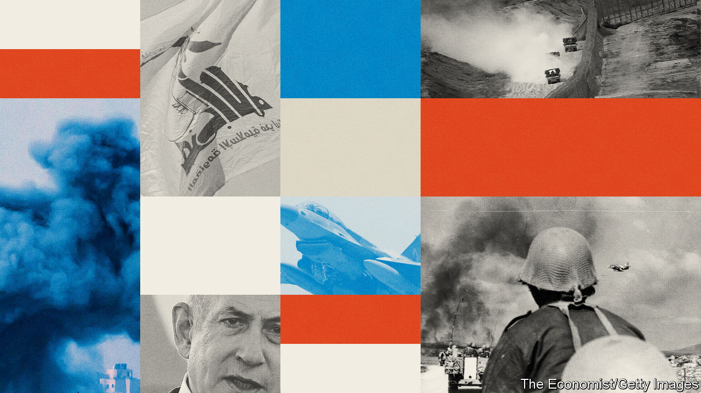

###### The Economist explains

# The A to Z of the Arab-Israeli conflict 

##### From “Abraham accords” to “Zionism” 

 

> Nov 20th 2023 


Bilateral agreements on Arab-Israeli normalisation signed in 2020. The first round of deals were between Israel and the  and  in September 2020. Sudan normalised relations with Israel the following month and Morocco in December 2020. Negotiations between  were  by the war between Israel and  which began in October 2023.


Gaza’s largest hospital. Israel claims that Hamas has its underground  below the building, which Hamas denies. Attacking health-care facilities can be l under international law.


In 1936 unrest broke out in the British mandate of Palestine amid frustration at rising Jewish immigration in the wake of Britain’s . By the summer of 1939 the uprising had been —but Britain later faced Jewish revolts and after the second world war handed the problem to the United Nations, which voted to partition the land.


 in the West Bank and Gaza Strip, agreed in 1995 as part of the Oslo II accord. In Area A, which includes the main Palestinian towns, the Palestinian Authority was given full civil and security control. In Area B it had power over civil affairs and some aspects of law and order, but Israel retained ultimate security control. In Area C, which includes most Jewish settlements, Israel kept full control. See map.


 signed after the first Arab–Israeli war of 1948. Israel and Arab states divided up the land. No Palestinian state was created; Egypt controlled Gaza while Transjordan (later Jordan) formally annexed the West Bank. See map.


Iran’s network of  and allies across the Middle East. It includes Hamas in Gaza and the West Bank, Shia militias in Iraq,  in Lebanon, militant groups in Syria and the Houthi militia in Yemen.


On November 2nd 1917 Britain issued the , named after ​​Arthur Balfour, the British foreign secretary, stating its support for “the establishment in Palestine of a national home for the Jewish people”. The document also insists that “nothing shall be done which may prejudice the civil and religious rights of existing non-Jewish communities in Palestine”.


Israel’s longest-serving prime minister and head of the right-wing Likud party. Since December 2022 has led a coalition which includes  and ultra-religious parties. He was previously prime minister from June 1996 to July 1999, and from March 2009 to June 2021. Also known as Bibi. Since 2019 he has faced criminal charges for corruption and fraud.


A Palestinian terrorist organisation responsible for the massacre of Israeli athletes at the Munich Olympics of 1972. 


A restriction on imports into Gaza, imposed by Israel and Egypt since 2007 after Hamas, a Palestinian Islamist group, took control of the territory.

 

Signed by Israel and Egypt in 1978, after the Yom Kippur war. In a peace treaty six months later Israel agreed to give back Sinai to Egypt, and to grant Palestinians autonomy. 


In 2005, at the end of the second intifada, Israel’s prime minister, Ariel Sharon,  all Israeli troops and Jewish settlers from the Gaza Strip and evacuated four of the 120 settlements in the West Bank. It also built a security barrier in the West Bank.


A sector of Jerusalem annexed by Jordan after the first Arab-Israeli war in 1948, then captured and annexed by Israel during the  in 1967. Legally it is as a  a separate entity belonging to no country, under the UN partition plan of 1947 but it is widely regarded as being part of the occupied territories. 


“Conquest” or “opening” in Arabic. The nationalist party led by  that formed the core of the Palestine Liberation Organisation and dominates the Palestinian Authority, which runs the West Bank. Founded by Yasser Arafat. Its main rival is Hamas.


The largest city in the Gaza Strip.

 

A 365-square-kilometre sliver of land, home mainly to Palestinians, wedged between Egypt, Israel and the Mediterranean. It was administered by Egypt after 1948, and captured by Israel during the Six Day War in 1967. In 2005 Israel “disengaged” from Gaza and pulled out Jewish settlers. It is home to roughly 2.2m people, many of whom rely on , and has been run by Hamas, a militant group, since 2007. It was placed , bombarded and then invaded by Israel in retaliation for Hamas’s attack in October 2023. Read our 


Defined by the UN as acts intended “to destroy, in whole or in part, a national, ethnical, racial or religious group”. Israel’s critics accuse it of committing genocide against the Palestinians; Israel calls Hamas a genocidal group. Read our full explainer on how the .


A  that dominates the Sea of Galilee. It was seized by Israel from Syria in 1967. In 1981 it annexed 1,800 square kilometres of the territory. Around half of the area’s population of 52,000 people are Druze Arabs. It is home to Israel’s only ski resort.


A  drawn during the Armistice of 1949. It served as the de facto border between Israel and Arab states until the Six Day War of 1967. It forms the basis of Palestinian claims to a state in the West Bank and Gaza Strip, with Jerusalem as its capital. See map.


Islamic Resistance Movement (“HMS” are its initials in Arabic), the Palestinian Islamist organisation which runs Gaza. It was founded in 1987 during the first intifada with the aim of destroying Israel and liberating the Palestinian people. In 2006 Hamas won a majority of seats in a Palestinian election and later formed a unity government with Fatah. In June 2007, after a brief civil war, it assumed sole control of Gaza, leaving Fatah to run the Palestinian Authority in the West Bank. On October 7th 2023 more than 1,000 Hamas fighters  and killed 1,200 civilians and soldiers, kidnapping 240 more. Read our full explainer about 


“Party of God” in Arabic. An Iran-backed militant group and political party based in , which  Israel to the north. It is dedicated to the destruction of Israel, and is the world’s most  non-state actor. Read our full explainer about . 


The systematic murder of 6m European Jews by the Nazis during the second world war. It is recognised by most as a  Hamas and other Islamist groups deny the Holocaust happened. 


Israeli prisoners held by  and . On October 7th 2023 around  were taken by Hamas from Israel to Gaza.


A “temporary cessation of hostilities purely for humanitarian purposes”, according to the UN. Such pauses are usually limited to a defined period of time and to a specific area. A ceasefire goes further—read our full explainer on the .


From the Arabic verb “to shake”. It describes campaigns fought by Palestinians against the Israeli occupation of the West Bank and Gaza. The first , which began in 1987, involved mainly strikes and stone-throwing. During the second intifada, from 2000 to 2005, Palestinians used guns and suicide bombs to blow up Israeli buses and nightclubs. 


An Israeli defence system under construction which will use lasers to shoot incoming rockets or drones out of the sky. Read our full explainer on the .


Israel’s system of  against short-range  and mortars, often fired from Gaza. (The country also has David’s Sling for medium-range rockets and Arrow for longer-range ballistic ones.)


The modern state of Israel was  in May 1948 by Jewish leaders after the withdrawal of Britain from Palestine. The name also refers to a kingdom in ancient Palestine comprising the lands occupied by the Hebrew people. See map.


Israel’s army. Largely made up of  with a small core of professional soldiers. Led in 2023 by Lieutenant General Herzi Halevi. Read our .


A city in Israel, holy to Christians, Jews and Muslims. Under the UN partition plan of 1947, Jerusalem was intended to be an international city, part of neither the future Jewish nor Arab states. It was divided by Israel and Jordan in the armistice of 1949. The eastern half was captured by Israel in the Six Day war of 1967, and annexed as part of its “eternal and indivisible capital”. Most countries keep their embassies in Tel Aviv, but the United States  in 2018.


An Israeli holiday marking Israel’s  of East Jerusalem, the West Bank and Gaza in the Six Day War in June 1967.


A city and a refugee camp in southern Gaza in which many of the current leadership of Hamas .


Agricultural communities in Israel often run as collective economies. Kibbutzim close to Gaza were  by Hamas on October 7th 2023.

A forerunner to the United Nations. In 1922 the League gave Britain the mandate to run Palestine as an international territory.


Four month conflict between Israel and Lebanon in 1982. Known in Israel as Operation Peace for Galilee. Israel invaded in order to dismantle Yasser Arafat’s Palestine Liberation Organisation which had taken control of the south of Lebanon. The war killed thousands of Palestinian and Lebanese civilians, along with hundreds of Israeli and Syrian soldiers. The PLO subsequently moved its headquarters to Tunisia. In 1985 most Israeli troops were withdrawn from Lebanon, except for a border “security zone”.


Conflict between Israel and Lebanon between July and August 2006. Launched by Israel in an attempt to destroy , an Iran-backed militant group and political party which had created a “state within a state” in the south of the country. Israel imposed a naval blockade, , Lebanon’s capital, and invaded the south. Six years earlier Israeli troops had withdrawn from the security zone established in 1985.


The  of Fatah and the , based in the West Bank. Mr Abbas was elected to serve a four-year presidential term in 2005 but has remained in post ever since. He is also head of the Palestine Liberation Organisation and of Fatah.


“Catastrophe” in Arabic. The mass displacement of Palestinians that accompanied the creation of Israel in 1948. Around 750,000 Palestinian Arabs fled or were pushed out of their homes. 


The collective name for the occupied West Bank, Gaza and East Jerusalem.


In 1993 Israel and the Palestinians, represented by the Palestine Liberation Organisation,  the first Oslo accord, which set out a five-year period of Palestinian autonomy in the West Bank and the Gaza Strip under a new entity, the Palestinian Authority. The Oslo II accords, under which Israel handed over security responsibility to the Palestinian Authority in parts of the occupied territories, were signed in 1995 with the intention of a permanent treaty five years later. That did not happen.


A Palestinian organisation recognised by the Arab League as the “sole legitimate representative” of the Palestinian people. Represents Palestinians internationally, including at the UN. 


An autonomous government for parts of Gaza and the West Bank founded in 1994. Intended to be the basis of a future Palestinian state. Its first leader was , leader of the Palestine Liberation Organisation. Expelled from Gaza by Hamas in 2007. Widely seen by Palestinians as corrupt and incompetent.


A militant group with links to Iran which operates in the West Bank and Gaza with the aim of establishing an Islamic state. Unlike Hamas the group limits itself to armed conflict. It has never participated in elections and has provided little support to people in Gaza. Read our full explainer .


A population of around 14m people who trace their origins to British-ruled Palestine. Around 7m  live in Israel, the West Bank and the Gaza Strip. Another 7m are strewn across the Arab world and beyond. Nearly 6m are registered as refugees.


A border  between Gaza and Egypt’s Sinai peninsula. Used during the war of 2023 to import aid.


A city in the West Bank and the de facto capital of the Palestinian Authority.


A conference of European powers and Japan held in Italy in 1920 during which the Ottoman empire was carved up. Britain was given a mandate to rule Palestine, the international territory envisioned under the Sykes-Picot agreement.


Around 700,000 Israelis living in the  West Bank, East Jerusalem and the Golan Heights. Their presence is considered illegal under international law.  between settlers and Palestinians is common. 


Territory briefly seized by Israel from Egypt during the Suez crisis in 1956 and again in the Six Day War in 1967. It was returned to Egypt in 1982 as part of a peace deal. See map.


 between Israel and its Arab neighbours in . Israel tripled its territory, capturing the West Bank, , the Gaza Strip, the Golan Heights and the Sinai peninsula. Israel has since moved to build Jewish settlements on some of the land occupied during the war.


In October 1956  Egypt, capturing the Sinai peninsula and the Gaza Strip. The conflict was planned in collusion with Britain and France in order to allow them to regain control of the Suez Canal which they had run until Egypt’s president, Gamal Abdul Nasser, nationalised it in July 1956. America was outraged and pushed Britain to abort the mission. In December 1956 the Israelis withdrew from Sinai and in March 1957 they withdrew from Gaza.


During the first world war Sir Mark Sykes, a British diplomat, and François Georges-Picot, a French one, were appointed to secretly  the lands of the Ottoman empire. The Arab provinces were to be split up among European powers. Given its significance in Christianity, Islam and Judaism, Palestine was envisioned as an .


Israel’s largest city and financial capital. Of the 96 embassies in Israel, 91 are located in Tel Aviv (the other five, including the , are in Jerusalem).


An Arab kingdom under Hashemite rule, created by Britain in 1921 after the San Remo Conference. Now Jordan.


First built for smuggling, tunnels under Gaza are used by Hamas fighters to attack Israel and to hide from Israeli fire. After the October 7th attacks the Israel Defence Forces unleashed air strikes to damage the.


A proposed  to end the Isreli-Palestinian conflict that is widely supported internationally. A Palestinian state would be formed in Gaza and the West Bank; Israel would swap chunks of its territory for portions with large settlements in the West Bank. Jerusalem would be shared, with some sort of joint control over the old city. 


The UN’s Relief and Works Agency, which looks after the welfare of 5.9m registered Palestinian refugees in the Middle East.


Israel’s name for the war of 1947-48. On May 14th 1948 Jewish leaders established the state of Israel. On May 15th a coalition of Arab neighbours invaded. At the end of the war Israel increased its territory to include land the UN had intended for an Arab state, as well as West Jerusalem. Transjordan held the West Bank and East Jerusalem and Egypt held the Gaza Strip. The war was followed by the mass displacement of Palestinian Arabs, known in Arabic as the 


Israeli-occupied territory run in part by the . Palestinians view it as the core of their would-be state. Right-wing and religious Israelis regard it as their ancestral territory, with many biblical sites, and are pushing for Israel to annex it in part or entirely. Home to increasing numbers of .


In October 1973, on the Jewish holy day of , Egypt and Syria launched an attack in Sinai and the Golan Heights. The war lasted three weeks and ended with a ceasefire secured by the UN.


A movement founded by , an Austro-Hungarian Jew, with the aim of creating a Jewish homeland. In the 1920s the movement was dominated by socialists, who went on to establish the state of Israel on socialist principles. In more recent years religious Zionism, an offshoot, which regards Zionism as a fundamental component of Orthodox Judaism, has become a powerful force. ■

