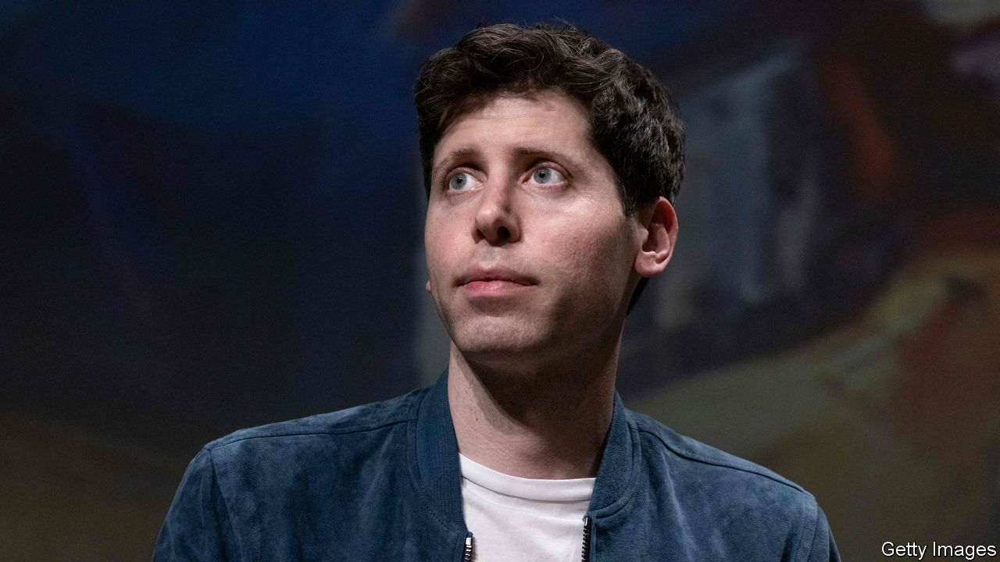
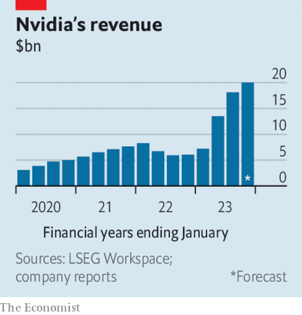

###### The world this week

# Business 

#####  

 

> Nov 23rd 2023 

 reinstated Sam Altman as chief executive, just days after he was ousted, and created a new board of directors. The turmoil at the startup that developed the ChatGPT chatbot shook the artificial-intelligence industry. The reasons behind the sacking are still unclear, but are thought to have reflected a disagreement over the speed of the AI revolution. Almost all of OpenAI’s staff threatened to quit if Mr Altman was not brought back. Microsoft, which owns a 49% stake in the firm, had offered to employ him. Larry Summers, an  and former American treasury secretary, will sit on the new board. 

America’s Department of Justice announced that  had pleaded guilty to money-laundering and failing to comply with international sanctions, and would pay penalties amounting to $4.3bn. Changpeng Zhao, who founded the world’s largest cryptocurrency exchange, resigned as chief executive and pleaded guilty to related charges. The department said that over five years Binance had enabled nearly $1bn in illegal payments involving countries and individuals under sanctions, and simply ignored American law and safeguards. 

Elon Musk tried to navigate a storm of criticism following his approval of an trope posted on X. After the White House lashed out at his apparent endorsement of a “hideous” conspiracy theory, Mr Musk insisted he was not antisemitic. He also announced that users on X who apply the term “decolonisation” to Israel and other terms that imply the genocide of Jewish people would be suspended from the platform. 

Meanwhile  sued Media Matters for America, a pressure group, after it published data purporting to show that X had allowed ads to run next to Nazi and Holocaust-denying posts. Some big companies, including Apple, Disney and IBM, pulled their advertising from the site following the report. X claims Media Matters “manipulated” data in order to destroy its business. 

Beyond satire

X was not the only social-media company to find itself in hot water over antisemitic-related content. A number of Jewish celebrities urged  to tackle a rise in anti-Jewish and anti-Israeli posts on its platform, which includes the re-emergence of Osama bin Laden’s bilious rant against Jews and the West, which first surfaced in 2002. Bin Laden’s self-styled “Letter to America” recently went viral on TikTok, which eventually removed hashtags linked to it. Sacha Baron Cohen, a comedic actor, said TikTok was “creating the biggest antisemitic movement since the Nazis”. 

In a tough week, Mr Musk was at least able to celebrate a further advance in testing SpaceX’s  rocket, the biggest ever built. After leaving its launch pad in Texas, Starship’s two stages separated successfully and one reached space for the first time, but the “super heavy booster” part of the rocket then exploded. SpaceX said this second test had provided it with invaluable data in planning for the next flight. 

 at last completed its $69bn takeover of  after Chinese regulators approved the deal. The combination of the chipmaker with the cloud-computing and software company was first proposed 18 months ago.

 


Boosted by a surge in demand for its AI chips from the likes of Amazon and Microsoft,  revenues more than tripled in its latest quarter, year on year. Net profit rose to $9.2bn compared with $680m in the same period last year. The company expects sales to China will drop “significantly” because of tighter restrictions on exporting AI chips to the country, but thinks revenues will climb again this quarter as demand from elsewhere makes up the shortfall.

 share price recovered some of the ground it lost when it said it would now not spin off its cloud unit. The Chinese internet giant cited America’s latest restrictions on exports of advanced chips to China as a reason for reversing course, as it believes the curbs will “materially and adversely affect” the business. 

The British government unveiled its , a kind of mini-budget. The rate of national insurance, a payroll tax that employees pay, will be cut from 12% to 10%. In another giveaway, a tax break that enables businesses to deduct investment from their taxable profits will be made permanent. The government’s ebullient presentation of its plans was at odds with the downgrading of official GDP forecasts. 

Bargaining power

A new contract between the  and Ford, General Motors and Stellantis was ratified by the union’s members, bringing an official end to its strike. As well as improved pay and conditions, the agreement brings thousands of jobs in electric vehicles and batteries under the UAW’s protection. 

