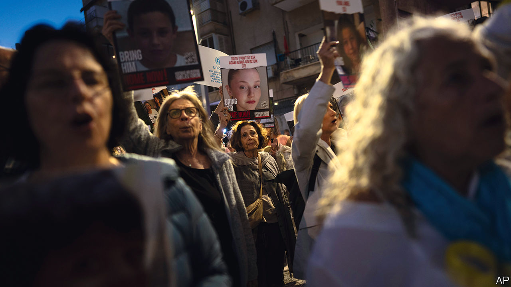
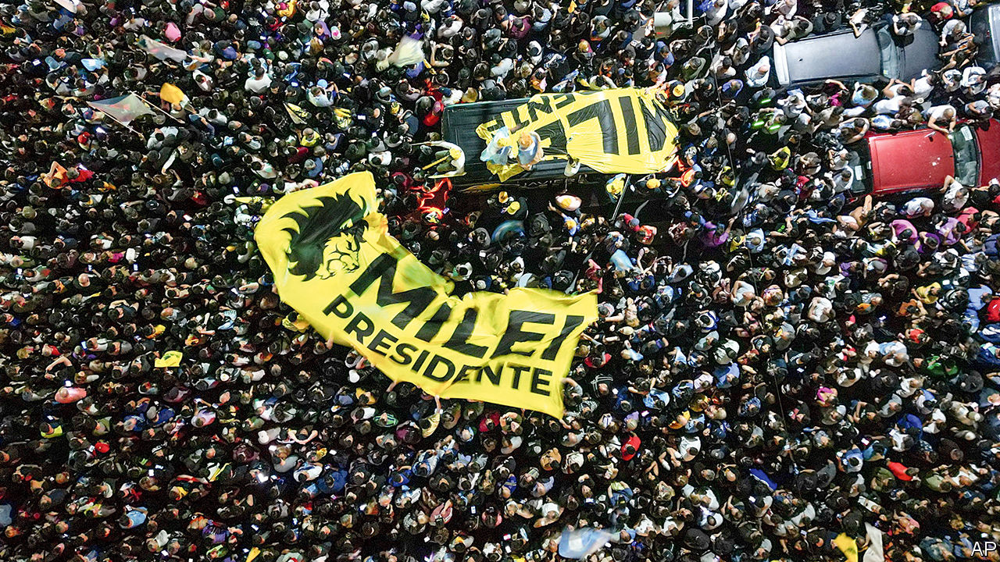

###### The world this week

# Politics 

#####  

 

> Nov 23rd 2023 

 agreed to a temporary truce in order to facilitate the freeing of some hostages who were captured by Hamas during its terrorist attack on Israel on October 7th and taken to Gaza. The deal, brokered by Qatar, will also release 150 Palestinian prisoners from Israeli jails, all of them either women or teenagers. Negotiations over the details delayed the release of the hostages until at least November 24th. The deal will also allow more aid into Gaza.

Israel carried out further strikes on , killing four members of Hamas and five Hizbullah militants. A Lebanese broadcaster said two of its journalists were also killed. Israel has intensified its attacks on Hizbullah targets in response to the Iranian-supported militia stepping up its rocket attacks. 

 Houthi rebels boarded and seized a British-owned and Japanese-operated cargo ship in the Red Sea, claiming it was linked to Israel. The attack by the Iranian-backed group has raised concerns over the security of a vital sea route that carries 40% of Europe’s trade with Asia.

Israel recalled its ambassador from , following an escalation in tensions between the two countries over the war in Gaza. South Africa, along with four other countries, has asked the International Criminal Court to investigate what they allege are Israeli war crimes in Gaza. 

The effort by  to restructure its debt hit a bump when a deal it had struck with bondholders was rejected by China and France, highlighting the difficulty in getting private and official creditors to agree on debt relief. The setback raises doubts about whether other African countries such as Ghana will be able to resolve their own debt troubles.

 president, George Weah, conceded defeat to Joseph Boakai, his rival in a recent presidential run-off election. Mr Weah’s concession ends worries about post-electoral violence in Liberia’s second democratic transfer of power since 1944, and calls full time on the political career of a man who won fame playing top-flight football in Europe. 

Ayes to the right

The  produced a shock result, as the Party for Freedom (PVV) led by Geert Wilders, a veteran far-right politician, won the most seats in parliament. Mr Wilders has pledged to halt a “tsunami of asylum and immigration” to the Netherlands but may find it difficult to form a coalition with the mainstream parties. The conservative party of the outgoing prime minister, Mark Rutte, came third; he is leaving office after 13 years in power.

 official figure for net migration in 2022 was revised sharply upwards, from 606,000 to 745,000. For the 12 months ending June 2023 the figure was given as 672,000. The statisticians think the “more recent estimates indicate a slowing of immigration coupled with increasing emigration.”

In  Pedro Sánchez named his coalition cabinet after parliament approved his bid for a new term. The prime minister’s Socialist party came second in an election in July. He has formed a minority government, but only by gaining the backing of Catalan separatists after granting a controversial amnesty to their leaders for holding an illegal referendum. Two days after Mr Sánchez was confirmed as prime minister 170,000 people marched in Madrid against the amnesty, the biggest such protest so far. 

Volodymyr Zelensky sacked the head of medical operations for  armed forces. The president said “a fundamentally new level of medical support for our soldiers” was needed. Reports suggest that some equipment is lacking in the field. The government is also looking at ways to improve troop rotation. Meanwhile, Lloyd Austin, America’s defence secretary, visited Kyiv, where he announced a new $100m package of military aid, the smallest from America so far for Ukraine’s war effort.

The German government suspended a vote on the budget amid a crisis resulting from a recent ruling by  top court, which found that a plan to divert €60bn ($65bn) in unused covid funds to climate-change programmes was unconstitutional. That legal decision has complicated the government’s spending plans by creating a knock-on effect on its ability to tap money in other special funds. 

Lai Ching-te, the presidential candidate of ruling Democratic Progressive Party, chose Hsiao Bi-khim as his running-mate. Ms Hsiao was Taiwan’s representative in America. Like Mr Lai she favours looser ties with China. Meanwhile, Taiwan’s two main opposition parties, the Nationalist Party (KMT) and Taiwan People’s Party, which both favour closer relations with China, were locked in acrimonious talks over which of their respective candidates should head a joint ticket for January’s election.

 claimed it had sent a spy satellite into orbit for the first time, following two failed attempts. South Korea responded by resuming reconnaissance and surveillance operations along the two countries’ frontier, in effect suspending part of an agreement struck with the North in 2018 to reduce tensions.

The UN refugee agency called on  to stop the expulsion of illegal migrants from the country over the “harsh season of winter”. The Pakistani government has ordered illegal Afghan migrants who are not refugees to leave. More than 370,000 have done so, but an unknown number are thought to have gone into hiding.

 new government approved an initiative to legalise same-sex marriage. If parliament approves the bill, Thailand will become the third Asian country, following Nepal and Taiwan, to recognise gay marriage.

Victory for a state slasher

 


Javier Milei won  presidential election run-off, taking 56% of the vote. The self-styled “anarcho-capitalist” trounced the Peronist candidate in 20 of the country’s 23 provinces. Mr Milei promises to cut red tape and slash public spending. With 40% of Argentines living in poverty, annual inflation expected to be 150% when he takes office next month and interest rates at 133%, Mr Milei says the central bank has enabled only “crooked” politicians to thrive. 

The governor of Texas, Greg Abbott, endorsed  for president, citing Mr Trump’s pledge to crack down on illegal migration. Mr Trump’s speech at the event was mercifully short, just ten minutes. At other recent campaign stops he has spoken for 75 minutes (Iowa) and two hours (New Hampshire—they don’t call it the Granite State for nothing). 

