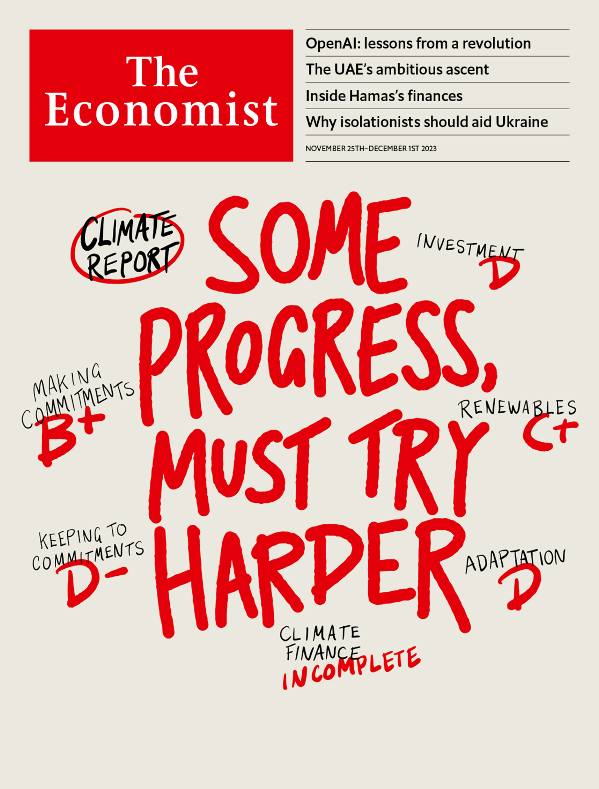
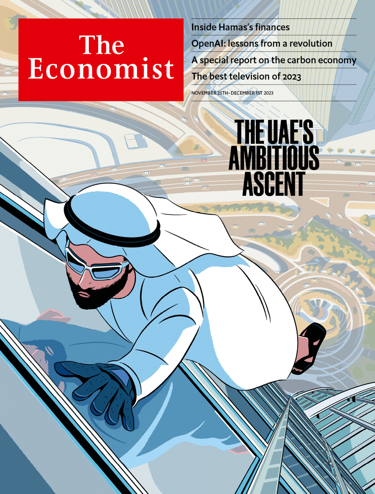

###### The Economist

# This week’s covers 

##### How we saw the world 

> Nov 23rd 2023 

WE HAD TWO covers this week. With the world gathering in Dubai for the 28th COP, one cover considers the progress that has been made in the fight against climate change. Some improvements have come thanks to better policies and cheaper and more widespread renewable energy. But they are not enough. The climate is still worsening, and serious, international debates are needed about solar geoengineering and carbon-dioxide removal. 

 


 

 

 


 


Our other cover focuses on the United Arab Emirates. Like Singapore, the uae is a haven for its region. But whereas Singapore’s ascent coincided with a golden age of globalisation, the uae is seizing opportunity in a time of chaos and disorder. Its successes and its failures hold lessons for middling powers as they navigate a fragmenting world.

 

 

