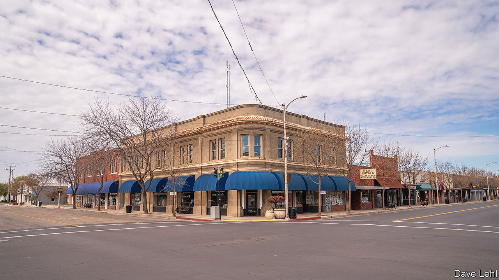

###### Just a small-town lab

# An accidental discovery in rural California raised biosecurity fears 

##### Now Congress is getting involved 

 

> Nov 23rd 2023 

On a December day in 2022, Jesalyn Harper went to a vacant warehouse to check out some suspicious parking. She was the only full-time code-enforcement officer in the town of Reedley, California, and while she was there, she noticed a green garden hose sticking out of a wall—a violation she ought to investigate. To her surprise, when she was let inside, she encountered three women in lab coats saying they were Chinese. As Ms Harper entered the building she discovered “Biohazard” signs; vials labelled in a mix of English, Mandarin and some kind of cipher; and hundreds of caged white mice.

She had found an “invisible” biolab: a privately operated and funded lab that can avoid government oversight. It was run by Jia Bei Zhu, a man with alleged ties to the Chinese Communist Party (CCP) and who is wanted in Canada, from which he is said to have fled after he was ordered to pay 330m Canadian dollars for stealing American intellectual property on dairy-cattle breeding. Mr Zhu was arrested in October for selling Chinese covid tests rebranded as American in the lab (which he denies), but it was unclear whether anything more sinister had taken place there. Kevin McCarthy, the recently ousted House speaker and a California representative, had already asked the select committee on the CCP to investigate. On November 15th, the committee published its report.

The findings were discombobulating. Inspections by local officials and the Centres for Disease Control and Prevention (CDC) found a number of vials, the labels of which suggested they contained pathogens, including malaria, SARS-CoV-2 and HIV. But the report said the CDC refused to test the vials, including those without labels or labelled in code, a decision it called “baffling”. The local authorities consequently destroyed all this without knowing exactly what they had. “Because of this, the select committee—and, more importantly, the American people—can’t resolve what pathogens Zhu and the Reedley Biolab possessed,” the committee wrote. 

A CDC official with knowledge of the investigation says the CDC “strongly disputes” the report’s critical conclusions, and that it does not have the authority to just seize and test samples. That disagreement highlights that there is no obvious agency in charge, says Kevin Esvelt, a biologist at Massachusetts Institute of Technology. While he does not think the evidence overall points to nefarious activity at the Reedley lab, it is unclear whose job it is to find and check other labs that may be less benign. Jassi Pannu from Stanford University agrees. “It certainly demonstrates that there’s no oversight of these private labs to prevent that from happening in the future,” she says. 

Part of the solution could be to make biological suppliers check that their customers are legitimate, suggests Allison Berke, who studies non-proliferation at Middlebury College. Mr Zhu, whose alias was David He, was able to acquire pathogens from American suppliers. That suggests others could equip their own invisible labs, which Dr Berke is sure exist. “I would be very surprised if [Reedley] were the only one,” she says. Not all will leave mysterious garden hoses around to raise the alarm. ■


