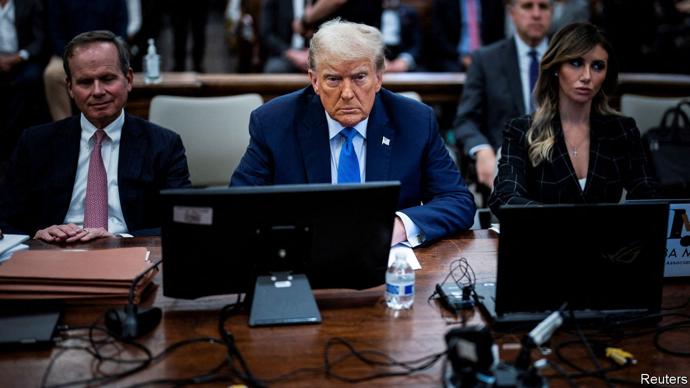

###### Deus ex constitutione

# Does a civil-war-era ban on insurrectionists apply to Donald Trump? 

##### So far, America’s judges have been reluctant to involve themselves in the 2024 election 

 

> Nov 21st 2023 

THE BOOK OF LEVITICUS prohibits wearing cloth woven of different kinds of material; Britain’s Parliament forbids entry to anyone wearing armour; and America’s constitution bans oathbreakers who have committed insurrection or rebellion from holding office again. Such antiquated restrictions are mostly just historical oddities. But sometimes they can be resurrected centuries later. That ignored section of the 14th Amendment to the constitution, written after the civil war to bar officials who had joined the Confederacy in order to break up the republic, is suddenly getting a lot of attention. Here it is:

“No Person shall be a Senator or Representative in Congress, or elector of President and Vice President, or hold any office, civil or military, under the United States, or under any State, who, having previously taken an oath, as a member of Congress, or as an officer of the United States, or as a member of any State legislature, or as an executive or judicial officer of any State, to support the Constitution of the United States, shall have engaged in insurrection or rebellion against the same, or given aid or comfort to the enemies thereof. But Congress may by a vote of two-thirds of each House, remove such disability.” 

You may be able to see where this is going. Donald Trump took an oath of office when he became president. His supporters staged a violent insurrection on January 6th 2021. This violence was not just aided and comforted by Mr Trump—who even in the aftermath of the attack could not prevent himself from saying “We love you, you’re very special” to the rioters—but begotten by his campaign to undermine faith in America’s elections. And Mr Trump, the front-runner in the Republican presidential primary, is certainly seeking to take office again. Does constitutional language meant to bar from office the likes of Jefferson Davis—a former Mississippi senator who was the Confederate States of America’s first and only president—also prohibit Mr Trump from doing so?

Lawsuits making that argument have been filed in 28 states, according to a tracker compiled by Lawfare, a non-profit. Twenty are still pending. Many of them have been filed by John Anthony Castro, a lawyer from Texas who is himself running, unnoticed, for the Republican presidential nomination. His quixotic efforts are making little headway with judges. But more credible plaintiffs are bringing challenges that force judges to reckon with uncomfortable questions of constitutional law.

So far, they seem reluctant to intervene in the 2024 election if they can possibly avoid it. For one example, look to a 100-page ruling by Sarah Wallace, a state judge in Colorado, issued on November 17th. Although Judge Wallace was convinced that “Trump engaged in an insurrection on January 6, 2021 through incitement, and that the First Amendment does not protect Trump’s speech,” she concluded that he should not be removed from the ballot.

That, she writes, is because the presidency is not mentioned in the list of offices in the relevant section of the 14th Amendment, and the president might not be one of the “officers of the United States”. She also writes, in a remarkable feat of hairsplitting, that the section covers those who “support” the constitution, whereas the presidential oath is to “preserve, protect and defend” it. Huh?

The legal controversy is not going to abate. The Colorado case is being appealed to the state supreme court. On November 8th the Supreme Court of Minnesota dismissed a challenge to Mr Trump’s candidacy by pointing out that the constitutional prohibition did not apply to the forthcoming primary ballot—calling it “an internal party election to serve internal party purposes”—but said that it could be raised again ahead of the general election. On November 14th a Michigan judge rejected a challenge on similar grounds.

Such challenges may have more success as the general election nears—and if the federal or state prosecutors trying the former president for subverting the 2020 election manage to secure a conviction. A single state or federal judge agreeing to strike Mr Trump from the ballot would increase the chance that the Supreme Court would step in to settle the matter.

Among opponents of Mr Trump, the idea that the prosecutors or the courts might intervene to save the country has become a bit worn. This hope was placed in Robert Mueller’s investigation into possible campaign co-ordination with Russia during the 2016 election; then in Mr Mueller’s expanded inquiry into the firing of FBI director James Comey; then in an impeachment inquiry in 2019 over Mr Trump’s withholding of money to Ukraine to further his own political interests; then in the second impeachment over the January 6th attack. At all these points, Mr Trump’s party or his supporters could have ended his career by turning against him.

Don’t Mencken it

Of course, Mr Trump is now in the greatest legal jeopardy of his career, facing four criminal trials and 91 indictments. Even this would not be enough to end his political career if Republicans circle the wagons. There is no constitutional prohibition on a felon running for office. In fact in 1920 the Socialist Party candidate, Eugene Debs, ran from prison and won 3.4% of the popular vote. America’s judiciary is understandably reluctant to be accused of deciding the next election. But by standing back, they could affirm H.L. Mencken’s jurisprudence: “Democracy is the theory that the common people know what they want and deserve to get it good and hard.” ■


