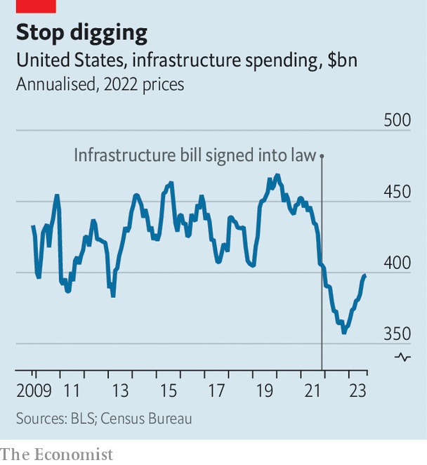

###### Infrastructure weak

# Spending on infrastructure has fallen in real terms in America 

##### That is despite a huge push by the Biden administration 

 

> Nov 22nd 2023 

It is easy to take internet connectivity for granted these days. But when stringing up fibre-optic cable in the woods of Vermont, not much comes easily. Some homes are a mile back from the road, requiring thousands of dollars and much tree-pruning to link them to the network. In remote areas new poles are needed to replace ones that date back to the introduction of electricity. The wait for these can run to two years. The local broadband group responsible for Vermont’s north-east corner brought high-speed internet access to about 2,500 homes in 2023. If not for the delays, it could have reached 7,000.

Bringing broadband to under-served parts of rural America is one element of a giant infrastructure programme that began two years ago when President Joe Biden signed it into law. It was hailed as a historic opportunity to repair America’s bridges, rebuild its roads for electric vehicles and update its power grid and communications technology. With headlines proclaiming its $1.2trn in investments, worth about 5% of GDP, it was easy to get caught up in the excitement. That makes the current state of the big dig all the more disappointing. Instead of the anticipated surge, total infrastructure spending has fallen by more than 10% in real terms since the passage of the law (see chart).

 


The most charitable explanation is that it takes time for big projects to get going. There are lags as money goes from being authorised by Congress to being doled out by the federal officials to actually being spent by state and local officials. Moreover, as anyone who has ever renovated a home knows, construction is always behind schedule. Many of the biggest expenditures will come near the end of the infrastructure law’s five-year term. John Porcari, a transport official in both the Biden and Obama administrations, draws a distinction with stimulus spending in 2009 during the global financial crisis. “The primary criterion then was getting people back to work. But with the infrastructure law, the primary criterion is the projects. We’re replacing what our parents and grandparents built and paid for,” he says.

The problem is that inflation has been rampant in the construction sector, making delays that much more pernicious. The single biggest component of the infrastructure package was a 50% increase in funding for highways to $350bn over five years. But highway construction costs soared by more than 50% from the end of 2020 to the start of 2023, in effect wiping out the extra funding. “A lot of the cost estimates that states and local agencies have are from three to five years ago, and they are just totally off now,” says Santiago Ferrer of BCG, a consultancy. This, he adds, leads to two outcomes: either authorities get no bidders because contractors think their prices are too low; or they revise their cost estimates, which takes yet more time.

Delays are also a product of the infrastructure law itself. It included strict “Buy America” rules, requiring builders to source things at home to boost domestic manufacturing. It also loaded on requirements to promote racial equity, environmental sustainability and fair wages. Laudable as these goals are, they have slowed things down. “The administration is at war against itself. It wants to advance these projects aggressively. But some of its requirements just preclude their delivery,” says D.J. Gribbin, a consultant and former general counsel in the Transportation Department. The law also included more than 100 new competitive grant programmes, which require new application systems and new compliance procedures. “These are a nightmare to set up and run,” Mr Gribbin says. Some state and local officials are not even bothering to apply for funding.

Beyond the structure of the law, infrastructure programmes inevitably run into headwinds in America. There is a substitution effect as the arrival of federal money allows states to step aside and spend less on construction. A recent wave of tax cuts by states has been made possible in part by the gusher of federal cash.

America’s federal system also presents a fiendishly difficult exercise in co-ordination. Broadband spending is one example. Before disbursing most of its funds, the federal government wanted to assess which states needed exactly how much, so it drew up detailed maps of nationwide internet connectivity. It was only this summer—18 months after the law was passed—that the state-by-state allocations were announced. Now, states are going to have to develop their own systems for spending the funds and monitoring progress. “It’s been a wild panoply of states at different stages and needs,” says Shirley Bloomfield, head of an association that represents 850 independent telecoms companies.

Another familiar obstacle is getting permits. The Biden administration has created a special action plan to try to speed up approvals for infrastructure and clean-energy projects. At the same time, though, its appointees in the Environmental Protection Agency have given states more power to block infrastructure projects because of fears about water quality. “The administration’s record on permitting is mixed at best,” says Ken Simonson of the Associated General Contractors of America. An example of states’ willingness to wield vetoes came in September, when regulators in South Dakota rejected a $3.5bn carbon-dioxide pipeline that would have run through five states in all. It was a setback for those hoping to see America capture more of its carbon emissions.

Despite the many frustrations, there are some bright spots. Several long-delayed projects are in motion. On November 3rd construction began on a rail tunnel under the Hudson river between Manhattan and New Jersey, though with a cost estimate of $16bn, about a third higher than just two years ago. A nearly $4bn expansion of a bridge linking Kentucky and Ohio is supposed to start next year. In all, the White House says that funding has been announced for more than 40,000 projects around the country. And just in time for all this work, inflation may be coming to heel at last. Construction prices have mostly stopped rising since the start of the year. 

Some also think that the infrastructure law may pay other dividends. To manage all the grant applications and the funding, the federal government asked states to establish infrastructure co-ordinators, leading to more joined-up planning for water, roads, energy and more. “It goes against a hundred years of how states have worked,” says Mr Ferrer. “It’s been hard and awkward for them. But it is a better way to do things.”

It is also important to recall the recent historical context: for decades American presidents failed to pass any significant infrastructure legislation. Donald Trump’s repeated pledges of “infrastructure week” when he was in the White House became a running joke. That makes the Biden administration’s efforts akin to “an athlete warming up to the game”, says Adie Tomer, an infrastructure wonk with the Brookings Institution. “It takes time to get it right but they are absolutely doing it.”

If funding does soon start to flow in greater volumes, new challenges will emerge. In rural Vermont, Kurt Gruendling of Waitsfield and Champlain Valley Telecom, a local company, is palpably excited at the prospect of bringing high-speed internet to all its 15,000 customers. He also knows that the next tranche of federal funding for broadband connectivity will be the biggest ever, at $42.5bn nationwide, and is bracing for shortages of both workers and parts. “Everybody is going to be building all at once, in all 50 states,” Mr Gruendling says. Then again, after a slow start to America’s big infrastructure push, that would be a good headache to have. ■


