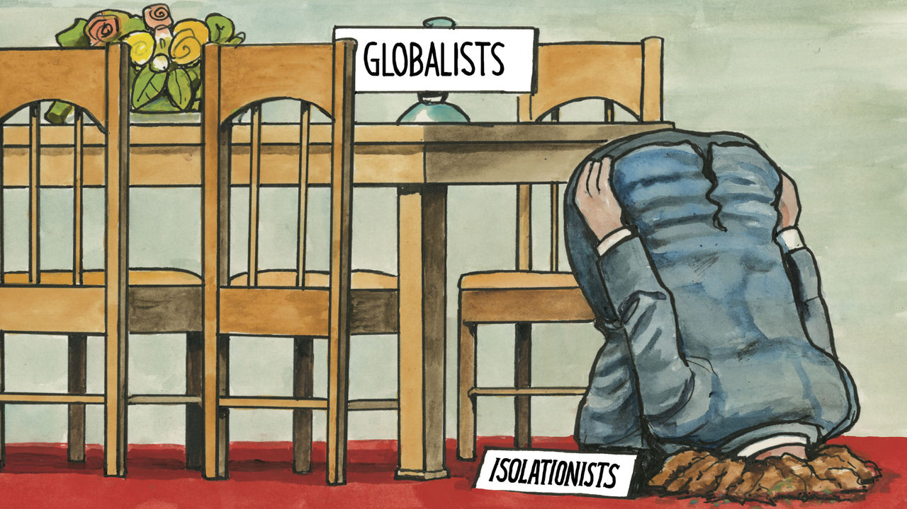

###### Lexington

# The (sort of) isolationist case for backing Ukraine 

##### Or: What America can learn from Sparta 

 

> Nov 23rd 2023 

J.D. Vance, a senator from Ohio, is tired of having Neville Chamberlain and Munich thrown in his face. A member of the Republicans’ sort-of-isolationist faction (it depends on the conflict), Mr Vance rose recently in the Senate chamber to scold some of his colleagues not only for seeking military aid for Ukraine but also for lacking his erudition. “What happened to our education system that the only historical analogy we can use in this chamber is World War Two?” he asked, not without petulance. 

Mr Vance preferred to point to the first world war, when, in his telling, “We didn’t de-escalate conflict when we had the opportunity.” Sure, Mr Vance acknowledged, Russia’s president is a “bad guy”, but, “Why is it that we think Vladimir Putin, who has struggled to fight against the Ukrainians, is somehow going to be able to march all the way to Berlin when he can’t conquer a country immediately to his east?” (Ukraine is mostly to the west of Russia.)


Mr Putin’s failure so far to march farther, at least according to the Ukrainians, is in no small part a consequence of American help. Mr Putin has made his ambitions plain. One of his close allies, Dmitry Medvedev, a former Russian president who is now deputy chairman of Russia’s security council, warned in early November of “the death of Polish statehood” if that country continued to oppose Russia. “History has more than once delivered a merciless verdict to the presumptuous Poles,” he observed. Count Mr Medvedev in the second-world-war analogy camp.

The first world war itself is a cautionary study in Russia’s imperialist ambitions, since they helped ignite that conflict, notes Paul Rahe, a professor of history at Hillsdale College in Michigan. “I don’t think he knows his history very well,” he says of Mr Vance. (His geography is not so hot, either: Ukraine is west of Russia.) For his own analogy for America’s support of Ukraine, Mr Rahe prefers to reach further back, to Sparta’s successful manoeuvring to kneecap an imperialist rival, Athens, starting in 415bc. 

Having allied with Athens in the past, enlisting its greater maritime power to hold off the Persians, Sparta had grown anxious that the Athenians might threaten its own grip on the Peloponnese. Then, in its hubris, Athens chose to attack Sicily, a vigorous 800-mile trireme-row away. As Mr Rahe recounts in a new book, “Sparta’s Sicilian Proxy War”, the Spartans saw an opportunity, without risking their own soldiers, “to do Athens great and perhaps irreparable damage—and that is precisely what they did”. The Spartans smuggled in a general, Gylippus, whose leadership not only changed the course of the conflict in Sicily but “profoundly shaped subsequent developments in the larger Greek world”.

In Mr Rahe’s telling, Sparta was an isolationist power. It was not out to conquer territory, but in order to protect itself it developed a grand strategy to form alliances and play other powers off against each another. America’s new isolationists are not quite so strategic, or even so consistent. They want to confront China and they are eager to send more military aid to Israel as it fights Hamas and Hizbullah, the proxies of Iran. Yet they do not perceive any benefit in aiding America’s European allies by stymying Iran’s ally, Russia. To Mr Rahe, the Ukrainian conflict is already delivering the benefits of a classic, successful proxy war, weakening a rival at minimal American cost. “It strikes me as a no-brainer,” he says.

Rather than trashing President Joe Biden’s low-cost, high-yield policy toward Russia, Donald Trump, the leading Republican isolationist, could easily be claiming credit for it. As president, he told the United Nations General Assembly in 2017 that “We must reject threats to sovereignty, from the Ukraine to the South China Sea.” He sent lethal American aid to Ukraine after President Barack Obama resisted doing so, fearing it would provoke Russia; he warned that Germany was too dependent on Russia for its energy; he demanded that other nato countries should meet their obligations to spend 2% of their gnp on defence. (Poland is on track to double that proportion, while France has approved its biggest military investment in 50 years.) 

There are reasons to cavil about Mr Trump’s actual contribution in each of these areas. (He did, for example, suspend aid to Ukraine while pressuring it to dig up dirt on Mr Biden). But when it comes to many other matters, a fastidiousness about accuracy has not restrained Mr Trump from taking far more credit with far less justification. America’s new isolationists seem to have a particular disdain for Europe’s fears or—if that description has too much of a pre-second-world-war echo for certain senators—a particular indifference to Russia’s desires. 

Time’s error

These neo- or proto- or sorta-isolationists do not dominate the Republican Party, at least not yet. In explaining his own support for arming Ukraine, Mitch McConnell, the Republican leader in the Senate, told the  in mid-November that “the country’s future, and the Western world’s future, depends upon winning this.” The new House speaker, Mike Johnson, has said he would support legislation that coupled more Ukraine aid with enhanced border security. President Biden, who wants $60bn in additional aid, may need to be seen by progressives to be resisting the Republicans’ border demands, but he should privately welcome them as addressing one of his biggest political liabilities. 

For 30 years American foreign policy has struggled with delusions that the end of the cold war meant the world was somehow overcoming history. It has turned out, to Washington’s sorrow, that the internet and capitalism did not make liberal values self-actualising in China or Russia. They did not guarantee democracy in Afghanistan or in Arab countries, even when backed up by American might. Now it appears that some nations still harbour revanchist ambitions. That was as true in the second world war as it was in the first, and in the Peloponnesian war, too. Only a fool would choose to keep learning these hard lessons all over again. ■


