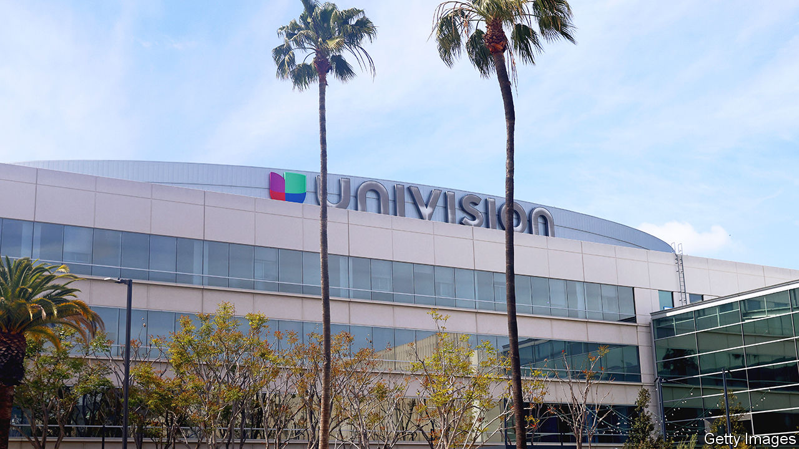

###### Mexican airwaves

# Univision, America’s Spanish news giant, reaches out to Donald Trump 

##### Under the network’s new owners, nobody expects the Spanish Inquisition 

 

> Nov 23rd 2023 

The last time Donald Trump took questions on camera from Univision, America’s biggest Spanish-language television network, the reporter ended up being bundled out of the room by Mr Trump’s security. “Go back to Univision!” jeered Mr Trump, as Jorge Ramos, the channel’s star anchor, refused to stop asking questions at a press conference in 2015. Univision, then owned by a big Democratic Party donor, was seen as hostile by many Republicans.

No longer. On November 9th Mr Trump sat down with Univision for an hour-long, primetime interview with notably soft questions. A rebuttal interview with the Democrats was cancelled. Democratic ads bought to fill breaks in the broadcast were also canned. Mr Trump, who once described Mexican immigrants as rapists, called Latinos “incredible people”. “All you have to do is look at the owners of Univision,” he said. “They’re unbelievable, entrepreneurial people. And they like me.”

That remark raised eyebrows. Last year Univision merged with part of Televisa, Mexico’s leading broadcaster, which has historically maintained cosy relations with politicians. In the 20th century it was a “soldier” of Mexico’s ruling party, in the words of its then boss. It has since warmed to Andrés Manuel López Obrador, Mexico’s left-wing president. Televisa executives were present at the interview with Mr Trump, along with Jared Kushner, his son-in-law, who is friendly with Televisa’s top brass and helped to arrange the interview, according to the . 

Foreign ownership of American TV stations is limited by law, but regulators granted Univision an exception. Its Mexican partners now seem to be shaping the newsroom. A few days after the Trump interview the station abruptly parted company with León Krauze, an anchor who had been singled out for criticism by Mr López Obrador for his coverage of a recent hurricane in Acapulco. On November 17th Univision’s American boss, Wade Davis, assured staff that “we hold Univision News to the highest standards of journalism”.

The behind-camera drama could be consequential. Half of America’s 60m Latinos get their news from Univision—as many as tune in to Fox News—according to polling by the Pew Research Centre. They trust it more than any network bar CNN, Pew finds. And as Latinos spread into swing states, politicians are eager to court them. Mr Trump, who won about 28% of the Latino vote in 2016, won 38% in 2020 and is polling strongly this year.

Reaching them depends less on Spanish-language media than in the past. Two-thirds of America’s Latinos were born in America, up from 60% at the turn of the century, and a quarter of Hispanics now say they can speak Spanish only a little. This is reflected in their media habits. Since 2008 they have been more likely to consume news in English than Spanish, finds Pew. Univision’s evening news has lost 40% of its audience in the past six years, according to Comscore, a data company (during the same period, English-language rivalssaw viewership rise).

Mainstream media are catering more to Latinos, too. Newspapers such as the  have Spanish-language editions and podcasts. And Latin culture is in demand from all audiences. Last month Bad Bunny, a Puerto Rican singer, presented “Saturday Night Live” partly in Spanish (with subtitles reading: “SPEAKING A SEXIER LANGUAGE”). Hispanic staff these days make up nearly a tenth of America’s TV news workforce, double the share in 1995. 

At the margins, however, Spanish-language media can still play a decisive role. Univision is particularly influential in swing states where the Hispanic population is insufficient to support more than one Spanish station, points out Chuck Rocha, a Democratic strategist. And though its audience is ageing, older viewers are reliable voters. “There are little old Mexican ladies every night, who watch [Jorge Ramos on Univision] and think of him as the voice of God,” says Mr Rocha. Mr Ramos began his career with Televisa in Mexico, but left for America after it censored his stories. So far, regarding the Trump interview, the voice of God has yet to speak.■


