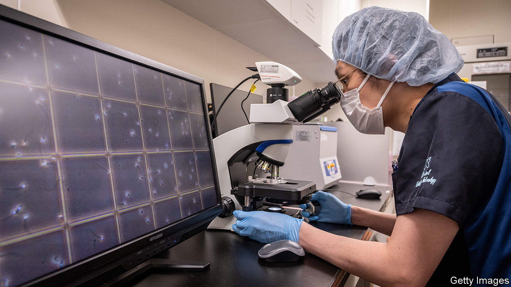

###### Baby-making

# Japan needs more sperm donors 

##### Gay and other unconventional families want help with reproduction 

 

> Nov 25th 2023 

AFTER THEY married in 2015, Shimuzu Nao and Ayaka dreamed of having children. But this was not straightforward. The couple are both biologically female; Nao, as the former is known, is a transgender man. While exploring possible workarounds, including adoption, they came across a man on social media who was willing to provide them with sperm. They proceeded to meet up with him several times at an internet café in Tokyo. Each time, he handed them a plastic syringe containing his semen, which Ayaka injected into herself. After the seventh meeting, she became pregnant. “Having children has been one of the most enriching experiences for us,” says Nao, now a father of two.

Assisted reproduction is popular in Japan. About 8% of babies were conceived through  in 2021, compared with 2% in America. But sperm and egg banks are unregulated in the country, and there are few of them. Laws pertaining to IVF only cover straight married couples (gay marriage is illegal in Japan). That is prompting hundreds, including single women and gay couples, every year to seek donors and surrogate mothers in other countries, including America, where such practices are legal. Others have, like the Shimizus, resorted to the less costly option of seeking sperm donors online in Japan. But this underground practice comes with certain risks, and there is a growing demand for regulation.

While egg donations are almost unheard of in Japan, artificial insemination using donor sperm (AID) has long been available in a few hospitals and more widely in the shadows. In 1948 Keio University Hospital in Tokyo started performing the technique, using sperm from medical students. Some 20,000 Japanese children are estimated to have since been born through AID. They are often not informed of their origins and have no right to get information about their biological fathers. But calls to facilitate disclosure grew during the 2010s, leading to a fall in sperm donors.

In recent years, Keio Hospital and other clinics that once performed AID have stopped doing so due to a shortage of sperm. “The idea of discoverability got some donors worried,” says Kuramoto Takeshi of JISART, a group of medical practitioners that promotes reproductive technology. “What if a child suddenly came up to you and said: ‘Daddy’?” Partly in response to that concern, Japan passed a law in 2020 that recognises married couples who have children through donated eggs and sperm as their offspring’s legal parents—and not the donors.

Even when sperm was more easily available, a shortage of AID capacity was driving demand for individual donors online. Hiro, a 30-something man in Tokyo, first donated his sperm to a lesbian friend four years ago. “I was surprised to learn such a practice existed,” he said. He now runs an X (formerly Twitter) account to advertise his willingness to donate to others.

But such informal arrangements can be fraught. Samples are not, as in clinics, screened for infectious diseases. Sperm donors may try to pressurise their beneficiaries into having sex. It can also be hard to verify donors’ personal information. In 2021 a Japanese woman gave up her baby for adoption and sued her sperm donor after learning that he was not, as he had claimed, Japanese, single and a graduate of a top university, but Chinese, married and an alumnus of a middling university. Such dealings through social media “should stop immediately”, says Miyazaki Kaoru, director of an IVF clinic in Tokyo.

Experts want regulation that would encourage donations to sperm banks and clinics. But the government’s conservative approach to families is getting in the way. It provides subsidies to married heterosexual couples in an effort to boost Japan’s birth rate, but refuses to provide any incentive, including via assisted reproduction, to non-traditional families. Parliament is now debating a bill that could restrict access to assisted reproduction to married couples. To face down the reactionaries will require more public discussion of alternative family structures, suggests Nao. “I want people to know that there are families like us.”■

