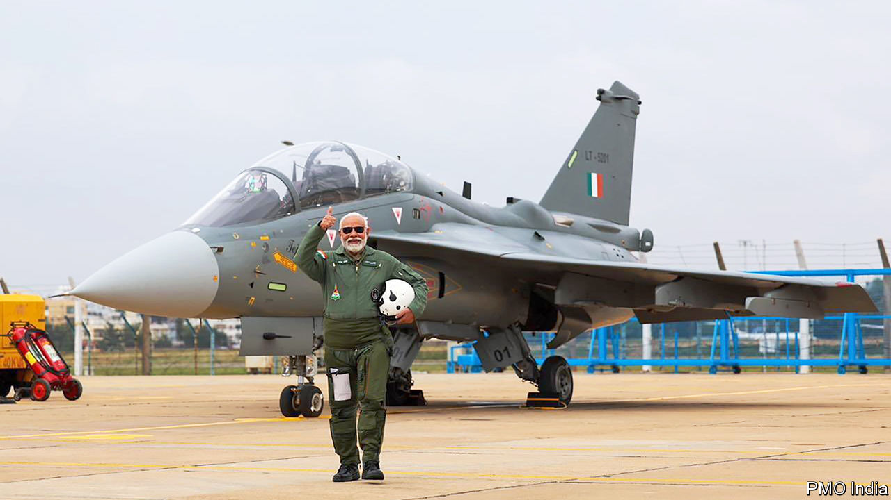
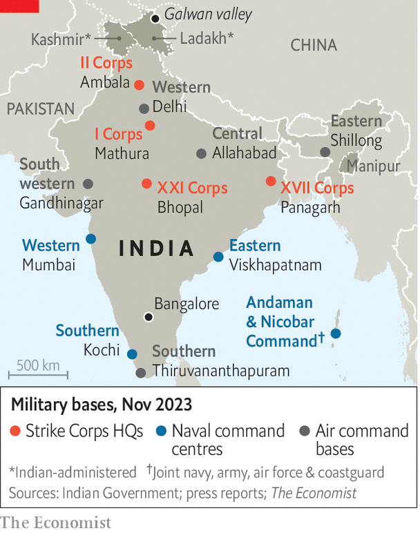
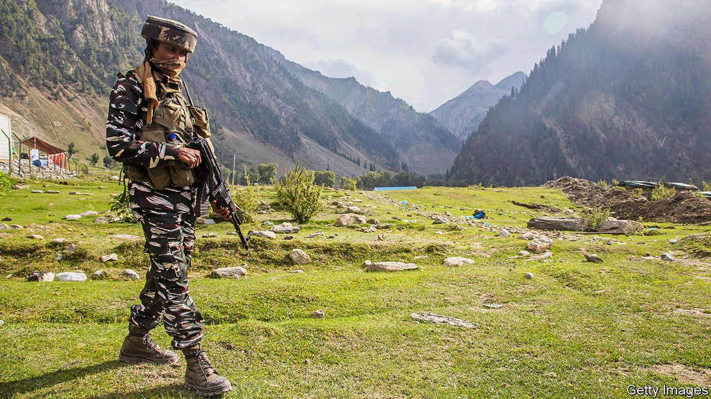
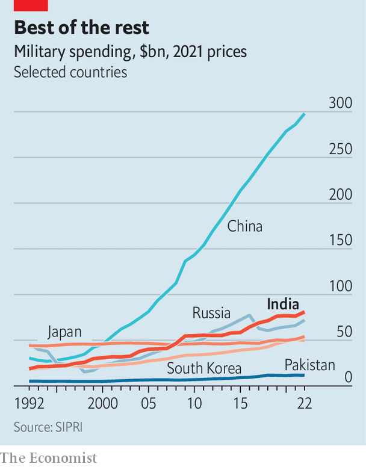

###### Asian defence

# Narendra Modi is remaking India’s 1.4m strong military 

##### The goal is to close the gap with China 

 

> Nov 29th 2023 

Narendra Modi, India’s prime minister, often dons fatigues while visiting troops in . On November 25th he went one better by squeezing into a flight suit and taking a sortie over Bangalore in a Tejas fighter jet. The Indian-designed plane embodies Mr Modi’s push for India to make more of . It also embodies much of what has gone wrong with the country’s defence. The jet is 20 years behind schedule, underpowered, and disdained by Indian pilots.

India’s growing geopolitical clout is based in large part on a hope that it can balance Chinese power. That makes the modernisation of the partly antiquated Indian armed forces—the second biggest of any country, with 1.4m full-time personnel—a matter of global interest. Follies like the Tejas make it easy to be pessimistic. The forces are also heavily reliant on Soviet-legacy hardware. Successful modernisation, assuming it happens, is likely to take decades. Yet a close look at India’s defence efforts reveals several areas of significant and underappreciated progress. 

This starts with a striking shift in focus. Indian leaders have talked about China as the main enemy for 25 years. But deployments told a different story. Only 12 of the Indian army’s 38 divisions historically faced China. Terrorist attacks emanating from Pakistan and domestic insurgencies absorbed most of the army’s attention. The trigger for change came in June 2020 when, after years of rising tensions, Indian and Chinese troops clashed violently, with clubs and machetes, in the Galwan valley in the mountains of eastern Ladakh.

After that skirmish, which resulted in the deaths of 20 Indian soldiers and at least four Chinese ones, India swiftly moved 68,000 troops and a bevy of tanks to the area, where a lone infantry division had previously covered 800km (500 miles) of front line. Jets and helicopters were sent to northern bases. A push for new roads, tunnels and bridges was accelerated—60% of border roads built in the past three years have been in states bordering China.

 


The most important change was that units which were once “dual-tasked”—instructed to keep an eye on both China and Pakistan—were told to focus on China. The Indian Army’s I Corps—one of the three armour-heavy “strike corps” originally built to scythe through Pakistan—was taken away from the Pakistan-facing western command and placed under the northern command, responsible for Ladakh (see map). “I spent two-thirds of my career looking at Pakistan,” says Raj Shukla, a retired general. “Today the posture reflects the threat.”

The second change is the biggest reorganisation of India’s military command structure since the country’s independence in 1947. In 2020, six months before Galwan, Mr Modi created a new post: a chief of defence staff, or CDS, to sit above the army, navy and air-force chiefs and push them to become more joined up. Previous governments had shied away from this move, fearing that a too powerful general would threaten civilian supremacy.

The reforms also included what passes for an electrifying innovation in India’s hidebound bureaucracy. Indian officers had long grumbled that they were bossed around by militarily illiterate civilian bureaucrats in the defence ministry; an agriculture specialist could have the authority to second-guess the size of a warship’s armament. Mr Modi thus created a new Department of Military Affairs (DMA) within the ministry. Its innocuous title concealed the fact that some civilians would work under uniformed officers—a notable tilt in civil-military relations.

Three years on, the reforms have mixed reviews. They have been “absolutely game-changing”, says General Shukla. They “gave the military back its legitimate voice in national-security decision-making”. But progress has been slower than some expected, in part because the first CDS, General Bipin Rawat, a charismatic former army chief, died in a helicopter crash in December 2021 after less than two years in office. Mr Modi then left the post empty for ten months before appointing General Anil Chauhan, a less authoritative figure.

Disjointed at the top

Progress on theatre commands has been achingly slow, in large part thanks to resistance from the air force. It is loth to see its shrinking fleet of aircraft parcelled out among several theatres, commanded by generals and admirals and devoted to tactical skirmishing on the front lines rather than strategic attacks deep into enemy territory. The first theatre commands, due to be launched next year, will be fragile experiments in inter-service harmony.

The third shift is in technology. India’s Defence Research and Development Organisation (DRDO), a state-owned behemoth, is good at building missiles—and bad at almost everything else. DRDO describes the Tejas as a “spectacular aviation triumph”. Most Indian pilots would keel over laughing at this. Indian services tend to prefer foreign weapons—Russian, European and increasingly American—to those produced by the state-owned arms firms and ordnance factories that have traditionally dominated the defence industry.

That is still largely the case for tanks, jets and other big-ticket items. The Arjun, an Indian-designed tank, first appeared in the late 1990s. More than 100 early variants were delivered to the army. But it suffered broadly the same fate as the Tejas, rejected by its would-be users—Indian armour officers—as overweight and obsolete. Yet there are flickers of promise elsewhere.

In 2014 the army’s seven main field commanders had almost nothing to spend on their own research and development or kit. In 2021 General Shukla, then in charge of the army’s training and doctrine command, was given just over $800,000 to spend on technology. A year later it rose to $18m—trifling by American or Chinese standards, but a leap forward for India. The northern command alone now has around $240m to buy and maintain new tech.

The beneficiaries have been smaller private firms—including many launched in recent years. The army was once “hostile to the concept of the private sector and startups”, says General Shukla. “Today it is embracing them.” According to Vrinda Kapoor, CEO of 3rdiTech, an Indian chip company, a few years ago she would have struggled to get a meeting with the armed forces. Secrecy rules prevented useful conversations anyway. That changed on both counts in 2019. “What I’m seeing now”, she says, “is a rapid change in mindset.” After Galwan, military services were given emergency powers to issue single-vendor contracts for up to $36m without cumbersome bureaucratic sign-off or competitions. If a firm nails trials, it gets the order.

This approach will not produce a new tank fleet. “There is still no capability for producing or integrating large systems in the private sector,” says Srinath Raghavan, an analyst. But it enables cutting-edge kit to be sent to front-line units quickly. This year NewSpace Research &amp; Technologies, a Bangalore-based firm, supplied the Indian Army with two sets of 50 swarming drones each. These were field-tested by one of the strike corps in an exercise in November, says Sameer Joshi, a former fighter pilot and the company’s ceo.

 


Old ways are being disrupted. That same exercise in November also tested Mr Joshi’s cargo drones, which are capable of carrying 50kg in mountainous areas where troops once relied on animal transport. They will put paid to the army’s 10,000 mules and drivers—eventually. “Although the breeding of mules has been stopped,” noted General M.M. Naravane, another former army chief, “at normal depletion rates, the mules will still be around for at least another two decades.”

Not every reform has been universally welcomed. Last year a huge row erupted when the government announced an “Agnipath” scheme to recruit 46,000 “Agniveers”—holders of a new rank—who would serve fixed four-year terms in uniform. Supporters say the scheme will bring down pension costs, which soak up more than a fifth of the defence budget, and lower the average age of soldiers from 32 to 26. It could yet result in a more diverse and representative army of the sort that India’s founding fathers envisioned. 

Sceptics fear it is at best a jobs scheme, at worst a form of social engineering designed to further Mr Modi’s Hindu-nationalist agenda. General Naravane does little to allay such fears in describing the project as a useful means by which India’s young population can be “disciplined and imbued with a nationalistic fervour”. Walter Ladwig of King’s College London warns that this could have operational consequences: “If the military is primarily being used to inject national character into the youth, by running them through military discipline, that potentially has deleterious effects on readiness.” 

Many army officers worry that Agnipath will destroy the regimental system, bequeathed by the British, under which some regiments recruit from particular castes and ethnic groups. The government denies that is its aim. But Mr Modi is committed to “decolonising” the armed forces by eliminating British names, rituals and insignia and introducing the study of ancient Hindu texts in military academies. Top commanders also increasingly refer to India as “Bharat”, according to Mr Modi’s wish. 

 


A bigger concern is that the gap with China remains a chasm. In 2014, when Mr Modi took office, India’s defence budget was 23% that of China’s (see chart). It is now 28%. But the many areas of shortfall are stark. India’s air force has an official target of 42 squadrons. It stands at just 31, a gap of more than 200 planes, with creaking MiG-21s being phased out quicker than new jets arrive. Indian air-force officers acknowledge privately that they are technologically at least a decade behind the People’s Liberation Army (PLA) in the air domain.

The navy is also far short of its ambition of a 175-ship fleet by 2035, with 150 ships and submarines to China’s 370. Talk of a three-carrier navy seems fanciful. A $4.8bn indigenous aircraft-carrier will be ordered soon, but will arrive only when the older of the two existing carriers is retiring. The new vessel will be far smaller than planned, with a tonnage around half that of China’s newest carrier. Admiral Karambir Singh, navy chief until 2021, is upbeat on his service’s trajectory. But he notes that China’s newest destroyers can carry 112 missiles in their vertical launch systems. India’s carry only eight or 16. 

Meanwhile the army faces serious constraints. Around 45% of its equipment is obsolete, according to data provided to the Indian parliament’s defence committee in March. Its war stocks are supposed to last for 40 days of intense fighting on two fronts. In 2017 the state auditor said that many types of critical ammunition would run out after ten. And the army has largely shuffled around existing units rather than raising new ones. The heavy commitment of forces on the border with China “has had all kinds of downstream consequences”, says Mr Raghavan, pointing to a sustained recent flare-up of ethnic violence in the north-eastern state of Manipur.

In private, Indian officials reckon they could not take on China for 30 years. Sushant Singh, a former Indian Army officer who now lectures at Yale, says India has watched helplessly as China nibbled at disputed territory in Ladakh and denied Indian troops access to 26 of the 65 points they once patrolled. “A humiliating situation exists on the China border,” he says.

Others are more hopeful. “In the last nine years there has been a monumental change,” says General Shukla, pointing to the institutional reforms as well as Indian air strikes against Pakistan in February 2019 and a bold air-land raid in the Kailash range in Ladakh in August 2020. That operation, which gave India oversight of a Chinese garrison, took the PLA by surprise.

India’s aim is to “add military muscle without spiralling costs”, says the general. The ratio of Indian to Chinese defence spending is about the same as that of Chinese to American, he observes. ’’Why is it”, he asks, “that China causes displacement anxiety in Washington, and we don’t cause similar displacement anxiety in Beijing?” Indeed, India’s progress should already be giving China pause.■


