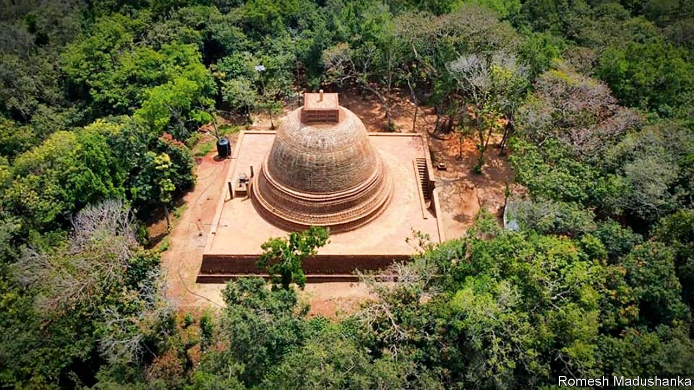

###### Plain stupa

# Sri Lankans are squabbling over monuments 

##### Tamils and Sinhalese have found something else to row about 

 

> Nov 30th 2023 

On a wooded hill edged by rice fields in Sri Lanka’s northern Mullaitivu district sit the ruins of an ancient Buddhist monastery. Members of the country’s Sinhalese majority call it “Kurundi Viharaya”. For Tamils, who are mostly Hindus and consider the war-battered north their homeland, it is “Kurunthoor Malai”. Since 2018, when the state archaeological department began excavating the site, Tamil and Sinhalese nationalists have rowed over which community has a greater claim to it.

Sri Lanka’s long civil conflict, between the secessionist Tamil Tiger rebels and Sinhalese-dominated government, has left deep scars in Mullaitivu. Tens of thousands of Tamil civilians were slaughtered by the army there in 2009 during the war’s terrible denouement, according to the UN. Some locals who fled the fighting were only permitted to return in 2013. It was around then that the department started showing interest in the many archaeological sites, including Kurundi, dotted across the vanquished Tigers’ former domain.

The Kurundi complex dates back to the 2nd century bc, with extensions added over subsequent centuries. The limited area that has been excavated includes a stupa, or Buddhist reliquary tower, and an image house, used to display representations of the Buddha. On the site’s summit, white butterflies flit to a chatter of cicadas.

For Sinhalese nationalists such as Ellawala Medhananda, a Buddhist monk and author of a popular book on the Buddhist heritage of Sri Lanka’s north and east, such ruins serve a keen political purpose. At the heart of the claim for a Tamil homeland is a belief that ethnic Tamils were the original settlers of Sri Lanka’s north and east. For Sinhala nationalists, the ancient Buddhist sites repudiate that claim.

Tamil nationalists counter that the monuments were also Hindu. The two religions often co-existed in pre-modern Sri Lanka. Excavations at many Buddhist monuments in northern Sri Lanka have revealed evidence of Hindu practice. Even where excavations are limited at a site, local Hindus often lay claim to it. Kurundi is locally believed to contain a Hindu temple; Hindus have begun gathering to pray there. These rival claims have put archaeology on the front line of Sri Lanka’s communal fissure. It has become a “highly volatile ethnic issue” that has “created a tension in the minds of both Sinhalese and Tamils because of its political implications”, writes G. P. V. Somaratna, a historian.

The Kurundi site was protected by British administrators in 1933. Earlier this year, the archaeological department—citing evidence of unexplored ruins outside its 78-acre expanse—called for a further 229 acres, including fertile paddy fields, to be blocked off. This has outraged the Tamil farmers who cultivate the land. Tamil leaders decry the proposal as an effort to “Sinhalise” the region. The site has been decked in signage, written in Sinhalese, that does not mention its Hindu significance. Local Hindus have filed lawsuits to prevent further changes. A judge who ruled in their favour fled the country in August, citing death threats and “a lot of stress”.

The politics of the dispute are warping the history. It is not merely the case that Tamils and Sinhalese once worshipped side by side. Buddhist and Hindu identities were also more fluid than Sri Lanka’s bitter politics today permits; some ethnic Tamils were once Buddhist. That probably makes the ancient sites at least as Tamil as they are Sinhalese—even if not in a way that extremists on either side would recognise. The row is about ethnicity, not religion, and essentially about “who got here first”, observes Shamara Wettimuny, a historian.

A growing number of sacred sites are seeing the same ethnic disagreement. Kandarodai, a collection of restored stupas in the northernmost Jaffna Peninsula, has been fenced off and put in (mostly Sinhalese) army hands. Local Hindus are outraged. Rowdy protests at some other monuments have led to police intervention. And with an election due next year, such tensions are likely to increase. A Tamil human-rights lawyer calls this “sectarian conflict based on ruins”. ■

