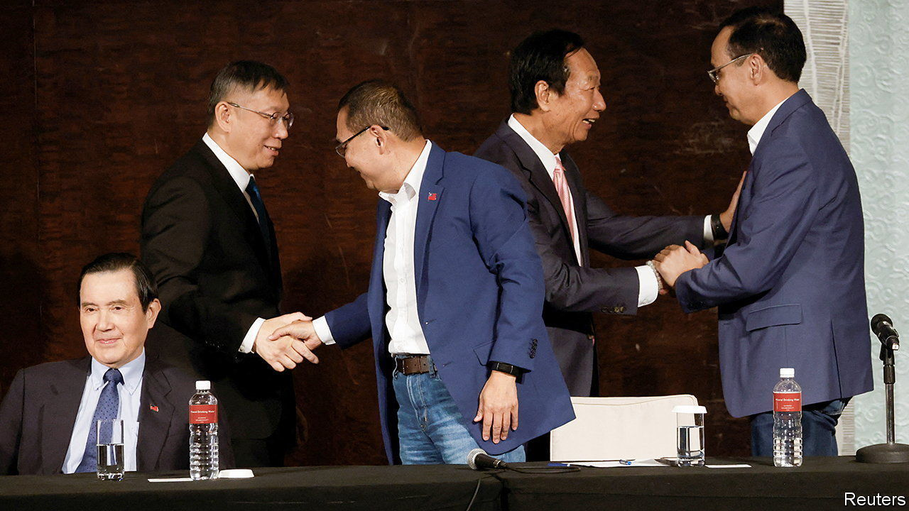

###### Ground zero

# Taiwan’s presidential election will be a three-way race after all 

##### Even with a divided opposition, polls point to a tight contest 

 

> Nov 24th 2023 

The question of who will be Taiwan’s presidential candidates for the election due next month was finally settled on November 24th. After a breakdown in last-ditch negotiations between the island’s main , there will be a three-way race. Hou Yu-ih of the Nationalist Party, or KMT, and Ko Wen-je of the upstart Taiwan People’s Party (TPP) will run against William Lai, the vice-president and candidate of the ruling Democratic Progressive Party (DPP). Terry Gou, the billionaire founder of Foxconn, a giant electronics-maker, who had campaigned as an independent, has withdrawn.

, which is based on a direct, first-past-the-post system, has the potential to redefine Taiwanese relations with China at a fraught time. In the face of rising Chinese aggression, both opposition parties would adopt a more compromising stance towards the mainland. Both accuse the DPP of endangering Taiwan by being too “anti-China”. The island-state must find a “safe balancing-point” between China and America, Mr Ko said in a recent television interview. With polls suggesting a combined opposition ticket would have started in the lead, much had therefore been riding on the negotiations between Mr Hou and Mr Ko to combine forces. A weighted poll-of-polls conducted between November 10th and 25th put Mr Lai on 32.33%, Mr Hou on 30.25%, and Mr Ko on 24.56%. Yet the talks fell apart over both opposition leaders’ demand to be the top dog.

Mr Ko, a former mayor of Taipei, then chose as his running-mate Cynthia Wu, a TPP legislator and wealthy heiress to the Shin Kong Group, one of Taiwan’s biggest conglomerates. Mr Hou selected Jaw Shaw-kong, a bombastic talk-show host who once founded a pro-unification political party. Mr Jaw is likely to appeal to “deep blue” voters, descendants of those who fled the mainland with the KMT in the 1940s, many of whom distrust Mr Hou because of his extensive Taiwanese roots.

Mr Lai of the DPP had previously announced that his running-mate would be Hsiao Bi-Khim, Taiwan’s de facto ambassador to America since 2020. Known in Washington as a discreet and capable diplomat, Ms Hsiao likes to describe herself as a “cat warrior” in contrast to China’s belligerent “wolf warriors”. Given the island-state’s perilous geopolitical position, she cautions, Taiwanese diplomacy must be undertaken with feline “caution, at times gently, but also with firmness”.

Despite Mr Lai’s small lead, the race looks tight. Oddly, polls suggest the flurry of chaotic opposition negotiating has modestly bolstered both Mr Hou and Mr Ko. After eight years in power, the DPP is struggling, especially with younger voters who are suffering from high housing costs and low wages. Some also worry about a possible war with China. At a recent rally for Mr Ko, a young supporter named Zoe Chu said she wanted to see Mr Ko elected to unseat the dpp and reduce tensions across the Taiwan Strait.

Even if the DPP retains the presidency, it is likely to lose its majority in Taiwan’s legislature in concurrent assembly elections. That would make it harder to pass laws against Chinese influence or budgets with increased defence spending. In any event, it is clear that the question of Taiwan’s posture towards the mainland will dominate the election. Most of Taiwan’s voters appear to be torn. They want a president who can navigate the next four years of America-China competition, by at once avoiding war and maintaining Taiwanese sovereignty. Now that the question of candidates has been settled, the debate on how to thread that delicate needle can begin. ■

