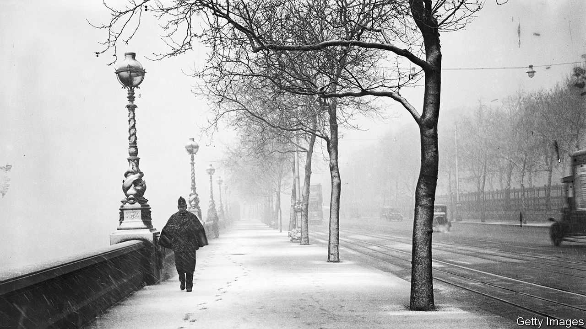
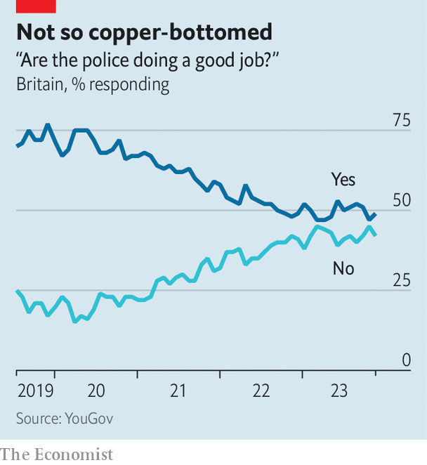

###### Policing by consent

# How to restore Britons’ confidence in the police 

##### Foot patrols and better vetting are the answer 

 

> Nov 30th 2023 

“Hello police!” shouted a toddler as James and Jordan strolled through Horsham, a market town in south-east England. Next they were hailed by a man with learning disabilities who wanted a “Sussex Police” pen: “I’ve been very good!” Then a woman ran out of Waterstones, a bookshop, to tell them someone had shoplifted a pile of books. “Don’t think she would have bothered to report that if she hadn’t seen us walk past,” said Jordan, as he went into the shop to take a statement.

It seemed unlikely that the shoplifter would be caught. Like many places in Britain, the town has seen a rise in , petty incidents of which are rarely prosecuted. But catching criminals is not the chief purpose of neighbourhood policing teams (npts), small teams of officers who concentrate on specific geographical areas. Across England and Wales npts are stepping up local foot patrols and making sure residents know their names and faces in a push to restore public confidence. That confidence has declined dramatically. 

 


A YouGov poll taken in November found that 49% of Britons thought the police were “doing a good job”, down from 77% four years previously (see chart). In his most recent assessment of policing in England and Wales, Andy Cooke, His Majesty’s Chief Inspector of Constabulary, described this as one of policing’s “biggest crises in living memory”. He could not remember, he said, “when the relationship between the police and the public was more strained than it is now”. 

Low confidence in the police undermines “policing by consent”, the idea that the authority of the police depends on the co-operation of the public. Without that trust, policing gets more difficult; it may also become more heavy-handed. “We’ve got a limited window to sort this out,” says Mr Cooke. 

In a way it is strange that Britons are so dissatisfied with their police. Crime rates in England and Wales are at record lows. The crimes that tend to induce extreme anxiety and anger—like burglary and car thefts—have seen the biggest drops. Yet this has largely been the result of improved security technology rather than police performance, which is far from perfect. Charging rates, for some crimes in particular, are “atrociously low”, says Mr Cooke. 

That is partly because of the role in such decisions played by the Crown Prosecution Service, which was diminished by spending cuts during the years of austerity. Similar problems elsewhere in the criminal-justice system—from court backlogs to —have also made life harder for the police. As the most visible face of an often dysfunctional system, officers can bear the brunt of public anger.

Yet two things in particular have eroded confidence. The first is a decline in neighbourhood policing. The sight of bobbies on the beat is as old as the Metropolitan Police Service in London, which was established in 1829 as a foot-patrol force. But it has become increasingly rare. 

Funding cuts again provide an explanation. Between 2010 and 2018 funding for policing fell by 19% in real terms. The number of police officers fell by 15%. The biggest cuts were made to NPTs; some were ditched altogether. Between September 2010 and September 2022 the number of police community-support officers (who walk the streets but cannot use force) fell by almost half, from 16,377 to 8,263. The public, meanwhile, has increasingly come to expect the police to deal with problems that are not crimes, from mental-health emergencies to free-speech debates. 

Things are getting better on these fronts. In recent years funding has risen: much of it has been spent recruiting 20,000 additional officers. Police chiefs have made efforts to define the role of the police more tightly; some forces have stopped responding to mental-health incidents. The hope is that this will allow the police to pay closer attention to another development: an increase in reporting of sexual crimes. 

The other big cause of low confidence will be harder to fix. In any given year most Britons are not victims of crime, which means their opinions of the police tend to be shaped by the media. The crimes that receive the most publicity are the most graphic; they are also the ones that least reflect the more humdrum reality of policing. This is truer than ever in an era of rolling news and social-media scrutiny, says Andy Higgins, research director of the Police Foundation, a think-tank. “Police need to be on the front foot in their public communications. They aren’t always great at explaining what they are doing.”

In November the College of Policing, which sets standards and undertakes training, chastised Lancashire Police for the way it had handled media coverage of the disappearance of  at the start of this year; she was later found to have drowned accidentally. In the absence of regular progress reports on the case, online speculation grew wild. All this led to “a breakdown of public confidence”, the College of Policing said.

The effect is much worse when police officers themselves commit crimes. In January it was revealed that the Met had been harbouring one of Britain’s most prolific rapists, David Carrick. In 2021 one of his colleagues, Wayne Couzens, kidnapped, raped and murdered a young woman, Sarah Everard. Revelations that the force had repeatedly ignored warnings about both men (Mr Carrick had been known by colleagues as “Bastard Dave”, Mr Couzens as “The Rapist”) were almost as damaging to public confidence as the crimes themselves. Subsequent investigations revealed  has dealt with allegations of misconduct, especially of the misogynistic or racist sort.

The Met is now cleaning up its act. Other forces, which no doubt harbour their share of degenerates, are following. In July the College of Policing introduced a new code of practice for vetting and revetting officers which also made it easier for police chiefs to sack bad officers. If successful, such reforms will help restore confidence.

Yet the hangover from austerity complicates these efforts, too. Last year a report by the inspectorate found that some forces had given vetting clearance to unsuitable candidates. The pressure to bump up police numbers while also replacing officers lost to prior rounds of spending cuts is thought to have contributed. Cutting public services to save money can exact other, bigger costs. ■


