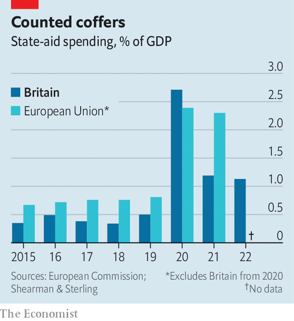

###### Spend drift

# Post-Brexit Britain is splurging more on state aid 

##### New figures show that Britain has become more European 

 

> Nov 28th 2023 

ADVOCATES of Brexit straddled two contrasting visions of the British economy. Figures on the Thatcherite right imagined a smaller state of low taxes and lower subsidies. The Eurosceptic left hoped that junking the EU’s state-aid rulebook would allow the government to back favoured industries. Things are not going the Thatcherites’ way. 

Brexit has coincided with a dramatic rise in the use of government aid to businesses, according to a new analysis commissioned by  from Shearman &amp; Sterling, a law firm. In 2015 British government aid amounted to 0.35% of GDP, compared with an EU-wide average of 0.67%. That surged to 2.71% in Britain and 2.39% in the EU in 2020, as covid-19 prompted bail-outs of stricken firms. 

 


Spending has since fallen but to a much higher level than the pre-covid trend, at 1.19% of GDP in 2021 and 1.13% of GDP in 2022 (see chart). “We only have a few years’ data, but it appears that both the EU and Britain have seen significant increases in subsidisation that the pandemic alone does not explain,” says James Webber, a state-aid lawyer at Shearman &amp; Sterling. 

Events have somewhat forced the government’s hand. Covid-19 was already spreading when Boris Johnson celebrated Britain’s formal exit from the EU in January 2020. The invasion of Ukraine in 2022 required action to mitigate energy shortages in Europe. Subsidies are in vogue everywhere; promises by politicians in Europe and America to attract manufacturing jobs and reduce dependence on China exert pressure for a response from Britain. 

Working out how much the government is spending is harder than it should be. Britain no longer features in the EU’s annual subsidy “scoreboard” and does not produce stats on its own use of state aid. Shearman &amp; Sterling’s analysis is derived from an online government database of subsidy awards, which is clunky and lacks contextual information.

A couple of big-ticket items drove up Britain’s spending in 2021 and 2022. They include £22bn ($28bn) to capitalise the UK Infrastructure Bank, a new state-owned development bank intended to replicate the role of the European Investment Bank. The state also spent £3bn to bail out Bulb, a failed energy company. 

More interventionism is likely, whatever the result of the next election. The Labour Party has promised to emulate . It initially sketched out annual handouts for factories, steel mills and renewable energy firms of £28bn a year (1.2% of GDP), although the grim state of the public finances has caused it to trim its ambitions. 

The Tories may decry subsidy races in principle. In practice they have been ready to dole out cash to keep  and steel plants in Britain. On November 22nd the Treasury announced that it would earmark £4.5bn over five years for advanced manufacturers. Indeed Britain’s post-Brexit system is designed to be permissive. In the EU the commission must vet the largest subsidies before they are given. In Britain the regulator’s advice to the government is non-binding; cash awards can be clawed back only after the fact by a court. Historically Britain was a frugal user of state aid. It is becoming more European. ■


