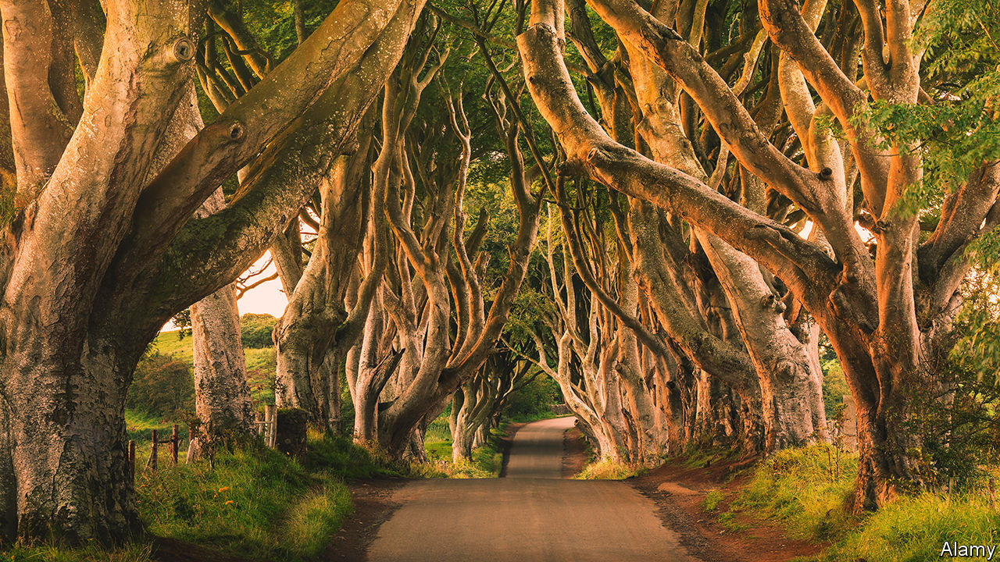

###### Ode to an avenue

# The Dark Hedges are dying 

##### “Game of Thrones” made them famous, to their cost 

 

> Nov 24th 2023 

“I awoke one morning and found myself famous,” Lord Byron said. Just over a decade ago a secluded avenue of ancient beech trees in rural north Antrim, in Northern Ireland, experienced something similar. For two-and-a-half centuries, the “Dark Hedges” were known to only a few. The trees had been planted before Byron was born. They were mere saplings when the first shots were fired in the American Revolution. 

Beeches are slow to grow but by the 21st century scores of smooth-barked giants lined the Bregagh Road, creating an atmospheric tunnel. Their thick interlocking branches twisted up to the heavens like contorted fingers. This dramatic setting drew the makers of “”, a sex-and-dragons TV fantasy, who used the scene to represent the Kingsroad. Although the trees were only briefly on screen, the HBO blockbuster made them famous. 

Celebrity was initially welcomed. The Northern Ireland Tourist Board promoted the trees. Fans of the show came from around the world. But they hastened the decline of the thing they had come to admire. Traffic jams meant that cars and coaches pulled up on the banks, churning the soil to mud, compacting the earth and damaging shallow roots. The trees were coming to the end of their natural lives anyway. But instead of careful management, they got Instagram likes.

Six years ago traffic was banned from the road. But that measure hasn’t been enforced. Age and weather continue to take their toll. Branches have sheared off and storms have uprooted entire trees. Where once there were more than 150 gnarled specimens, now just 86 remain. 

Bob McCallion has been photographing the beeches for 45 years; his images have won awards. He believes they are now so dangerous that people shouldn’t be walking beneath them. “Tourism is taking precedence over public safety. Those responsible should hang their heads in shame,” he says. On November 20th teams arrived to chop down six trees because they were unsafe. 

Nine miles away is another big tourist attraction, the Giant’s Causeway. “Worth seeing, yes; but not worth going to see,” Samuel Johnson famously said of the hexagonal basalt columns. That will soon be true of the Dark Hedges.■


