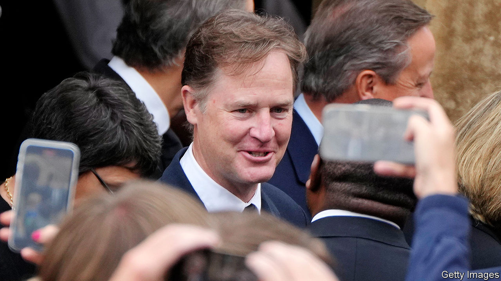

###### The agony and the Cleggstasy

# The curious case of Nick Clegg 

##### The ex-deputy prime minister and Meta bigwig seems ordinary. But he can’t be 

 

> Nov 29th 2023 

To understand Nick Clegg, look in the Collins English Dictionary. There, a little before “clematis” and “clemency”, you will find the entry “Cleggmania” (NOUN, ). Its definition is “the brief surge in popularity for the leader of the Liberal Democrat party, Nick Clegg”. 

Sir Nick is a funny mixture. He feels both very successful (he has his own dictionary entry) and not that successful (read it). He charms many people (see “-mania”, not to mention its cognate, “Cleggstasy”) but irritates others (the surge was, after all, “brief”). Before he led the Liberal Democrats into a  with the Conservatives in 2010 he was so popular that T-shirts were printed bearing the logo “I agree with Nick”. After it he became so unpopular that the T-shirts vanished and a mocking song about a policy U-turn on tuition fees appeared in their place. 

In person he offers that same odd blend. His anecdotes are peopled by bigwigs from both sides of the pond. “John” (Major) offers avuncular advice; “Sheryl” (Sandberg) rings while he is on holiday; “Mark” (Zuckerberg) is a close colleague. But what he talks about most is not success but failure—of his “catastrophic” loss in the 2015 election, when his party slumped from 57 seats to eight (he lost his own job as an MP in 2017); of his “terrible” defeat; of looking disaster “squarely in the face”. All political careers end in failure. Few ex-politicians talk about it as openly as he does.

Yet he is clearly not a failure. Look at the “Executives” page of Meta’s website, and you find him near the top, with the title “President, Global Affairs”. Most of the other executives look like superannuated students; Sir Nick wears a grown-up, collared shirt. In both clothes (in an interview in the Meta offices in London, then on Zoom, he wears similarly sensible things) and manner (he is one of those rare, appealing sorts who doesn’t merely speak but listens), he feels less like an international whizz and more like someone’s nice dad. 

Which, you suspect, is why Meta wanted him—and why he bothers people. Many politicians (and tech bros) are so odd that they are beyond envy; Sir Nick seems a superior sort of everyman. Which means that every man can look at him, feel envious and ask: what does he have that they don’t? 

One answer is a phone call from Ms Sandberg in 2018. Facebook (as it was then) was leaving behind its adolescent beanbag-and-ballpit phase and entering some very  about everything from the  to worsening mental health. Mr Zuckerberg went from being “hero to villain in the blink of an eye”, says Sir Nick, but being a “relatively sort of introverted” engineer type wasn’t entirely ready to cope. Sir Nick was familiar with ebbs and flows in popularity. 

He was on holiday in Switzerland with his sons when Ms Sandberg, then the firm’s chief operating officer, asked if he wanted to work at Facebook. He promptly said: “No. Not on your nelly. Absolutely not.” Not for ideological reasons, he says, but because “I just couldn’t imagine decamping the whole family to California.” She persisted; he wavered. It was a good time for a change. He had lost his seat in Parliament, his family seemed keen to go (though they are now back in Britain) and he had an appetite to try something completely new. 

It helped that Britain—which by 2018 had voted to leave the EU—was much less appealing. He describes himself as “European”, which might sound like an affectation but is almost an understatement. His mother is Dutch, his father is half-Russian, his wife is Spanish and he speaks five languages. He loathed the “swivel-eyed” populism that led to Brexit and had no desire, at 50, to rot away in the House of Lords (“a truly absurd institution”) or, the modern equivalent, to produce political podcasts. 

In joining Meta, however, Sir Nick was plainly not after the easy life. For there are actually two reasons people are bothered by him. The first critique sees him as not quite good enough to do all that he does: an ordinaryish man enjoying extraordinary success. The second is that he is too good to do what he does, that he is a moral man who makes compromises—first in coalition with the Tories, then inside Meta—and himself becomes compromised. 

Sir Nick himself says that he has always liked ”getting my hands dirty on difficult issues, difficult dilemmas”. The most obvious such issue in Meta was over whether to  from Facebook and Instagram in 2021. “As an old-fashioned liberal I felt pretty queasy about it. Because we are a private-sector company wielding immense power over speech in the public realm.” 

If such decisions are hard, one benefit of his previous career is that everything else feels easier. Leaving politics, he says, had been “hugely liberating”. He did things that he hadn’t done for years: going to the theatre, listening to music, bingewatching TV. He felt like “a pot plant that was suddenly being…properly watered again”. 

The schedule in politics had been punishing, the sheer volume of reading overwhelming. Politicians are “force-fed” information from the civil service like “producing the political equivalent of foie gras”. When various “Nick Clegg looks tired” memes were doing the rounds, he had pneumonia. If people ask him now what is needed for a career in politics, he says: “Pure physical resilience.”

After the election in 2015 Sir John Major warned him that it would take “at least two years” to recover. Arguably, despite all Sir Nick’s subsequent success, it took longer. “It was by a long, long way the most sudden, brutal and public failure that I’ve ever had to endure. I actually wouldn’t wish it lightly on any of my erstwhile opponents.” A nice sentiment. ■


