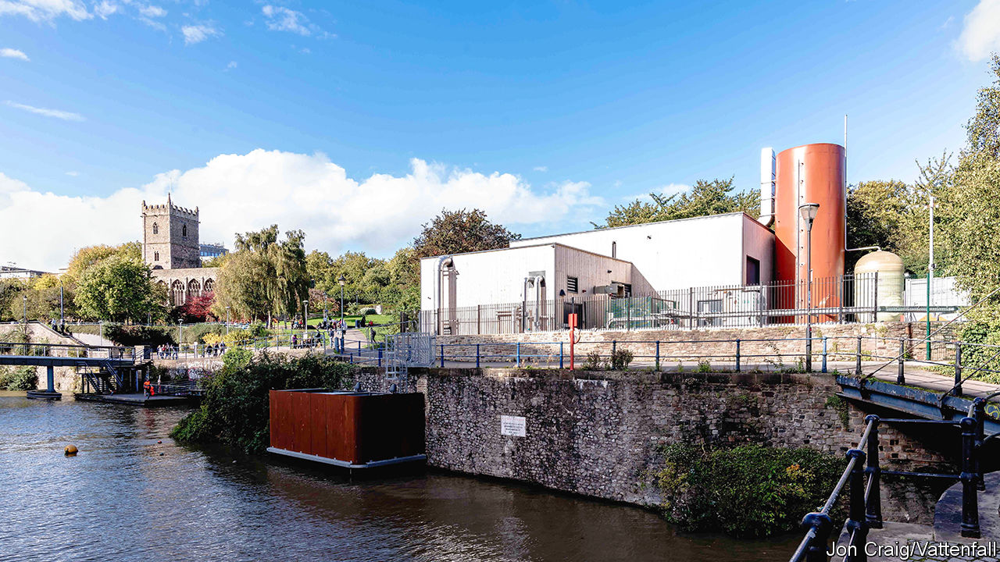

###### Heat pumps

# Why Britain’s homes will need different types of heat pump 

##### A tower block, a terraced street and a village require different solutions 

 

> Nov 30th 2023 

The water in Bristol harbour looks chilly. But it holds ambient heat due to latent energy from the sun. When the Castle Park Energy Centre is humming, it sucks up 133 litres of the stuff each second. Once filtered, the water passes through a dense network of pipes in the pump room. 

That ambient heat turns a refrigerant, in this case ammonia, from liquid into gas. The gas is then compressed, raising its temperature, and pumped through a heat exchanger which warms a separate supply of water ready to be used in homes. Its job done, the initial load goes back into the harbour some four degrees Celsius cooler. 

 can extract energy from water, ground or air. At 3MW, the monster in Castle Park is the largest in Britain: around 500 times bigger than a standard air-source unit needed for a three-bed home. It cost around £4.5m ($5.7m) to build. It is remarkably efficient. Even running at half-capacity, it heats 2,500 apartments in the city centre, as well as a school, a health centre and several offices. That is only the start. Bristol City Council wants it to form part of a city-wide heat network—meaning a central heating system sending hot water through insulated pipes—that covers 62,000 homes by 2030. 

Heat pumps are coming to almost all homes in Britain. Although the country lags far behind installation rates elsewhere in Europe, the government hopes some 600,000 air-source pumps will be installed annually by 2028 to help meet its climate goals. That is almost 11 times the number sold in Britain last year. But a successful roll-out will require not only scaling up but also working out what type of pump works best where.

The vast majority of heat pumps sold last year were air-source. These boxy devices, which tend to squat in back gardens, can be sold directly to a homeowner. Although some homes need  or bigger pipes, many require little additional work. Octopus Energy, a techy outfit that has become the country’s fifth-biggest energy supplier, currently offers to install one for £7,500 ($9,500).

In leafy villages or towns, where houses and gardens are roomier, the Octopus-style offer will be hard to beat. But many homes and apartments lack space; flats and terraced streets account for almost half of Britain’s housing. In dense city centres heat networks are a better option, says Andrew Sissons of Nesta, a think-tank. 

Although it is expensive to lay insulated pipes, pilots show that heat networks can be very cost-effective, especially if anchored round buildings with high demand like schools and hospitals. As the networks are scaled up they can draw in a city’s waste heat, for instance from data centres, incinerators or supermarkets full of refrigeration units. An experiment in north London is using waste heat from the Tube. 

To experience a slightly different model, walk an hour south-west of Castle Park to Ashton Rise, a new-build estate of over 100 homes. Here water is brought up by 100m-deep boreholes; in this case, the ambient heat is drawn from the ground. The water is run through an array of pipes connected to the houses on the estate, each of which has a tiny “shoebox” heat pump—smaller than a mini-fridge—to turn this tepid supply into something hot enough to use. Octopus has seen enough promise in this approach to invest £70m in Kensa, the Cornish company that built the system. 

Bristol is ahead of the game in part because it changed its planning policy to require large buildings in the city centre to consider connecting to heat networks. Elsewhere zoning policies make it more difficult to plan networks or dig up entire streets. Current rules also impede financing for upfront investments like Castle Park and Ashton Rise. The government expects heat networks to account for around a fifth of heating in Britain by 2050. To get to that mark, they will need a helping hand from policymakers. ■


