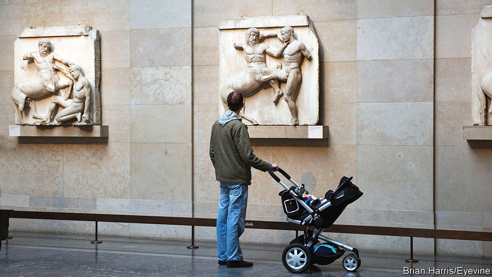

###### The Brutish museum?

# Why is the British Museum always in trouble? 

##### Partly because it was bad. But partly because it was good 

 

> Nov 30th 2023 

“The Essex Antiquities” doesn’t have quite the same ring. The sculptures that were hacked from the Parthenon in the early 19th century go by many names. They are called the “Parthenon Sculptures”, the “Parthenon Marbles” and, by traditionalists, “the Elgin Marbles” but never known by the name of the county in the south-east of England. Yet in 1902 part of the frieze from the Acropolis turned up in a rockery in a charming garden in Essex. Quite how it got there, as Mary Beard, a classicist, puts it, “we have no idea.” 

The gets in trouble precisely because people do know how it acquired its bits of the Parthenon, and much else besides. This week’s drama was a spat between the visiting Greek prime minister, who likened the  to cutting “the Mona Lisa in half”, and the British prime minister, who threw a tantrum in response and cancelled a planned meeting with his counterpart.

The Parthenon Sculptures are not the museum’s only controversial items. In recent years it has also been embroiled in arguments over the Benin Bronzes (Nigeria wants them back), the Rosetta Stone (Egyptians want that one) and the Easter Island statues (Rapa Nui claims them). It gets in trouble because it has far too many objects—8m at the last count, which is considered greedy. More recently, it has got in trouble for having too few—it let 2,000 items get stolen, which is clearly incompetent. It has been accused of dealing in stolen goods, exhibiting “pilfered” objects and generally being “Brutish”.

Not without cause. Many of its objects have objectionable back stories. Lord Elgin removed parts of the Parthenon so carelessly that they fell to the ground and shattered; the boat onto which others were loaded promptly sank. One infamous curator, E.A. Wallis Budge, bragged about how he had smuggled objects out of Egypt illegally by variously cutting them up, hiding them in books and, in one case, tunnelling into the back of a house while Egyptian officials guarded its front. “All Luxor rejoiced,” he wrote when he filched them. UNESCO would have been less thrilled.

Such looting should be seen in context, however. “One mustn’t judge Elgin unusually harshly,” says Paul Cartledge, emeritus professor of Greek at Cambridge. For Elgin was egregious but not exceptional. He wasn’t the only one to nick things from the Parthenon: parts of it were hacked off as souvenirs and left in the pockets of pleased tourists. Museums in four other countries have bits of the marbles. If Elgin “hadn’t got the Parthenon, a Frenchman would have got it”. An alarming thought. 

Indeed competitive nationalism runs throughout the history of museums. Nationalism provided an excuse to take things. Budge argued that it was better for him to nick a mummy and bring it back to the British Museum since it has “a far better chance of being preserved” there than in Egypt. It is commonly said that the Rosetta Stone has three scripts on it but as Neil MacGregor, a former director of the museum, has pointed out, it has four. On the side it reads “Captured by the British Army in 1801”.

Nationalism also helped spur museums into existence. The British Museum was one of the first institutions to use the word “British” in its title and the first national museum to open its doors to the public, in 1759. It still spurs things on today. Most people never hear of an artefact until it becomes the focus of a row between countries, as the Parthenon Sculptures did again this week. The British Museum’s website lists 1,699 objects also associated with Elgin. Since no nations are arguing about them, no one cares. 

The British Museum’s history is flawed, then, but also influential. Today, it is taken for granted that the obvious thing to do with old objects is to gather them all in a room, add labels, a loo and a gift shop selling Rosetta Stone rubbers, and then open it all up to the public. This was not always so. The British Museum is in trouble in part because it treated objects badly but also because it treated them well. Unlike the bits of the Parthenon that disappeared in tourists’ pockets, its sculptures are still there to get cross about. And, on the bright side, it also occasionally thwarted the French. ■


