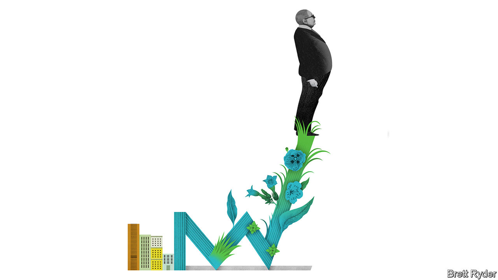

###### Schumpeter

# Charlie Munger was a lot more than Warren Buffett’s sidekick 

##### In business, he was a paragon of common sense 

 

> Nov 29th 2023 

Every May tens of thousands of the faithful flock to Omaha, Nebraska, hometown of Berkshire Hathaway, to bask in the presence of the investment firm’s two leaders: Warren Buffett, known for his folksy genius, and Charlie Munger, for his killer zingers. But for the truly hard core, for many years a more cloistered gathering took place near Schumpeter’s current abode in Pasadena, a lush city on the edge of Los Angeles. At the Pasadena Convention Centre, Mr Munger alone would hold forth, his dry wit in full flow. Recording devices were not allowed, but notetakers scribbled furiously as they tried to keep up. 

The last one took place in 2011, when Mr Munger, who died in an LA hospital on November 28th aged 99, was a sprightly 87-year-old. It was his last shareholder meeting as head of Wesco, a financial conglomerate about to be wholly swallowed up by Berkshire, and hence the end of his one-man show. He spoke for three hours. As usual, he poked gentle fun at the audience, telling them, “You folks need to find a new cult hero.” Yet he clearly enjoyed delivering what one scribe called his sermon from the “Church of Rationality”. He beamed when they gave him a standing ovation. 

Looking back through notes of that meeting, the themes he dwelt on seem random. He discussed what he felt was his inadequate legacy, though he took pride in attributes such as basic morality, self-discipline and objectivity. He advised rich parents how to look after their children (don’t try to motivate them with artificial hardships, he said, because they will inevitably hate you for it). He discussed the importance of being rational amid mistaken biases (which he called the “Lollapalooza effect”). He even put in a good word for , describing it, according to one notetaker, as his favourite “adult magazine”.

And yet those were not scattershot musings. They echoed a carefully thought out worldview on life, investment and business culture that he expounded on extensively in writings and speaking engagements whenever he was not in the spotlight as the Sage of Omaha’s curmudgeonly sidekick. As Mr Buffett put it, Mr Munger influenced Berkshire’s entire investment philosophy by introducing the wisdom that it is “better to buy a good business at a fair price than a fair business at a good price”. In other words, he deserves a big share of the credit for turning the financial conglomerate into the $780bn powerhouse that it has become. 

Though the two men bore an uncanny physical resemblance (Mr Munger, at least later in life, was more portly), intellectually they had different strengths. Mr Buffett is a master of the plain and simple; Mr Munger was a complex thinker (“Charlie does the talking, I just move my lips,” Mr Buffett once quipped). Like the best duos—think Bill Gates and Paul Allen at Microsoft, Mickey Mantle and Roger Maris at the New York Yankees, and John Lennon and Paul McCartney in The Beatles—their strengths complemented each other, producing something almost magical. In the case of Messrs Buffett and Munger the magic lasted for 60 years. During that time they famously never had a row. 

As with many successful partnerships, they shared common roots. Like Mr Buffett, Mr Munger grew up in Omaha. As teenagers both worked in the Buffett family store at different times. They met in Omaha in 1959, not long after Mr Buffett, then owner of a fledgling investment firm, had been told by a potential client that he resembled the erudite Mr Munger, who was six years his senior. He came to replace Benjamin Graham, a legendary “value“ investor, as Mr Buffett’s sounding board, with four qualities that Janet Lowe, Mr Munger’s biographer, said resembled Graham’s. He was honest, realistic, profoundly curious and unfettered by conventional thinking. Those are as good traits as any to summarise his approach to business.

In terms of honesty, he put the trustworthiness of business leaders, and the soundness of their accounts, above all else. He hated gimmickry (the accounting term EBITDA, he said, should be substituted with “bullshit earnings”). He was openly scornful of the “megalomania” of some investment bankers, whom he blamed for the financial crisis of 2007-09. In a deft parody penned in 2011 he described the perpetrators as Wantmore, Tweakmore, Totalscum and Countwrong. America was Boneheadia.

As for realism, he was no softy when it came to business. He believed in “moats” that safeguarded firms’ brand value, pricing power and scale. Take Wrigley’s Chewing Gum versus a cheaper competitor, for instance. “Am I going to take something I don’t know and put it in my mouth—which is a pretty personal place, after all—for a lousy dime?” Handle new technologies with care, he preached. Know your “circle of competence”. Don’t rush into new ventures you don’t understand.

For him, curiosity was a lifelong project, and he believed that business people should constantly refresh their knowledge, challenging their assumptions and learning from mistakes more than successes. As he said on the first page of “Poor Charlie’s Almanack”, a compilation of his writings and speeches: “Acquire worldly wisdom and adjust your behaviour accordingly. If your new behaviour gives you a little temporary unpopularity with your peer group…then to hell with them.”

Invert, always invert

Finally, think unconventionally. Don’t follow the herd. He loved Confucius and boldly encouraged America to “get along with China” despite the current tensions. Apple, he said, was an example of how engaging with China was both good for business and good for China. Everything that worked in the opposite direction, he said earlier this year, was “stupid, stupid, stupid”. Even by Mr Munger’s standards, that was blunt; he normally expressed himself with humour, not exasperation. But it summed up what was probably his greatest contribution to business thinking. He was a paragon of that old-style virtue—common sense. ■


