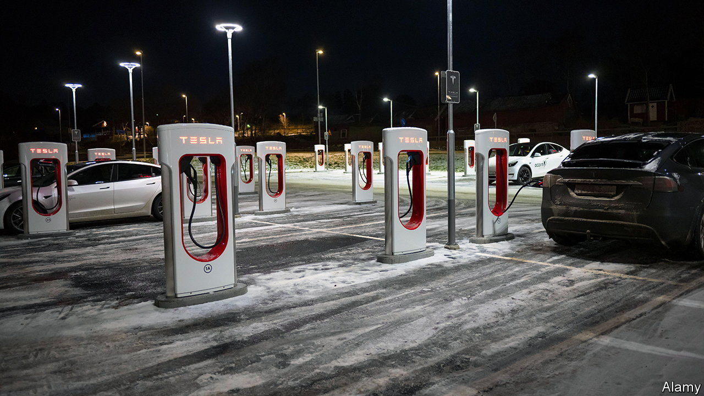

###### Swedish strikes

# Elon Musk v labour unions: Sweden edition 

##### Tesla faces a small but serious threat in Scandinavia 

 

> Nov 30th 2023 

Elon Musk, boss of Tesla, has gone to great lengths to keep unions away from his electric-car maker’s 127,000 workers at its “gigafactories” in America, China and Europe. Even in Germany, land of harmonious relations between workers and bosses, the powerful metalworkers’ union, IG Metall, has no say at the company’s local plant in Grünheide, near Berlin. Mr Musk’s latest challenge—a strike by some 130 mechanics at ten Tesla service workshops in Sweden—looks like a trifle. But it may yet prove consequential.

The Swedish strikers are members of IF Metall, which represents the country’s metalworkers. They downed tools on October 27th, demanding collective-bargaining rights. Mr Musk ignored them at first. That dismissive stance became harder to maintain as other workers joined them in sympathy strikes. Postal workers refused to deliver licence plates for Tesla cars, dockers to unload Teslas from ships and cleaners to scrub the firm’s showrooms. 

On November 27th Tesla filed lawsuits against the Swedish Transport Agency and the national postal service over their workers’ refusal to deliver licence plates for its cars. On the same day the court ruled that Tesla would be allowed to collect the plates directly from the transport agency’s offices. But the strike continues. IF Metall vows to pay the strikers’ wages for months, even years, if that is what it takes.

“My guess is that the Swedish unions will win,” predicts Jesper Hamark of the University of Gothenburg. For IF Metall this is a much bigger fight than a walkout by 130 car mechanics. The union does not want to set a precedent that could inspire other companies to operate in Sweden without accepting collective bargaining. Today around 90% of workers in Sweden are covered by such agreements; 69% are union members.

A face-saving solution for Mr Musk could be to set up a Swedish subsidiary under a different name that would run the workshops and allow collective bargaining. Tesla’s bigger worry is that the plucky Swedes embolden workers at its German factory, which manufactures 60% of Teslas sold in Europe. That share is likely to increase should European countries impose tariffs on electric cars from China, where the remaining 40% currently come from. To serve Europe’s growing EV market, the world’s second-biggest behind China, Tesla plans to double its German workforce from around 11,000 to 22,500. 

“What’s going on in Sweden is encouraging for us,” says Markus Sievers of IG Metall. Swedish comrades’ fight for better working conditions is its fight, the German union has declared. It claims that Tesla’s German workers are paid a fifth less than those at carmakers covered by the industry’s collective wage agreement. And it has already set up an office near Grünheide to win Tesla employees over. ■


