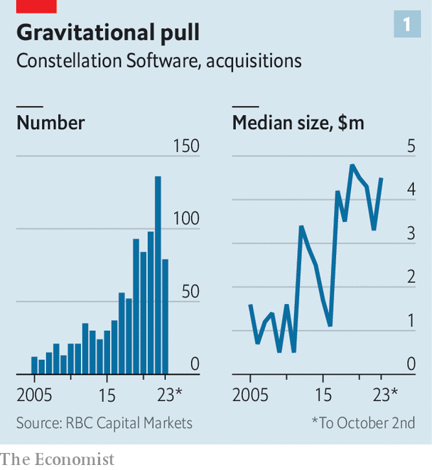

###### Baby Berkshire

# How a Canadian company became the world’s best acquirer of tech firms 

##### Meet Constellation Software, tech’s Berkshire Hathaway 

 

> Nov 30th 2023 

For older startups these are tough times. The weak recent stockmarket debuts of Arm, a British chipmaker, Instacart, a grocery-delivery group, and Klaviyo, a software firm, have dampened enthusiasm for initial public offerings. Venture capital (VC) has dried up. Data from PitchBook, a research firm, show that late-stage startups need almost three times as much money as is available to them. Many are putting themselves up for sale. Acquisitions of private firms valued at $100m or more are at their highest since September 2022. 

 


One happy buyer is Constellation Software. The Canadian firm’s targets must have sales of at least $5m and show consistent revenue and profit growth. A strong management team, preferably founder-led, is a plus. Though it has splurged on larger deals, the median value of firms it acquires is around $3m. According to Royal Bank of Canada (RBC), since 2005 Constellation has spent $8.7bn on more than 860 firms (see chart 1). In that time its revenue has grown by about 25% a year on average. This year it could exceed $8bn. The company’s market value is up by a big-tech-like 250% in the past five years, to $50bn, outperforming the tech-heavy NASDAQ index (see chart 2). It is now Canada’s second-largest tech firm after Shopify, an e-commerce platform. 

 


Whether by fluke or design, Constellation’s dealmaking success is based on principles that look strikingly similar to those of the world’s heavyweight acquirer, Berkshire Hathaway. Like Warren Buffett, Berkshire’s boss, and his right-hand man, Charlie Munger (who  on November 28th), the founder and president of Constellation, Mark Leonard, seeks out businesses with a lasting competitive edge. In Constellation’s universe, such a “moat” is enjoyed by software firms that specialise in building digital wares for unsexy industries from car dealerships and builders to spas. Tech giants shun these relatively piddling markets and smaller rivals lack the requisite know-how. The result is rich profits for the incumbents. 

After a deal is done Constellation, much like Berkshire, runs the business with benevolent neglect. It does not integrate newly acquired companies or parachute in fresh managers. It is content to leave day-to-day operations to the existing leadership. It does not desperately try to squeeze out inefficiencies by centralising common business functions. Constellation believes that splitting a business weakens its bond with customers, notes Paul Treiber of RBC. Cash from the subsidiaries flows to the parent company, which uses it to buy new businesses. These in turn generate more cash, and so on. 

To manage over 800 firms, Constellation is structured as a holding company with six large operating groups. Businesses in similar markets are grouped together. In 2021 Constellation floated Topicus, an operating entity that generated 14% of the firm’s total revenue and is now valued at $5.8bn. When any of the other five big operating units get large enough, they, too, may be listed. As with Topicus, Constellation would retain control of the board.

Like Berkshire but in contrast to private-equity or VC funds, Constellation has no exit clock ticking. It can thus be patient with investment decisions. Mr Leonard’s annual letters to investors echo Mr Buffett’s in describing the company as a “good perpetual owner”. This marathon mentality shapes employee pay. Bonuses are tied to returns on invested capital rather than just revenue growth. Executives must invest three-quarters of their bonus in company stock, which they cannot sell for four years. This aligns management’s incentives with those of shareholders.

Constellation’s success reveals an important truth about mergers and acquisitions that would also be familiar to Mr Buffett: serial acquirers tend to outdo occasional dealmakers. Tobias Lundberg of McKinsey, a consultancy, calculates that regular buyers on average generate about two percentage points more in excess total returns to shareholders annually compared with irregular ones. 

Mr Lundberg puts this edge down to practice. As with exercise, the more buying a company does, the better it gets. A few firms like Tyler Technologies from Texas and Roper Technologies from Florida are trying to emulate Constellation’s workout regime of picking up niche software makers. None has so far come close to matching the Canadian company’s muscle. ■


