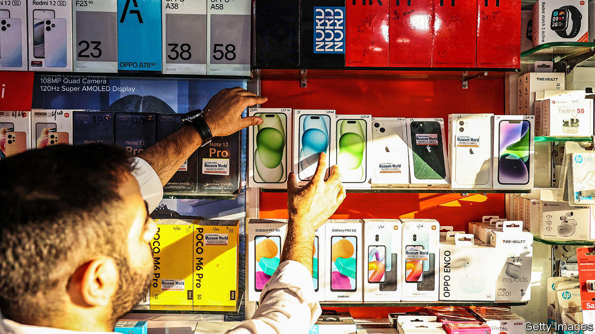
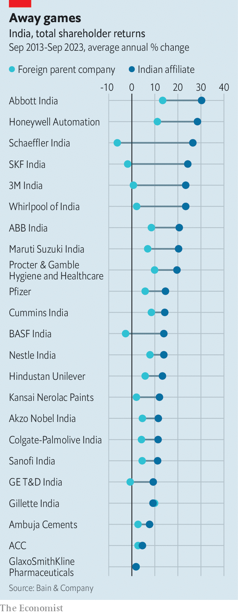

###### An outside chance

# How to succeed—and fail—as a foreign business in India 

##### Why some companies are staying put while others up sticks 

 

> Nov 30th 2023 

THE RECENT history of foreign business in India is littered with failures. Even as the country has tried to lure global businesses keen to diversify into a fast-growing emerging market and, amid rising geopolitical tensions, away from China, many multinational companies are throwing in the towel. Notable departures over the past couple of years include Abu Dhabi Commercial Bank; Ford, an American carmaker; Holcim, a Swiss cement giant; and Metro, a German retailer. Disney is negotiating the sale of all or part of its streaming business. On November 24th Berkshire Hathaway, a $780bn American investment Goliath, offloaded its 2.5% stake in Paytm, an Indian payments processor. 

These are only the latest companies to call it quits. Inbound foreign direct investment has been flat since 2018. Although nearly 11,000 foreign firms entered India between 2014 and 2021, a government report found that 2,783 had left or closed in that period—a dispiritingly high number for a supposedly fast-charging economy.

Some were probably put off by practical challenges, such as clogged roads, unbreathable air and patchy telecoms networks. Some no doubt balked at the legal obstacles to hiring workers, buying land or paying the right taxes. Some may simply have felt unwelcome; local bureaucrats and business leaders often see foreigners as a direct threat to domestic interests. Crucially, many fared less well than home-grown rivals. According to BCG, a consultancy, their gross operating margins average 12%, against 15% for Indian firms. When confronted by India’s reality, as opposed to its potential, plenty of excited foreign chief executives quickly find themselves “disabused”, sighs a consulting boss. 

Plenty, but not all. Dove soap, Knorr stock cubes and other consumer staples made by Hindustan Unilever, the Indian arm of a British giant, can be bought in 9m shops across the country. India’s top car-seller is Maruti Suzuki, a joint venture with a Japanese firm, followed by Hyundai of South Korea. Honda of Japan may soon dethrone Hero, an Indian rival, as the bigger maker of two-wheelers. Indians snap up Samsung phones and use WhatsApp, part of Meta’s social-media empire, to talk private and, increasingly, commercial business. They make half of all their digital payments via PhonePe, which is owned by Walmart, an American retailer. 

Far from quitting, some foreign companies are doubling down on their Indian bets. Which businesses persevere—and why—helps understand what it takes to succeed in India as a foreign enterprise.

One group of corporate outsiders that can thrive in India are those whose business is aligned with the priorities of the Indian state, such as boosting export-oriented manufacturing. Apple has become the poster child of this approach, by moving some iPhone-making to contract manufacturers setting up shop in India. Vestas of Denmark and Senvion of Germany are producing wind turbines for sale abroad. Tesla is reportedly negotiating lower import tariffs on its electric cars in exchange for setting up an electric-car factory. 

An indirect way to shore up India’s economic ambitions is to help build the roads, ports and other infrastructure needed to get products from the factories to faraway markets. An investment manager at a big financial firm lists the Indian subsidiaries of engineering companies as good wagers on Indian growth. Over the past ten years ABB’s Indian affiliate has generated annual total stockmarket returns of 21%, two and a half times those of its Swedish-Swiss parent. America’s Honeywell averaged 11% globally but 28% for its Indian arm.

Another successful group are foreigners who make an effort to indigenise their Indian business. Some team up with well-connected locals. Google and Meta have invested billions of dollars in partnerships with Reliance Industries, India’s biggest conglomerate, whose Jio telecoms unit brought mobile internet to 440m Indians. In August BlackRock, the world’s biggest asset manager, returned to India in a joint venture with Reliance. Its earlier foray involving a smaller partner was discontinued in 2018. If this time works out, BlackRock will have succeeded where those trying to go it alone, such as Fidelity, had failed. SAIC Motor, a Chinese car firm, is reportedly looking to sell a large stake in MG Auto, a local subsidiary facing a pernickety tax exam, to JSW, India’s steel champion.

Outsiders have other ways to make their business more Indian. Rather than run its Indian bank from its home in Singapore, DBS set up a local affiliate complete with an Indian board accountable to Indian regulators. Walmart strengthened its Indian presence by acquiring a controlling stake in Flipkart, a local e-commerce platform, in 2018. In July the American retailer increased its interest by buying the stakes held by two American tech-investment firms, Tiger Global and Accel.

 


One last important group is staying put—firms that are already big in India. Often, says the India head of a sovereign wealth fund, they flourish not by creating new markets but by replacing informal provision of existing goods and services. Many, similarly to ABB and Honeywell, earn better returns from their Indian subsidiaries, notes Nikhil Ojha of Bain (see chart). Some, like Hindustan Unilever or Maruti Suzuki, have been in the country for decades. Many Indians would consider them homegrown. 

Some are not so well liked, at least at first. Since it entered India ten years ago, Amazon has faced limits on local acquisitions, restrictions on selling own-label products, rules on inventory size and accusations that it threatened millions of  corner shops. Rather than give in, the e-emporium has stood firm. In June its boss, Andy Jassy, said it would invest an extra $6.5bn in India by 2030, bringing its total spending in the country to $26bn. It is expanding its e-commerce distribution network and building cloud-computing data centres. In November it launched FanCode, a channel on its Prime Video streaming service dedicated to sports including cricket, the national pastime. 

This resolute approach appears to be paying off. Resistance to Amazon’s Indian growth seems to be easing among government officials, who may have concluded that its logistical expertise is what India needs to connect its factories to the world. Billions of dollars in promised investments can’t have hurt, either. ■


