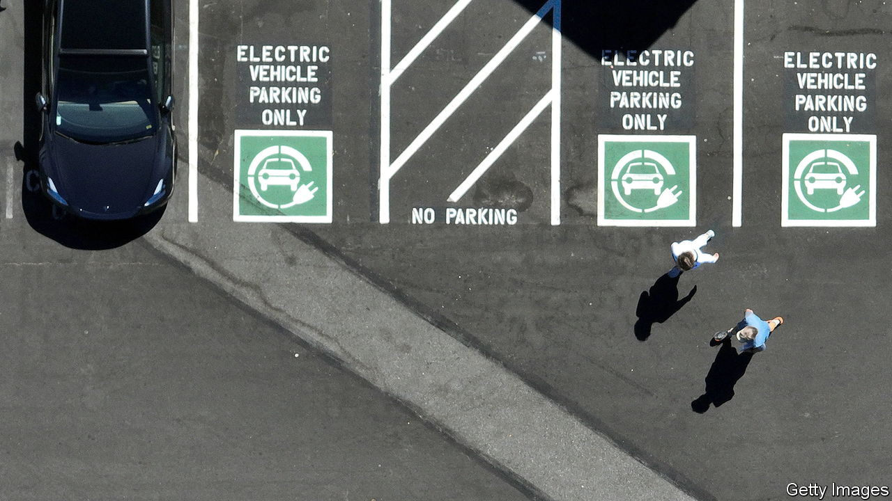
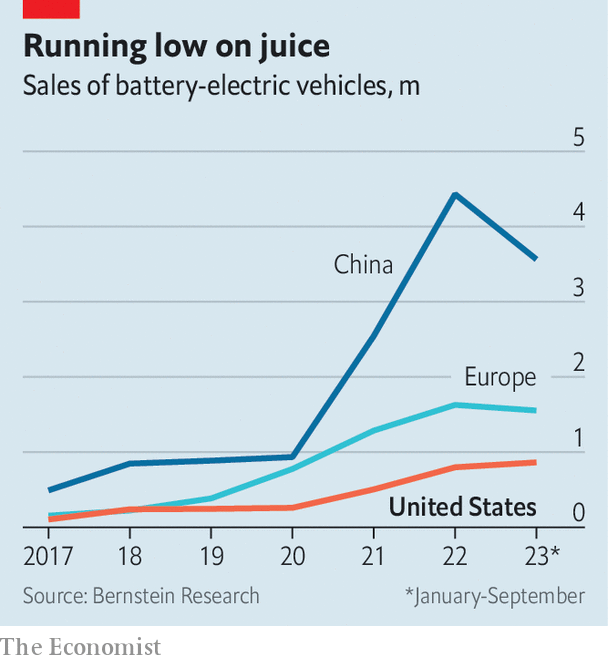

###### Electric curmudgeons

# Is America’s EV revolution stalling? 

##### Its motorists aren’t won over by battery power—yet 

 

> Nov 27th 2023 

AMERICANS LOVE . So long, it seems, as they don’t run on batteries. A poll published in July by the Pew Research Centre found that less than two-fifths of them would consider buying an  (EV). Despite expanding charging networks and more EV models to choose from, that is a slightly lower share than the year before. 

Those words are backed up by relative inaction. In the third quarter of 2023 battery-powered vehicles made up 8% of all car sales. So far this year fewer than 1m EVs (not counting hybrids) were sold in America, a little more than half the number in less car-mad Europe (see chart). Chinese drivers bought almost four times as many. Between July and September General Motors (GM) shifted a piddling 20,000 in its home market, compared with more than 600,000 fossil-fuelled vehicles. Fully 92 days’ worth of EVs languish on dealership forecourts, compared with 54 days of gas-guzzler inventory. Outside California, Florida and Texas, which together account for over half of American EV registrations, electric cars mostly remain a curiosity. 

 


Disappointing demand is now prompting carmakers to reassess some of their ambitious electrification plans. In October Ford said it would delay $12bn of EV investments. GM has ditched some EV targets and put off by a year a $4bn scheme to turn an existing factory into one for e-pickups, among other EV-related savings; it will instead pay out a record $10bn in share buy-backs in 2024. Carmakers’ battery-making partners are turning cautious, too. In September SK Battery laid off more than 100 employees and reduced output at a plant in Georgia. In November LG Energy Solution, a fellow South Korean firm, said it was laying off 170 workers in Michigan.

All this presents bumps on the road to electrified motoring in America. The car industry’s ability to swerve around them will determine the fate of its energy transition. And, since passenger cars contribute a fifth of American total carbon emissions, it will have an effect on the country’s decarbonisation efforts, too.

The biggest brake on EV enthusiasm in America is price. The average EV there sells for $52,000, reckons Cox Automotive, a consultancy. That is not a world away from the $48,000 that Americans typically pay for a petrol vehicle. But total costs of ownership, which combine the sales price and running costs for five years, vary more widely. At $65,000, the typical EV is $9,000 more expensive to own than a petrol car (owing to factors like pricey home chargers, dearer insurance and, compared with Europe and China, inexpensive petrol). On Ford’s latest earnings call executives grumbled that Americans were stubbornly “unwilling to pay premiums” for EVs. 

A new tax credit of up to $7,500 for EV purchases offsets some of this cost disadvantage. But it applies only to cars that obey strict rules of origin for components. It is also fiddly; buyers must file a form with their federal income-tax return. EVs’ low adoption rates, relative novelty and rapidly evolving technology, meanwhile, make it hard for buyers to tell how fast they lose their worth, which may put some off the purchase. Others may be discouraged by quality problems. In recent years EVs have been recalled because of faulty battery packs. Seven of the ten car models that face the most basic problems, such as with door handles, are EVs, according to a survey by J.D. Power, a research firm. 

Cheap and cheerful EVs tend to offer better value for money. But in America it is hard to find a set of electric wheels for less than $30,000. American carmakers have followed Tesla, the EV pioneer, in focusing first on higher-margin premium models rather than EVs for the masses. GM and Honda, a Japanese giant, recently dropped their joint $5bn plan to build an affordable EV. Inexpensive and decent-quality Chinese EVs from companies such as BYD have turned China into the world’s biggest EV market and may soon flood Europe. They are, however, all but excluded from America by high tariffs and other barriers.

All this leaves America’s car industry circling a roundabout. Consumers’ unwillingness to pay for expensive EVs is forcing carmakers to offer steep discounts to shift inventory. Tesla has slashed its prices several times in the past year. Carmakers are offering average discounts of almost 10% on their EVs, more than twice as generous as for petrol cars. But this is making it even harder for the companies to make money from battery power. Ford’s electric division is losing about $62,000 for every vehicle it sells, in contrast to a net profit of $2,500 apiece for the company’s petrol cars. Continued losses in turn may temper car firms’ appetite to invest in a broader electric offering that would appeal to buyers. 

American carmakers are still hoping they can escape this vicious circle. They are mostly postponing their American EV investments rather than pulling the plug on them. In the next year or two many companies are expected to unveil dedicated electrified “platforms”, as a car’s structural backbone is known, rather than lumping batteries unsatisfyingly onto existing petrol-driven skeletons. Some of the EVs’ quality problems are teething pains typical of all new models, be they electric or petrol-powered, which will be sorted out as production lines mature. And from January the EV tax credits will also be available at the point of sale, making it less burdensome for buyers to take advantage of them.

All this could eventually improve quality, expand product ranges, push down costs and, with luck, generate profits for car firms. Eventually may, though, come a bit later than hoped. ■


