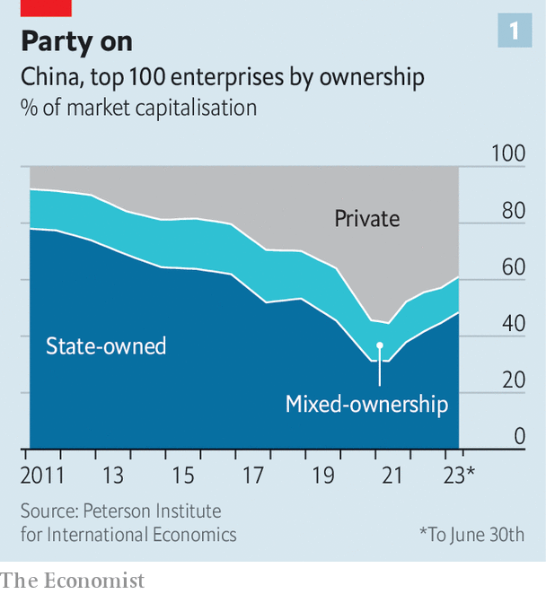
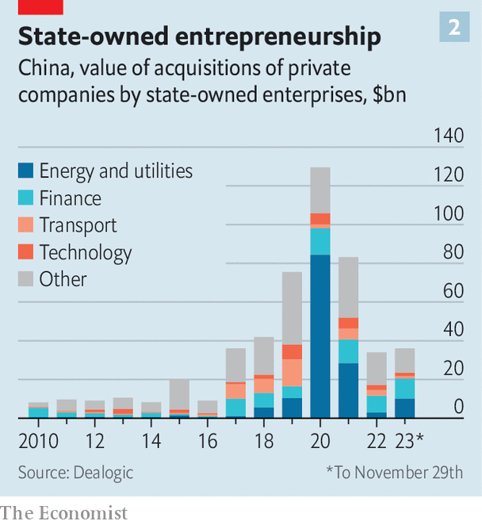

###### Blurred vision

# Xi Jinping’s grip on Chinese enterprise gets uncomfortably tight 

##### Welcome to the era of party-state capitalism 

 

> Nov 26th 2023 

AS THE HEAD office of Northern Heavy Industries (NHI) comes into view, so does a huge slogan fixed permanently to its roof in metre-high red Chinese characters, where you might usually see a company name. The 22-character mouthful reads: “Wave High the Great Banner of  Thought in the New Era of Socialism with Chinese Characteristics.” A billboard-sized image of Mr Xi, China’s leader, waves to visitors as they enter the lobby. In a nearby factory NHI’s tunnel-boring machines, used for digging metro lines, rise four storeys into the air. The company was founded by the state many decades ago. Today more than ever it embodies an archetypal image of a state-owned enterprise (SoE).

Except that on paper NHI is private. A company called Fangda Group, which is listed in Shenzhen and fully privately owned, took a 47% stake in NHI in 2019, in a rare instance of a private company bailing out a state one. This made Fangda by far the largest single shareholder. The deal should have privatised NHI. 

But in  nothing is so straightforward. Fangda is not the controlling shareholder. Executives say there isn’t one. Some staff in its factories call it a state firm; some say it is private. When asked about Fangda’s involvement in NHI, a manager says the investment was a “policy decision”. An investment adviser says that, for reasons he cannot divulge, investors should approach Fangda itself as if it had the backing of the state—even though the state does not feature in its shareholder register. Fangda’s website is covered in Communist Party imagery such as sickles and hammers. It describes its corporate mission as “listening to the party and following the party”. 

Chinese business has become much more professional in the past three decades. The country’s stockmarket is one of the world’s largest and has been opening up to Western investors. In futuristic industries like electric vehicles and green energy its firms lead the world. China’s digital economy has produced rare rivals to America’s internet giants. They and others have global ambitions and are backed by some of the world’s savviest asset managers.

Yet over the same period the lines between the state sector and private business have grown blurrier. Many global investors increasingly view China’s private sector as a captive of the Communist Party. So do Western politicians, who rail against firms such as Huawei and TikTok for their alleged links to the party (which the companies deny). A recent paper from the Centre for Strategic and International Studies, a think-tank in Washington, asks: “Can Chinese firms be truly private?” Monitoring state influence has thus become more important than ever. It has also become more difficult than at any time in the past.

One factor that has complicated matters is the central government’s policy that explicitly seeks to blend state and private interests. Launched in 2013, “mixed-ownership reform”, as it is known, has encouraged private investments in some state firms and vice versa. The philosophy behind the policy was to introduce private capital into clunky state enterprises.

 


Most of the investment since then, however, has flowed in the opposite direction. According to Fitch, a ratings agency, on average 50 state companies a year took the controlling rights of listed private business between 2019 and 2021, up from fewer than 20 in 2018. Privately owned firms’ share of market capitalisation among China’s 100 largest listed companies shrank from a peak of about 55% in mid-2021 to just 39% at the end of June this year, according to the Peterson Institute for International Economics (PIIE), another Washington think-tank (see chart 1). State enterprises may have spent around $390bn investing in private companies since 2018, according to data from Dealogic, a research firm (see chart 2).

 


Mixed-ownership reform may have helped some SoEs perform better. Several academic studies found that in its wake some firms saw improvements to innovation and the return on assets. However, the reform has also created a vast grey sector that has characteristics of both state and private companies. The rise of government-backed funds armed with $1trn in capital has injected state funding into many private technology companies, including plenty of promising startups. 

State investors have also been taking “golden shares”, tiny stakes that grant outsize voting powers, in China’s internet giants. In October it was revealed that a government agency had taken a 1% stake in a subsidiary belonging to Tencent, China’s mightiest internet titan.

In the red

With the exception of top executives and government officials no one really understands what golden shares do. Company spokespeople say they are harmless. Investors disagree. When earlier this year such an arrangement came to light at Tencent and Alibaba, another internet giant, their share prices sank. An investment manager in Hong Kong explains that the discount was the result of state links being associated with corporate and financial stability, not risky innovation and animal spirits. From the state’s perspective, he adds, rapid profit growth and high valuations could be perceived as dangerous if they take place in the wrong sectors.

Distinguishing between state and private companies is becoming more difficult because state influence over companies is no longer just tied to ownership, says Margaret Pearson of the University of Maryland, College Park. In “The State and Capitalism in China”, published in May, Ms Pearson and her co-authors say that China is moving from state capitalism, where business is guided by national interests, to “party-state capitalism”, in which it is organised around the interests of the Communist Party. 

Until the late 2000s how the party exercised its power over corporate management was mainly evident in its appointments of SoE bosses. That has changed significantly since Mr Xi became party chief in 2012. A sweeping anti-corruption campaign, followed by a crackdown on tech companies, has helped deflate and reshape China’s digital economy. 

Outspoken technology entrepreneurs have vanished. A handful of tech founders and other business leaders have stepped down. Alibaba is splitting itself into several companies. Tencent has shed tens of billions of dollars in assets. New Oriental, China’s most promising private-education business before the state snuffed out its entire industry almost overnight, has become an unglamorous online marketplace for agricultural and other products. Insiders argue about precisely how much direct influence the party had over such corporate decisions. Most agree that it is pleased with the outcome.

State support, implicit or explicit, can help businesses aligned to Mr Xi’s vision. A lot of innovation in green energy, electric vehicles, robotics and digitisation is done by private firms but bankrolled by the state. Many entrepreneurs report that life is good in those areas. In sensitive domains like generative artificial intelligence (AI), new services are developed hand in hand with the state. Private companies working on AI frequently consult regulators, who provide guidance for what development is and is not permissible. Rather than regarding such consultations as an obstacle to innovation, Chinese AI firms often see it as a fast track to success.

The party exercises control in subtler ways, too. One potent tool is its corporate “social credit” system. Launched not long after Mr Xi came to power, it rates companies based on factors including their legal and debt-payment record. Lauren Yu-Hsin Lin at the City University of Hong Kong and Curtis Milhaupt of Stanford Law School recently examined all publicly available scores in Zhejiang, a wealthy coastal province. They found that companies with more political connections had higher scores. Other than a company’s size, the variable most closely associated with a high score is having a director or a chief executive who has served in important government or party positions. 

Firms with high scores can be “red-listed”, or given preferential access to credit. Ending up on the system’s blacklist makes it exceedingly hard to get loans. This gives private firms a strong incentive to follow state policies even in the absence of direct state ownership. 

Cell-side analysts

Another way for the party to control businesses is through party committees, where employees who are party members meet to discuss ideology and its place in corporate life. These cells typically do not have any formal administrative clout. However, they can channel information about the company or its industry to regulators. This information may in turn shape local regulations, notes a banker. As with golden shares, the clearest impact that party committees have had so far is to breed distrust among foreign investors, and between foreign companies’ local subsidiaries and their headquarters.

Many of the changes in the private sector can be explained as an attempt on the part of entrepreneurs to balance commercial activity while also showing loyalty to the party and fulfilling political duties, says Huang Tianlei of PIIE. Showing loyalty does not necessarily make them less profit-seeking. They are simply trying to adapt to a political economy founded on the supremacy of the party. 

Still, the blurrier the line between the state and the private sector, the harder it becomes for entrepreneurs to strike a balance between party and profit. Ms Pearson and her co-authors find that private companies may not be “secure enough in their autonomy from the state to pursue their own interests with ease”. It is not just investors who find the system tiresomely muddled. The view from within is getting hazier, too. ■


