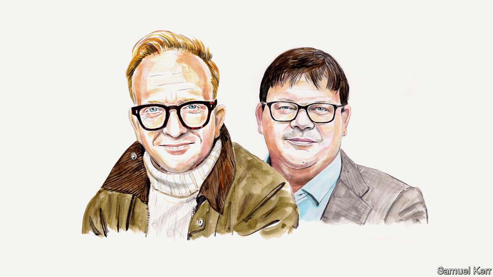

###### COP28: host of questions

# Rhys Davies and Ben Keith argue that the UAE is a tainted COP host 

##### The Gulf state’s human-rights record suggests it is no champion of open dialogue, say the two lawyers 

 

> Nov 27th 2023 

IN THE LANDSCAPE of international diplomacy, the choice of a host country for a global summit is often symbolic. As the world prepares to converge in the United Arab Emirates (UAE) for the COP28 climate conference, the decision to host such a pivotal event in the heart of the Middle East warrants scrutiny.

The UAE has sought to position itself as a beacon of modernity. Yet the decision to hold COP28 in the Gulf state is problematic. The UAE’s economy is heavily reliant on oil and gas, and it is one of the world’s highest per-person carbon emitters. The BBC has just reported on leaked documents that suggest the UAE was looking to use its position as host of the summit to negotiate bilateral fossil-fuel deals. (The UAE’s COP team did not deny this but said “private meetings are private”.)

Even setting aside concerns over the UAE’s commitment to the green transition, there is another reason to question its choice as host: the country’s record on human rights. The very essence of COP28 is to address the pressing challenges of climate change and it demands open dialogue, inclusivity and respect for fundamental rights. Holding the conference in a country where dissenting voices are often brutally silenced sends a conflicting message that is sure to undermine the credibility and efficacy of the summit’s outcomes.

In recent years the UAE has embarked on a strategic campaign to bolster its global image. Its foray into renewable-energy projects and its hosting of COP28 is an attempt at greenwashing, a bid to present itself as a leader in the fight against climate change. Likewise, its investments in European football clubs, its partnerships with global sporting icons and its hosting of impressive sporting events, including a Formula One grand prix, are emblematic of sportswashing. The aim? To polish the country’s image and shift the narrative. 

Similarly, the UAE’s investments in museums such as the Louvre Abu Dhabi and international film festivals are a form of culture-washing. By positioning itself as a patron of the arts and culture, the Gulf state crafts an image of sophistication and global cosmopolitanism. Yet, beneath these veneers, the pressing issues of human-rights violations and political suppression remain.

The UAE’s human-rights record is dreadful. Freedom of expression is severely curtailed. Dissent, whether in the form of online activism or peaceful protests, is met with unapologetic repression. The case of Ahmed Mansoor, a blogger and human-rights activist imprisoned since 2017 for his advocacy, illustrates a larger, systemic issue: the state’s intolerance of criticism.

Our work on human rights in the UAE has shown the dark underbelly of the regime. One of our clients, Ryan Cornelius, a British citizen, has been languishing in a Dubai prison for 15 years in a politically motivated case. A UN panel’s finding that he has been arbitrarily detained and demands for his release have fallen on deaf ears. Another client, Zack Shahin, an American, has also been caught in the dishonesty of the UAE’s judicial system—and the UN’s plea for his release has also been ignored.

The UAE’s geopolitical dance, especially its cosying up to Russia and its embracing of sanctions-busting, shows the Gulf state’s true colours. Can the world’s democracies, in good conscience, engage properly with a host country whose alliances raise questions about its commitment to global peace and co-operation?

The West’s engagement with the UAE is a reflection of the shifting networks of global power. Old hierarchies are being challenged and reshaped. COP28, in this context, is not just about environmental policies but also about recognising and navigating these evolving networks of influence. The UAE’s role as host is double-edged. On one hand, it offers the country an opportunity to showcase its advancements and commitment to sustainability. On the other, it rightly places its human-rights record under the global microscope.

The West often sees the UAE as an important ally in a troubled region, especially in terms of security and intelligence. However, diplomacy must be balanced with accountability; engagement should not be at the expense of turning a blind eye to its brutality. The COP28 summit presents a unique opportunity, not just to address the existential threat of climate change, but also to champion the universal values of human rights and justice. In a world in which democracy is increasingly under threat from populism and autocracy, this is all the more important.

As delegates gather in the UAE, the world must not be swayed by the country’s architectural marvels or its apparent environmental initiatives. Behind the gleaming façades lies a more complex narrative. The UAE’s leadership in hosting COP28 must properly be measured not by its hospitality or logistical prowess, but by its willingness to introspect, reform and align itself with the universal principles that democracies hold dear. The world watches, and it expects nothing less than genuine commitment and change.■


