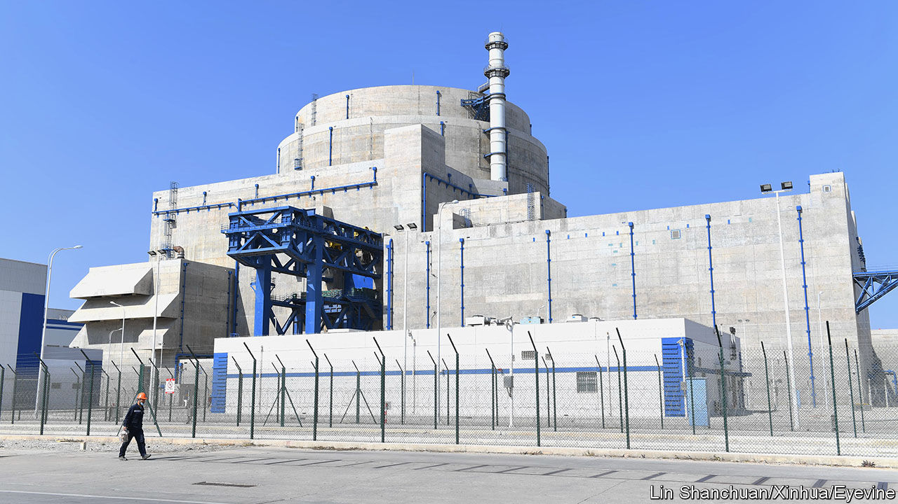
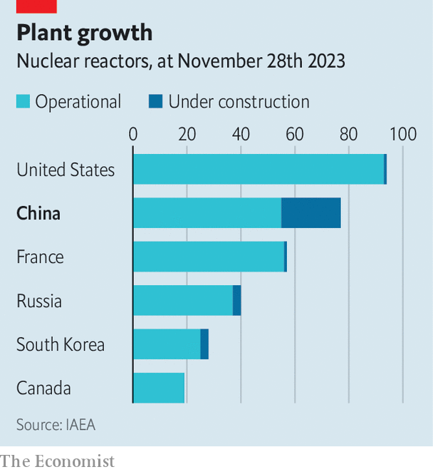

###### Going fission (and fusion)

# China is building nuclear reactors faster than any other country 

##### Can its scientists solve the fusion problem? 

 

> Nov 30th 2023 

TO WEAN THEIR country off imported oil and gas, and in the hope of retiring dirty coal-fired power stations, China’s leaders have poured money into wind and solar energy. But they are also turning to one of the most sustainable forms of non-renewable power. Over the past decade China has added 37 nuclear reactors, for a total of 55, according to the International Atomic Energy Agency, a UN body. During that same period America, which leads the world with 93 reactors, added two.

 


Facing an ever-growing demand for energy, China isn’t letting up. It aims to install between six and eight nuclear reactors each year. Some officials seem to think that target is low. The country’s nuclear regulator says China has the capacity to add between eight and ten per year. The State Council (China’s cabinet) approved the construction of ten in 2022. All in all, China has 22 nuclear reactors under construction, many more than any other country.

The growth of nuclear power has stalled in Western countries for a number of reasons. Reactors require a large upfront investment and take years to construct. The industry is heavily regulated. China, though, has smoothed the path for nuclear power by providing state-owned energy companies with cheap loans, as well as land and licences. Suppliers of nuclear energy are given subsidies known as feed-in tariffs. All of this has driven down the price of nuclear power in China to around $70 per megawatt-hour, compared with $105 in America and $160 in the European Union, according to the International Energy Agency, an official forecaster.

China is not immune to the safety concerns that have turned many in the West against nuclear power. After the disaster at Japan’s Fukushima Dai-ichi nuclear plant in 2011, China temporarily put its construction programme on hold. It has maintained a ban on inland nuclear plants, which have to use river water for cooling. Earlier this year China reacted angrily when Japan began releasing treated and totally harmless wastewater from the Fukushima plant into the ocean. In general, though, nuclear energy does not stir or divide the Chinese public the way it does people in other countries.

That’s good, because if China is to phase out coal and become carbon neutral by 2060, it will need an energy source that can help it reliably meet baseload demand (the minimum level of power required to keep things running). Wind and solar are less suited to this, as they depend on the co-operation of nature. But nuclear fits the bill. When it comes to energy generated, China’s nuclear stations outperform today’s installed solar capacity (though not wind). And most reactors are located on the coast, close to big population centres, unlike most wind and solar projects, which pose a challenge in terms of transferring the power they generate over long distances.

In the early days of its programme China imported its nuclear technology. It still must rely on other countries for the uranium that fuels reactors. But most of its new and planned reactors are based on Chinese designs, especially the Hualong One. Now it is keen to export such units (it has already made deals with Pakistan and Argentina). With much of its equipment sourced at home, China’s programme has not been hindered too much by the Biden administration’s export controls, which aim to cut off China from advanced technologies of American origin. 

Some of China’s scientists and engineers have been put to work on a new project—developing nuclear fusion. Fusion plants do not require uranium and produce much less radioactive waste than fission plants do. But the technology, which aims to mimic the sun’s internal workings to create an inexhaustible supply of energy, has proved elusive. 

Fusion reactors control plasma with superconducting magnets in a process called confinement. A Chinese reactor holds the record for the longest confinement at high temperatures: around 17 minutes. But the country’s scientists, , are confronting a problem of fundamental physics: holding plasma together at extreme temperatures for extended periods requires more energy than the reaction itself can produce. If China can solve that problem, it might hasten the end of dirty energy—for everybody. ■


