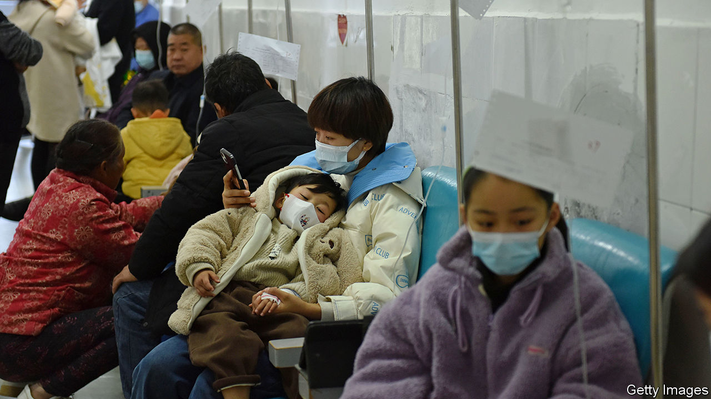

###### Not again

# China is struggling with a surge of respiratory ailments 

##### The stress on hospitals points to old problems 

 

> Nov 30th 2023 

On China’s fever-prone social media, netizens have been sweating with anxiety as hospital waiting rooms fill up. On November 29th a provincial newspaper posted a message on Weibo, a microblog service, describing an unnamed hospital in the north. The waiting area, it said, was filled with the sound of coughing and the crying of children. After receiving confirmation that her daughter had tested positive for a bacterium that can cause pneumonia, one woman, having waited hours, still had 300 people ahead of her in the queue for a consultation. 

The item rapidly became one of Weibo’s hottest-trending posts: its hashtag received tens of millions of views. It was quickly deleted. China’s censors apparently want to keep the temperature down. But in recent days similar stories have filled the internet. Some have included pictures of packed fever clinics and even of children doing their homework while hooked to intravenous drips. The covid-era custom of wearing masks in public had all but ended in China. Amid a recent surge of respiratory diseases, especially among children, it is making a comeback. 

On November 22nd the World Health Organisation (WHO) asked China for more details of the outbreaks, raising concerns all over. On the following day Chinese officials told the WHO that there was no new or unknown cause of these ailments. They said the infections were being caused by a range of familiar pathogens, such as the  bacterium, as well as adenovirus, covid-19, influenza, and respiratory syncytial virus, or RSV. The WHO said some of the increases were “earlier in the season than historically experienced, but not unexpected” given the lifting of covid controls, and were similar to patterns observed in other countries. It quoted the Chinese officials as saying that hospitals were not being overwhelmed. 

Drips all around

But it is clear that China’s health-care system still suffers from problems that make it prone to unusual stress. One is the weakness of primary health care. The number of general practitioners (GPs) has more than quadrupled since 2012, but there are still far fewer of them per person than there are in rich countries and they are often poorly trained. Many Chinese prefer to go straight to hospitals for diagnosis and treatment rather than consult a GP. This causes lengthy queues, especially at the best facilities. Another handicap is pressure on doctors to generate revenue. Ill-informed patients demand unnecessary treatments, which doctors are often willing to prescribe (such as intravenous infusions even for minor ailments).

China has stopped publishing regular statistics on covid vaccinations, but last year take-up was low among the elderly. Less than 4% of over-60s typically get a flu jab. So it will be a tough winter for China’s hospitals—and for the country’s most vulnerable people. ■


