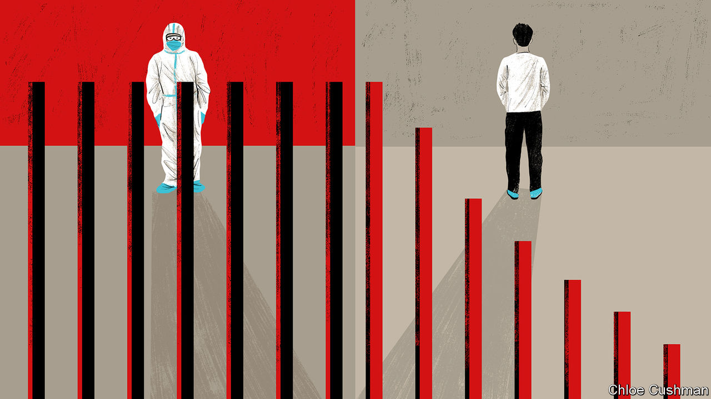

###### Chaguan

# China’s economy is suffering from long covid 

##### Revealing gloom on the streets of an ordinary Chinese city 

 

> Nov 30th 2023 

IF PLACES COULD be diagnosed with long covid, then Shangqiu—a sleepy city of 3.7m people, in central China’s wheat belt—would be a good candidate. A full year after the chaotic, ill-planned collapse of China’s “zero-covid” policies, evidence abounds of lingering harms done to Shangqiu’s economy, and to residents’ morale. 

Local finances were strained even before China began nearly three years of lockdowns and mass virus-testing drives. Shangqiu, in Henan province, is classed in the poorest third of Chinese cities, when ranked by income per person. Still, in the final, doomed months of China’s “all-out people’s war” on covid-19, city leaders spent lavishly on pandemic controls.

In May of last year Shangqiu built a 1,000-room quarantine hospital, at a cost of 135m yuan ($19m). This followed an injunction from central authorities to trace close contacts of infected people, take them from their homes and isolate them. Today that camp—a sprawling complex of modular cabins and testing huts in long rows—lies empty on the city’s eastern edge, surrounded by fields of winter wheat. Farmers have put its driveway to good use, at least, spotting a place to dry corn cobs for animal feed. City budgets remain in rough shape. In a stand-off with the government over funding, Shangqiu’s bus company threatened to halt services earlier this year, citing “very serious” pandemic-caused losses. 

Yet when Chaguan rode the train to Shangqiu on this first anniversary of zero-covid’s abandonment, he heard no demands to hold city leaders to account. Instead, residents shared anxieties about the economy and the future. Party leaders can take comfort that citizens of Shangqiu mostly endorsed the authorities’ stern handling of the pandemic—at least when talking to a foreign reporter. In contrast, leaders should worry about a crisis of confidence gripping China’s heartland.

During a recent lunchtime lots of restaurants in Shangqiu’s old town were empty, and many shops padlocked and closed. A wedding-dress rental business stood out for bustling activity. Watched by a yapping brown poodle, assistants crammed sequinned gowns into bags. The owner, a woman in her 30s sporting a school-uniform-style blazer and skirt, explained that business is good. Couples are rushing to hold wedding parties postponed by two and a half years of covid lockdowns. Unlike liberal-minded big cities, Shangqiu is a traditional place where marrying by the age of 25 is the norm, she added. Because the following day was auspicious in the lunar calendar, 20 weddings had been planned, each earning her shop as much as 4,000 yuan. Spending per wedding is down, though. The pandemic taught families to save for a rainy day. Even public-sector jobs are no haven, after city finances took a battering. The store-owner’s brother-in-law works for the police department. At the moment, his salary is always late, she reported. As a result, he is careful about spending, even once his salary arrives.

At a jewellers around the corner, a manager described an initial rush of consumption after China reopened a year ago. “We felt the economy coming back,” she recalled. But in recent months clients have stopped making discretionary purchases, buying only the “three gold items” that accompany a traditional Henan engagement: a ring, earrings and a necklace. Asked about zero-covid’s legacy, she replied: “It’s been a year now. We can’t let the pandemic take the blame all the time.” The next moment, though, she recalled lockdowns when “we could not make money.” That has left “common people” far more cautious about spending. It has also left them more anxious about their physical health, she ventured. She described a society waiting for “life to feel normal again”.

A backstreet education company in Shangqiu offers evening classes in book-keeping. Even though good jobs are hard to find at the moment, course enrolments are down by a third since last year, a tutor confided. Adult education is an aspirational business, with most clients inspired to “better themselves” after seeing friends succeed, she explained. Put another way, in bad times crises of confidence can feed on themselves.

In Shangqiu signs of a frozen property market are all around, from apartment complexes advertising unsold homes to construction sites devoid of activity. In a deserted shop selling household appliances, a lone worker explained that customers only come to buy necessities, such as a new kitchen exhaust hood. She bought her own flat ten years ago for 220,000 yuan. It is worth almost double that today. Yet prices are sliding, she added. 

All alone in a crowded country

Unusually, the electrical-goods seller challenged government accounts of the pandemic. She expressed bafflement that previously strict controls vanished in late 2022, and disputed the official line that by then the virus was mild and caused few deaths. “As a matter of fact, many people died, even some young people, not just old people,” she recalled. She remembers the pandemic as a frightening time, when incomes dried up, but people still had to make car-loan and mortgage payments. People have learned to save up in case a similar crisis returns: “You need to rely on yourself.”

To a car salesman in the city centre, the bursting of a “property bubble” is China’s main economic problem, and would have happened even without the pandemic. He described the four apartments he and his wife have bought since 2010, seeing property as a safe investment. In his telling, the pandemic was a reminder that incomes and house values are linked, and that prices cannot rise for ever. He worries that the government’s current, piecemeal measures to stimulate consumer demand will be ineffective.

Shangqiu’s public mood reveals a dilemma for China’s leader, Xi Jinping. An austere sort, he says that welfare safety-nets encourage laziness. When hard times strike, including during the pandemic, he scolds the masses to behave responsibly. Ordinary Chinese have paid heed. Seeing a world of unforeseeable risks, they are responding defensively. Covid’s legacy will be long. ■


