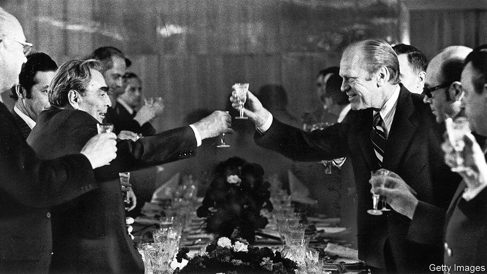

###### World in a dish

# In Russia’s arsenal the knife and fork have been powerful weapons 

##### So argues a new book about the country’s gastro-diplomacy 

 

> Nov 28th 2023 

JOSEF STALIN understood the power of feasts. His chefs created sumptuous spreads which were designed to intimidate his guests. Witold Szablowski, a Polish author, suggests that when Stalin hosted Allied leaders for the Yalta conference in 1945, buckets of caviar and Crimean champagne helped him secure territorial concessions in eastern Europe.

Mr Szablowski argues that Soviet and Russian rulers have long fought with knives and forks. “What’s Cooking in the Kremlin”, his book, looks at their gastro-diplomacy. State dinners reached an apogee under Leonid Brezhnev (pictured left) in the 1970s. One chef recalls a roasted pheasant, perched on a pedestal of bread and decked with its own feathers. 

At a meeting with  in 1986, Richard Nixon was so impressed that he had photos taken of every dish.  was known for her picky eating, but even she called for seconds—then thirds, then fourths—of fresh blinis.

Ironically, those who presided over these displays could be alienated by their lavishness. Viktor Belyaev, one of the Kremlin’s longtime chefs, says Brezhnev preferred familiar fare. When he returned home from banquets, he would ask for fried potatoes with soured milk. 

Mr Szablowski argues that cooks are adept observers of human nature; that may be why , the personal chefs to Soviet leaders, were part of the KGB. (Spiridon Putin, Vladimir Putin’s grandfather, catered to Lenin and  and was probably part of the secret police.) The vignettes in this book reveal a different side to political figures and thereby dent the image they cultivate. It is hard, for instance, to see Mr Putin in the same way after hearing of his childlike obsession with ice-cream. 

“What’s Cooking in the Kremlin” also chronicles how food has shaped ordinary people’s lives. Mr Szablowski speaks to women who worked in canteens in Chernobyl’s exclusion zone and gave chocolate to soldiers afflicted by radiation poisoning. More recently, during the siege of the  in eastern Ukraine, a woman called Natalya spent weeks feeding the fighters in underground tunnels. Each tale in the book is accompanied by a recipe. Here Natalya calls for one or two cans of Spam, cooked in 30 litres of water collected from the plant’s industrial tanks. 

The darkest section of the book covers the, when Stalin destroyed Ukrainian agriculture, causing millions of deaths (and crushing a restive region). Hanna Basaraba was six years old when the happened. “I remember being hungry non-stop,” she recalls. She ate tree bark and rotten potatoes; others boiled linen clothing to make soup. One of Ms Basaraba’s neighbours was driven to madness and was believed to have eaten her own children.

Nine decades later, Ukrainians are by a tyrant in Moscow. As well as dropping bombs, Mr Putin has  via the Black Sea in order to wreck the country’s economy. Like Stalin, he is ruthless enough to use food as a weapon. ■


