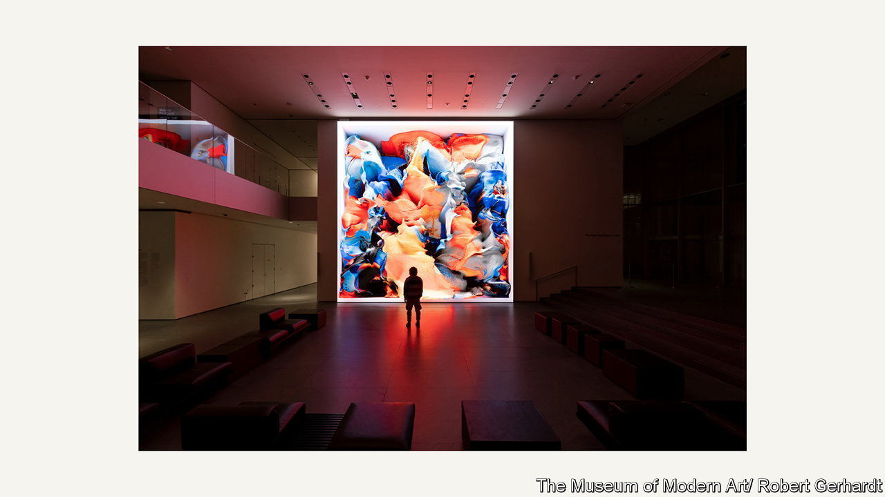

###### Digital art

# Museums are learning to love NFTs 

##### August institutions are adding tokenised artworks to their collections. Why? 

 

> Nov 30th 2023 

DECEMBER 4TH marks an unhappy anniversary in the art world. Two years ago Pak, an anonymous artist, sold “Merge”—a single artwork made up of thousands of parts—for a combined total of $92m, a record for a living artist. It was the height of the mania for  (NFTs).

The fall that followed was dramatic. Today NFTs are as unfashionable as elbow patches or frosted lipstick. According to NFT18, an analytics firm, in October NFT art sales amounted to $21.7m, down 99% from the peak of $2.7bn in January 2021. Many of those who bought them have written them off or are trying to offload them. A website has even been set up to help collectors deduct these losses from their tax bills: unsellablenfts.com. 

Some art-world insiders have welcomed the . But the boom still left its mark on the industry. Major art museums are now beginning to acquire nft-based, or “tokenised”, artworks, even though they have lost their pandemic-era shine. Digital art, once on the fringes of the art world, is now being seen by more people.

Artists have been making art with and about computers since the 1960s. It rarely received as much attention as painting or sculpture—until , a digital mosaic by Beeple, made up of 5,000 images, went for $69m at Christie’s. “Literally overnight the entire world [was] talking about digital art,” says Steven Sacks of the bitforms gallery in New York. 

Not all digital artworks are nfts, and nfts are not artworks in and of themselves. An NFT is more like a : a tool for creating a unique version of an easily replicated digital asset. By creating an NFT, an artist establishes “digital scarcity” and hence value. 

There has been a conflation of the “certificate of authenticity and the art itself”, says Christiane Paul, the Whitney Museum’s curator of digital art. The NFT bubble led to a “radical misunderstanding about what digital art is”. (The term encompasses everything from iPhone doodles to complex computer-generated video.)

But as museums seek both to capture the zeitgeist and to appeal to new segments of the public, NFTs and digital art are making their way into museums’ collections. The Whitney, which first acquired an NFT in 2018, now owns 30 (two were donations). In the past year the Los Angeles County Museum of Art, the Pompidou Centre and the San Francisco Museum of Modern Art have acquired NFTs. 

In October the Museum of Modern Art in New York (MoMA), perhaps the most important contemporary-art institution, accepted the donation of two NFT-based works. The first, “Unsupervised” by Refik Anadol, features churning animations generated by a machine-learning model—one trained on data from MoMA’s collection. The other, “3FACE” by Ian Cheng, is a kind of “personality test” for the collector: an algorithm generates a cartoonish visual representation of their crypto wallet. 

Both works are part of MoMA’s effort to enhance its digital offerings. (Last year the museum controversially sold some $70m of art from its collection to finance digital projects and acquisitions.) Mr Anadol’s piece was given pride of place at MoMA and proved very popular with the public, says Michelle Kuo, one of the curators of painting and sculpture. But the work has not won over critics, who have called it “an extremely intelligent lava lamp” and a “pointless museum mediocrity”. 

Some curators have pointedly kept their distance from nfts. One museum director in Texas was offered NFTs by a donor (perhaps one in search of a tax write-off): he asked, “Can I sell them and buy real art?” In the end, the museum declined the donation altogether. 

Yet the real cultural legacy of the NFT boom is that it brought digital art into the public eye. It “opened up the gallery doors for digital artists”, says Zachary Small, the author of “Token Supremacy”, a forthcoming book. Serious work from the “NFT internet culture” will succeed in the traditional art world, predicts Jeffrey Deitch, an American gallerist. 

In time the digital art market may come to resemble the analogue one: full of gate-keepers. Curators and gallerists will have to sort through reams of rubbish on OpenSea, an NFT marketplace; an artwork’s value will be determined less by the health of a certain cryptocurrency and more by critical consensus.

Can collectors’ trust be regained? Auction houses including Christie’s and Sotheby’s insist sales of digital artwork continue to grow, even if prices are down. Digital art accounts for 3% of high-net-worth buyers’ spending and 8% of their collections, according to data collected by Art Basel: down by half from last year, but up from before the boom. Spending was highest among Gen-Z collectors, suggesting that youngsters may drive this trend forward. 

The art world is currently “in the stone age of the virtual turn”, says Daniel Birnbaum, director of Acute Art and a former curator of the Venice Biennale. Some hope this is like the dotcom bubble before it. That would make the NFT moment not the end of something, but the beginning. ■


