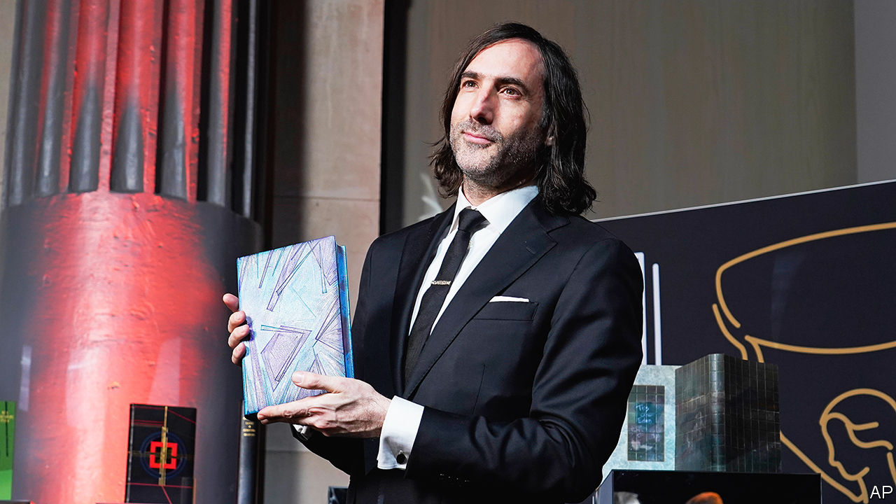

###### Pressing up

# Small publishers are sweeping the Booker and Nobel prizes 

##### Independent companies are outclassing their bigger rivals 

 

> Nov 27th 2023 

In recent years the judges of the Booker prize, Britain’s most prestigious literary award, have opted for sombre novels about apartheid, civil war and poverty. The winner for 2023 is, once again, not the sort of jolly yarn that will provide relief from the news. “Prophet Song” imagines Ireland’s descent into totalitarianism. Paul Lynch, the author (pictured), has said he was “trying to see into the modern chaos”.

But the book’s triumph tells a rosier story about the publishing industry. Oneworld, which published it in Britain, employs 25 people and is led by Novin Doostdar and Juliet Mabey, a husband-and-wife team. In addition to this year’s prize, the independent firm published Booker winners in 2015 (by ) and 2016 (Paul Beatty). In America “Prophet Song” is published by Grove Atlantic, another independent, with a staff of 30.

These houses are tiny compared with the juggernauts that dominate the book trade. The world’s largest publisher, Penguin Random House (PRH), employs 10,000 people. PRH, along with HarperCollins, Hachette and Macmillan—known as the “Big Four”—account for 51% of sales in Britain. In America the picture is similar: the “Big Five” (the same group, plus Simon &amp; Schuster) dominate the market, with 60% of sales. 

But a large staff and large budgets do not always translate into quality. When it comes to the world’s most important literary prizes, small publishers are outperforming bigger ones. Last year’s Booker prize went to  by Shehan Karunatilaka, which had been rejected by larger publishers before being issued by Sort of Books in Britain and W.W. Norton in America. American indies also published Booker prizewinners in 2019, 2020 and 2021. 

Independently published books have done particularly well with the . This year’s laureate, Jon Fosse, is published in America by Transit Books, a minuscule outfit. (Its headquarters are the publishers’ home, making it literally a “publishing house”.) Last year’s Nobelist, , is published by Seven Stories in America, which has a dozen full-time employees. Mr Fosse and Ms Ernaux are both published in Britain by Fitzcarraldo Editions, perhaps the pre-eminent small press, which has issued books by four of the past nine Nobel laureates. Its team is made up of seven people.

What is the secret to big success for small presses? Nothing new, the editors say, but rather something as old as the book trade: picking worthy titles, editing them carefully and promoting them well. It often comes down to money—in particular, not thinking too much about it. 

Big publishers have to produce quarterly profits for shareholders, which means they need  that will reliably sell. (That means celebrity memoirs, pulpy romance novels and predictable action thrillers.) They strive to post ever higher returns: in 2021 Simon &amp; Schuster boasted a 21.4% profit margin. 

By contrast, independent houses say they are satisfied with profit margins of around 3%. Financial considerations are “only one of the factors involved in selecting books”, says Morgan Entrekin of Grove Atlantic. He describes his firm—whose rich back catalogue includes works by  and Jack Kerouac, among others—as a “not for loss” business. 

Oneworld can “afford to go out on a limb for something”, says Ms Mabey, and the approach “has paid off for me many times over”. Good books, if they are taught in schools, can sell for years and make a profit in the long term. Prizes provide another lift. “The Seven Moons of Maali Almeida” has sold roughly 20 times more copies than Mr Karunatilaka’s other novel.

Indie companies are willing to take chances on authors whom bigger publishers consider too risky. Mr Entrekin bought the American rights for Bernardine Evaristo’s “Girl, Woman, Other” after corporate publishers dropped the mid-career novelist. (It  in 2019.) Independents are also willing to stick with authors who may be writing well but selling modestly, publishing the third and fourth novels that may lead, as in Mr Lynch’s case, to a prizewinning fifth. 

Publishing is, by its nature, a gamble. The recent renaissance of independent presses may fade with the changing tastes of prize committees or the fickle fancies of readers. “Sometimes you catch a thermal,” Ms Mabey says, and a book soars. “Sometimes you don’t.” But small publishers can adapt to changing winds. And with another Booker in the bag, Oneworld, like so many of its peers, is flying high. ■


