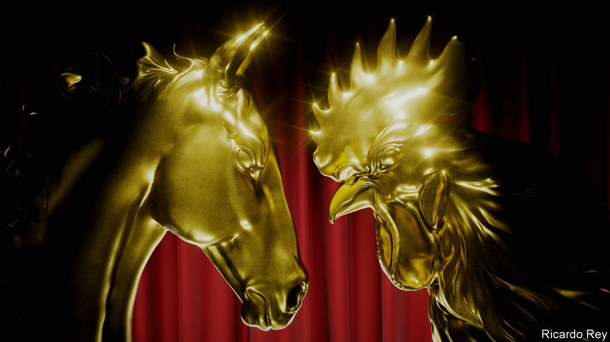

###### Film-making in China

# Two film awards reveal the battle for the future of Chinese cinema 

##### The Golden Horse and the Golden Rooster illustrate the divide between independent and mainstream film-making 

 

> Nov 29th 2023 

ON THE FACE of it, the Golden Horse and the Golden Rooster awards ceremonies are remarkably similar events. Both are glitzy and take place in November. Both celebrate the year’s best Chinese-language films. Both give out golden animal figurines to the winners. 

But a closer look exposes a chasm between them. The Golden Rooster awards, hosted in Xiamen, a port city in south-east China, on November 4th, featured mainland Chinese films approved by Communist Party . Most were big-budget blockbusters and heavy on special effects, handsome heroes and nationalism. 

The Golden Horse awards, meanwhile, took place in Taipei on November 25th. Nominated films came from mainland China, Hong Kong, Malaysia, Singapore and Taiwan. Many were thoughtful art-house films, suffused with social criticism. None of the nominated films applied for the  of Chinese state approval, meaning they will never be released in cinemas on the mainland.

The twin events reflect the bifurcation of Chinese cinema. The Communist Party wants to use film as an ideological tool: it has tightened its control over the country’s movie industry, demanding that storytellers “eulogise the party, the motherland, the people”. Films must be made with “ethics and warmth” and offer a “trustworthy, lovable and respectable image of China”. 

In short, the party wants more movies like “Creation of the Gods I: Kingdom of Storms”, the winner of the Golden Rooster for Best Feature Film this year. The fantasy epic dramatises the battles of kings and spirits in ancient China. State-affiliated film groups say it is an example of how movies can promote cultural self-confidence in line with Xi Jinping Thought, the philosophy of China’s leader, which  is required to study.

In Taiwan, the Golden Horse awards and the accompanying festival celebrate cinema as a tool for free expression. Founded in 1962, the event is widely referred to as the “Chinese Oscars”. It has become a refuge for independent Chinese film-makers who have no interest in hewing to the demands of censors.

For decades the Golden Horse attracted stars from both sides of the Taiwan Strait. Then in 2018, Fu Yue, a director, used an acceptance speech to declare her hopes for Taiwan’s formal independence. The following year, China’s film administration banned mainland movies from competing. Officials gave no clear reason why, though the announcement came as cross-strait . The government has vigorously tried to persuade film-makers that the Golden Rooster is more prestigious.

Such efforts have not succeeded. Only 179 films entered the Golden Rooster awards this year, compared with 552 submissions for the Golden Horse—including 210 submissions from mainland China, Hong Kong and Macau, according to Wen Tien-hsiang, head of the Golden Horse executive committee. Mainland films remain welcome at the Golden Horse awards, Mr Wen says: submissions can come from anywhere so long as the film’s cast and language are predominantly Chinese. “If you want to come, if you dare to, then come,” he says. “We will give you a fair chance.”

Despite the Communist Party’s disapproval, mainland films have continued to enter the Golden Horse awards. To avoid punishment back home, the film-makers often register their work as non-Chinese. The top prize this year went to “Stonewalling”, which entered as a Japanese film, even though its cast and most of its crew are from mainland China and the story is set there. 

The film’s directors, Huang Ji and Otsuka Ryuji, are a married couple from China and Japan respectively. Their aim is to chronicle the experiences of the most vulnerable people in China, particularly rural women and children. “Stonewalling” is the third part of a trilogy following Lynn (Yao Honggui), first as a youngster in rural Hunan province, then attending high school, then moving to the city. In “Stonewalling” she is pregnant and desperate for money.

The films are semi-autobiographical, Ms Huang says. Her parents play the main character’s parents; many of the scenes are shot in the clinic that they run in real life. This points to Ms Huang’s and Mr Otsuka’s resourcefulness—as well as to the logistical difficulty of independent film-making in China. “Any creator who wants to make something close to reality will meet all kinds of obstacles,” says Ms Huang. “We decided not to be bothered by them.”

In the past, indie films made without state approval could be shown only at private screenings within China and at international festivals. But in 2016 China passed a new law requiring all films to obtain permits, regardless of whether their makers planned to distribute them abroad, in Chinese cinemas or online. Anyone involved in producing a film without a permit could be fined and banned from the industry. That has made it much harder for independent film-makers to find actors, crew and financial backers.

As a result, most of China’s top actors, directors and producers have chosen the more straightforward option. Many are prepared to self-censor, or to lend their talents to the party’s propaganda efforts, if it means their work gets a nationwide release. The Chinese film market is more than 20 times the size of Taiwan’s. 

This year’s Golden Rooster nominees included superstars such as Tony Leung and Wang Yibo. Among the feted movies were, a film about the Chinese air force; “Hidden Blade”, a spy thriller about undercover Communist Party agents in Japanese-occupied Shanghai; and “The Wandering Earth 2”, a sci-fi epic following Chinese astronauts and scientists.

Many of these “main-melody” films, as China’s patriotic movies are nicknamed, are impressive spectacles; some even manage to produce genuinely moving moments. This kind of fare is , too. But that is in part because Chinese audiences have limited options, says Zhang Zanbo, a director who can no longer make films in China after criticising the Golden Horse moratorium. “If you get used to eating junk food fried in gutter oil, you don’t know what real delicacies are like,” he says. 

Tastier morsels are on offer at the Golden Horse awards, at least. Its nominees included “Time Still Turns the Pages”, a drama from Hong Kong about student suicides; “Eye of the Storm”, a Taiwanese thriller about the SARS outbreak; and “Snow in Midsummer”, a co-production by Malaysian, Singaporean and Taiwanese film-makers about the Malaysian riots of 1969. Most of these films will not be released in China. Their audience, and their profits, will probably be small. 

Yet to many, the most important thing is that the Golden Horse remains a beacon of creative freedom. When the awards began, Taiwan was governed by martial law. Its films were also rigorously censored and ordered to promote “healthy realism” and patriotic ideas, says Mr Wen of the executive committee. Only after Taiwan’s democratisation in the 1980s and 1990s did storytelling become untrammelled. 

For film buffs, that history is instructive. Politics may “divide people by their identities and constantly draw lines between them. But films can break through that,” Mr Wen says. “As for what we cannot break though right now, we will wait.” ■


