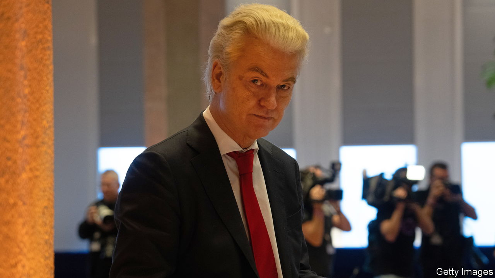

###### Where there’s a Wil Ders a way

# Geert Wilders struggles towards power in the Netherlands 

##### Other parties are reluctant to join a government with the anti-Muslim populist 

 

> Nov 30th 2023 

THE DUTCH election on November 22nd appeared straightforward: a win for the xenophobic right, with the anti-Muslim Party for Freedom (PVV) of Geert Wilders in the lead. In his newspaper column last week, Ronald Plasterk, a former Labour minister who has turned right, said a government of the PVV and three less radical parties should be simple. It is not, as Mr Plasterk is discovering. The PVV picked him as the , who sounds out the parties, after its first choice quit over a corruption scandal. It turns out that forming a government including Mr Wilders, long shunned by other parties, is far from easy.

 


Mr Wilders’s preferred partners are the centre-right Liberals (VVD), whom he has been lambasting for the 13 years they have been in power. But Dilan Yesilgoz, the VVD’s new leader, says it will not join the cabinet; after losing ten seats it should leave government for a while. She would, though, back a right-wing government in a confidence-and-supply deal. A smaller party, the populist Farmer Citizen Movement (BBB), is keener to join.

But one party Mr Wilders needs is not on board. New Social Contract (NSC) is a brand-new outfit set up by Pieter Omtzigt, a former Christian Democrat and a stickler for the rule of law. During the campaign he ruled out a coalition with the PVV, whose plans for banning mosques and so on violate the constitution. Mr Wilders says he will park those, but that is not enough for Mr Omtzigt. He refuses to negotiate with the PVV unless it scraps the unconstitutional bits of its manifesto and promises to stay in the EU, honour treaties, aid Ukraine and fight climate change.

Even if Mr Wilders can satisfy Mr Omtzigt, a minority government without the VVD would need ministers from the untested PVV, NSC and BBB, which would struggle to find good ones—as the corruption scandal showed. In the Netherlands MPs must quit parliament to become ministers, which the PVV can ill afford: it could barely fill the seats it won (the new MPs include a metalworker and a pancake-kiosk owner). Such a government would lack a majority in the Senate, which can veto legislation.

Leftists staged protest marches against Mr Wilders’s win, but uncertainty over a coalition has muted their reaction. Some like the PVV’s economic agenda, which makes vague promises of more housing and cheaper health care. Many Dutch Muslims count on the constitution and a strong judiciary to protect them. Such complacency is risky: as Poland, Hungary and America show, populists relish battles with the courts. “We should not just assume that the universal populist playbook does not apply in the Netherlands,” says John Morijn, a rule-of-law expert at the University of Groningen.

Ms Yesilgoz’s vow not to join a government may be just “a typical negotiating tactic”, says Kay van de Linde, a political analyst. “She’s hoping Wilders will beg her.” Mr Wilders could let another party provide the prime minister; all four parties want a tougher line on migration. He may yet give the Dutch their most right-wing government ever. But it now looks less likely: the Muslim-bashing, Eurosceptic populist would have to change his stripes. ■

