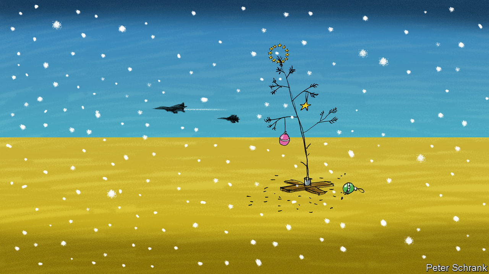

###### Charlemagne

# How a sombre mood gripped Europe 

##### Support to Ukraine is less assured than it once was 

 

> Nov 30th 2023 

The festive season is upon us, and with it some enduring European traditions: twinkly Christmas markets have sprung up across Germany; the Dutch will soon inexplicably parade themselves daubed in blackface; and in Hungary Viktor Orban, the prime minister, is once more plotting to spoil the mood at an end-of-year summit of EU leaders. Getting through December is never easy in Brussels, a place where thorny decisions are ritually pushed back to the last possible moment (the endless rain does not help). Alas, 2023 looks unlikely to end on a high. Not only is the Hungarian euro-Grinch at his most cantankerous, he may soon have a new ally on the hard right after Geert Wilders came top in the Dutch election on November 22nd. To make matters worse, a budget mess-up in Germany is threatening havoc with the EU’s already-strained finances. A summit on December 14th and 15th was meant to succour Ukraine with money and the prospect of accession to the club. Now the prospects for both look wobbly.

A gloom has enveloped Europe in recent weeks. As summer turned to autumn, it became increasingly clear that the Ukrainian counter-offensive many hoped would bring Russia to its senses had fizzled. Having been united on Ukraine (bar Mr Orban), in October the EU fell into division and irrelevance as war broke out in the Middle East. Faster than you can say “Ho! Ho! Ho!” the prospect of Donald Trump returning to power in America has gone from a can-you-imagine-if to a what-should-we-do-when scenario.

Europe did at least go into this geopolitical funk with a clear plan to fulfil its duty when it came to Ukraine. While America had done the heavy lifting on providing military aid, especially early on, the EU could pride itself on having helped in softer ways. Beyond hosting millions of refugees since 2022, Europe’s main contribution has been to underwrite Ukraine’s future. For that to be credible there was to be money; some €50bn ($55bn) of EU cash was pledged in June, to help keep the government in Kyiv solvent until the end of 2027. Most importantly, Ukraine would one day get to become a member of the club, a sure way for it to prosper after the war and thus stay out of a revanchist Russia’s clutches. The summit in December was to consecrate progress on both. As well as signing off on the money, Ukraine was to move to the next step of EU accession, that of starting formal negotiations (eight smaller countries, including six in the Western Balkans, are also in this years-long process). Depending on whom you speak to, both the cash and enlargement could be delayed, if not worse. 

Start with the money. Mr Orban has telegraphed for months he is opposed to sending more cash to Ukraine—a problem, since the decision requires the unanimous assent of the EU’s 27 members. His enduring willingness to see things from the Kremlin’s point of view is one factor. Another is that Brussels has for years frozen Hungary out of some EU spending programmes on the grounds that it is flouting democratic norms such as an independent judiciary. For months the EU has assumed it could unlock the situation in a time-tested way, ie, by giving in to Mr Orban’s blackmail, at least in part. The prospect of at least some of the over €30bn in suspended funds being released soon was thought likely to bend Hungary’s leader to the EU’s will, as has happened when he has threatened vetoes in the past, for example over sanctions. 

A slug of cash may not be enough this time. For one thing, Mr Orban feels vindicated and is said to be determined to make his point that the EU should have listened to him when he warned it was being drawn into a long conflict. But another spanner in the works has come from Germany. On November 15th its constitutional court ruled that various off-balance-sheet funds the government had used to get around a self-imposed “debt brake” were unconstitutional. A hasty rejig of its domestic finances is on the cards. That in turn puts into jeopardy a planned overall increase in the EU budget of which the funding to Ukraine had been a part. While everyone bar Mr Orban is happy for money to be sent Kyiv’s way, there is no consensus on a separate €50bn requested by the European Commission to pay for other stuff, such as inflation-busting Brussels staff salaries, new schemes to throttle migration and so on. Scrooge-minded governments such as the Dutch or Swedish ones have lobbied against the extra money; Germany was also sceptical, now it says its hands are tied. Separating Ukraine’s €50bn from the remaining €50bn could be tricky politically, making a deal on the whole package even harder by the year’s end.

Advent of nothing good

That Ukraine will eventually get its cash is not in much doubt. But the funds could arrive late—perilously close to when the authorities in Kyiv will run short of cash in early 2024—or in ad hoc instalments. That would dent the EU’s credibility. This would especially be the case if the start of accession talks is also delayed. Ukraine has met (with caveats) all the requirements to get to the next stage of its EU journey. That is not enough for the veto-wielding Hungarians. Mr Wilders, whose MPs will take up seats in parliament next week, is an avowed critic of enlargement. Delaying the start of accession talks until spring, as some think may now happen, arguably matters little, given that joining the EU takes years. But if Ukraine cannot sail through the process’s early throes, that bodes ill for its difficult later stages, which will involve convincing existing EU members that lots of money they currently receive should go to building motorways and enriching farmers in Ukraine instead.

What the twin squabbles over money and enlargement amount to is a loss of momentum. The unity that allowed Europe to stand tall in the early days of the conflict is not quite as assured as it once was. Given that America’s continued support is itself uncertain, it is a bad time for Europe to lose its nerve. The stakes are so high that optimists think an EU deal is inevitable. Hopefully they are right. For if Europe cannot find the will for Ukraine to thrive, it will be a far jollier Christmas in the Kremlin than in Kyiv. ■


