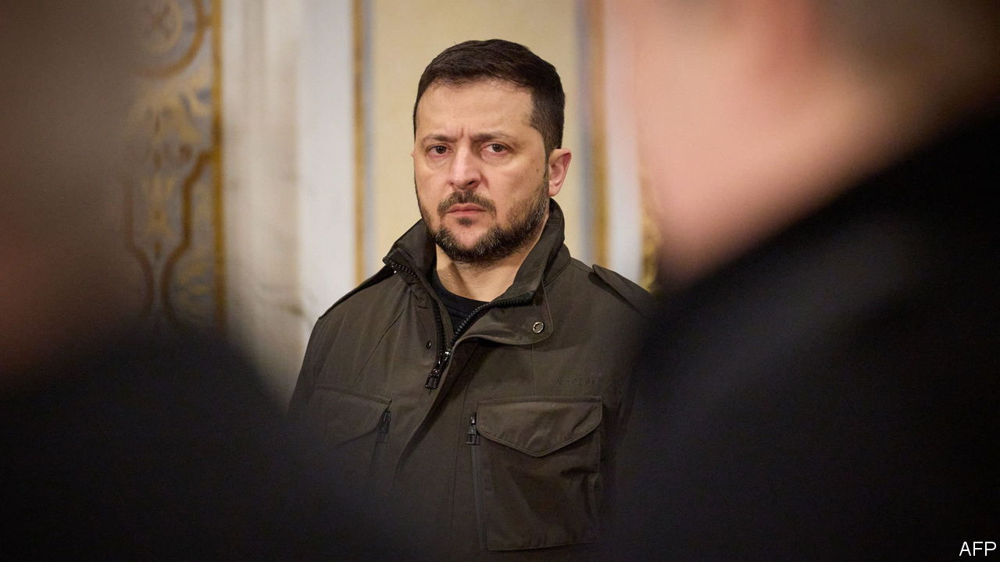

###### Bulldogs of war

# Russia is poised to take advantage of political splits in Ukraine 

##### Politics has returned, but the fighting has gone nowhere 

 

> Nov 28th 2023 

AN OFFER TO become culture minister should have been a no-brainer. As head of Ukraine’s Institute of National Memory, Anton Drobovych had the background. And for many of the previous months, he’d been stuck fighting in the most dangerous operations of Ukraine’s counter-offensive in the Zaporizhia region, or recuperating from serious injuries in hospital. Mr Drobovych did not reject the proposal outright; but his understanding of the political scene in Kyiv was enough to sow doubts. Could he survive re-emerging ideological tussles, briefings and bureaucratic battles? No, he resolved to return to the ranks of his assault-forces unit. “I decided I had more important work on the front lines.”

Mr Droboych is one of a number of Ukrainians straddling two increasingly distinct worlds: the grim reality of a ; and an ever more waspish political battleground in Kyiv. When Russia began its invasion in February 2022, competitive politics went into hibernation. They returned as the existential threat to Ukraine decreased later that year. Yaroslav Zhelezhnyak, an opposition MP, says there is still “broad agreement” on fundamental matters of national security. But a prominent MP in the president’s own party says jostling has already made Ukraine “unstable”. Mistakes are being made “on all sides”. And presidential attempts to “centralise decision-making” and “shut down dissent” are having the opposite effect. 


Cracks have emerged not only along political lines but, most worryingly, between the military and political leadership. Relations between President Volodymyr Zelensky and his commander-in-chief, Valery Zaluzhny, are understood to be terrible. The differences of opinion were first reported in summer last year. A recent  by  with the general, in which he declared that Ukraine’s war had reached a stalemate, brought that problem into the open. Mr Zelensky publicly rebuked his general for the headlines. In a later interview he appeared to warn Mr Zaluzhny to stick to military affairs rather than “do politics.” 

A senior government source suggests the open conflict in the leadership was a “predictable” result of a  that had “not gone to plan”. The official says Mr Zaluzhny was possibly unwise to contradict the more optimistic public positions of his president, but few inside the government could quibble with his sober conclusions. A blame game is now under way about who is responsible for the failure. “The politicians are saying their generals are Soviet-trained twits. And the generals are saying the politicians are interfering twits. Victory has many fathers, but no one wants to parent a stalemate.”

Another factor at play is a reported criminal investigation into the defence of southern Ukraine. This was the one area where Russian forces were able to establish a quick and hugely important victory in February and March of 2022, creating a new land corridor to Crimea in a few weeks. Ukrainian turncoats assisted the advance. Bridges were not blown up as they should have been. The army was also ill prepared. Mr Zaluzhny is, say some reports, currently named only as a witness to the probe; but that may change into something more serious. Allies say the possibility of a criminal charge is designed to keep him in line. His media engagement could be seen as an insurance policy, a general-staff source suggests. 

Mr Zaluzhny has not declared any political ambitions, and his few steps into the political arena have been anything but deft. That does not mean he poses no threat to Mr Zelensky. The president, a comic performer as recently as 2019, knows how quickly Ukrainian society can make and break its leaders. Internal polling seen by suggests the president, once lauded for his role in defending the country, has been tarnished by corruption scandals in his government and by concern over the direction of the country. The figures, which date from mid-November, show trust in the president has fallen to a net +32%, less than half that of the still-revered General Mr Zaluzhny (+70%). Ukraine’s spychief, Kyrylo Budanov, also has better ratings than the president (+45%).

The same polling suggests Mr Zelensky risks losing a presidential election were he ever to go head to head with his commander-in-chief. Ukrainian society would probably not welcome any unprovoked challenge. For now, eight out of ten Ukrainians are against the very idea of holding elections, originally due next March. The president has also ruled them out, citing martial law. But the downward drift of his ratings may yet persuade him to change his mind. Russian propaganda will doubtless make hay if the elections do not take place.

Ukrainian intelligence sources say Russia is already trying to capitalise on the ambitions and tensions. Andriy Cherniak, a spokesman for HUR, the military-intelligence agency, claimed evidence that showed new Russian strategies for different constituencies: one to shore up support in Russia; another to undermine confidence in the West; and a third to amplify grievances in Ukraine. There is a separate disinformation campaign for Ukrainian soldiers, he says, with deep-fake videos purporting to show commanders of various levels encouraging their subordinates to surrender. “Russia has not been able to do what they need to do on the battlefield, but they are having real success here.” 

The senior government source suggests Russian propaganda has gained traction because it has material to play with. There is corruption, he admits. Management is often ineffective. Ukraine has not put its economy on enough of a war footing. But only Russia stands to gain if the president were forced out. “Some of our politicians don’t worry enough about the Russian threat, and it makes me angry. They think they can challenge for power, destroy Zelensky, and it will be of no consequence.” The security services had effectively eliminated most levers of Russian influence since the start of the war, he added. The most effective levers were now “Ukrainians themselves”.

On the front lines, Russia is enjoying a relatively good period of the war. It is satisfying much of its manpower needs by recruiting from the poor and prisons; a convicted cannibal was recently pardoned to fight. Ukraine, in contrast, is struggling to mobilise from the general population. Army bosses are recruiting at a level that just about covers natural losses on the frontline. But if the majority of those mobilised at the start of the war knew what they were fighting for, few of the new recruits are as willing, and filling the recruitment quotas is getting harder. Political tensions are unlikely to help that process.

Doubts at home and abroad about the direction of the war are also beginning to reach soldiers on the front lines. They do not appear to have changed behaviour or morale in any significant way, at least not yet. “People under fire couldn’t give a damn if Zaluzhny had a quarrel with Zelensky or not,” one commander says. Mr Drobovych agrees. When he chats to his comrades at the front, no one is talking about the need to return to Kyiv to “fix politics”. The only discussion is about staying alive. For this cohort of Ukrainians, there is no doubting the risk the enemy still poses. “Russia is asking a simple question of us: life or death. That will keep us fighting, regardless of what happens in Kyiv or Washington.”■


