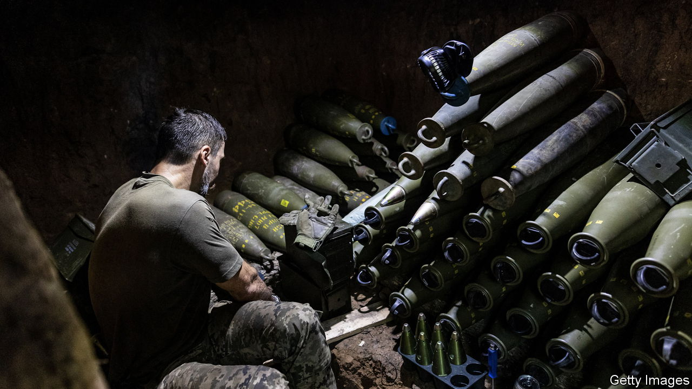

###### More blood, less treasure

# Ukraine’s new enemy: war fatigue in the West 

##### Congress holds up military aid as unsupportive populists make gains in Europe 

 

> Nov 27th 2023 

FOR MORE than 600 days of full-scale war, America has been Ukraine’s greatest saviour as it marshalled arms, money and more to help repel Russia’s invasion. Now America has become one of Ukraine’s greatest worries. Its aid for Ukraine is fast running out, and dysfunction in Congress is blocking new assistance. Nobody is sure when—or whether—it will be restored. 

The effect is being felt at the front as America tries to stretch its dwindling funds. “In the spring the flow of military supplies was a broad river. In the summer it was a stream. Now it is a few drops of tears,” says one informed Ukrainian source. Ukraine faces a bleak winter amid great uncertainty: its counter-offensive has  to break through Russian lines; its enemy is increasing its arms production; and its vital ally is paralysed by political turmoil and distracted by Israel’s war in Gaza.


Lloyd Austin, America’s defence secretary, visited Kyiv on November 20th to reassure Ukraine that the United States will support Ukraine “both now and into the future”. Yet Mr Austin knows that the power of the purse belongs to Congress; and the balance of power in Congress is held by an isolationist wing of the Republican party, especially in the House of Representatives, where one of their sympathisers now serves as the speaker. Twice since September Congress has passed a “continuing resolution” to avoid a shutdown of the federal government; and twice it excluded new aid for Ukraine. 

The Senate is trying to unlock the assistance in December, before a shutdown looms again in January. President Joe Biden has requested a supplemental budget of $106bn, of which $61bn is for Ukraine, and the rest for Israel and other national-security priorities. Republicans are tying aid for Ukraine to tougher measures to curb migration across America’s border with Mexico. Those involved say the sides are still far apart. 

The longer the delay, the more parties become consumed by election fever. If there is no deal before Christmas, some in Congress worry, a fresh allocation of aid may be delayed until after the elections in November 2024; and if Donald Trump is elected president it may be ended entirely. “Time is not our friend,” says one gloomy pro-Ukraine senator.

In public, at least, Ukrainian leaders dismiss the notion that America could cut them off. “I don’t believe it will happen,” said Andriy Yermak, a top aide to Ukraine’s president, Volodymyr Zelensky, saying he found “strong bipartisan support” during a visit to Washington this month.

Since Russia’s invasion, America has provided about $75bn in overall aid to Ukraine, and European countries collectively have delivered , according to American calculations. But crucially America still provides the larger share of military aid, with its contribution worth some $44bn. The Pentagon says it has about $5bn left in “presidential drawdown authority” (PDA) to supply Ukraine with weapons from its own arsenal, and just over $1bn in funds to replenish it. Given the depletion of military stocks across the West—and the crisis in the Middle East and a potential one over Taiwan—America’s brass may be reluctant to give away more than they are allowed to buy back. 

PDA packages for Ukraine have shrunk, from an average of more than $1bn a month (and a peak of more than $5bn in January) to $350m in October and only $250m so far this month. A separate pot known as the Ukraine Security Assistance Initiative (USAI), worth more than $18bn, has all but run out. This was used mostly for longer-term supplies from American companies. Weapons in the USAI pipeline will continue to arrive, even without a new aid package. A small amount of USAI money, about $25m a month, is also rolled over under continuing resolutions. 

Josep Borrell, the European Union’s foreign-policy chief, has called on European countries to take up the slack from America if necessary. Indeed, they have issued a flurry of new promises recently. Germany said it planned to double its support for Ukraine next year to $8.5bn, and would also deliver more air-defence systems. The Netherlands, Finland and Lithuania all announced new packages of military help. But clouds loom. A constitutional-court ruling in Germany looks likely to hamper plans to boost aid. The hard-right Freedom Party of Geert Wilders, which won the largest number of seats in the recent Dutch election, opposes sending weapons, raising questions about whether the Netherlands can still lead the coalition to supply F-16 jets to Ukraine. Slovakia’s new government has already halted military aid. Ukrainians worry that without American leadership, Europeans may quickly lose heart. 

In what has often been an artillery war, Ukraine is already suffering from “shell-hunger”, says Michael Kofman of the Carnegie Endowment for International Peace, an American think-tank. He reckons that Ukraine was firing 220,000-240,000 larger calibre shells (152mm and 155mm) per month during the summer, but the rate of fire is dwindling and will fall to 80,000-90,000 shells a month. Even these numbers are more than America and European countries are currently producing—roughly 28,000 and 25,000 a month respectively. Western production is rising, with targets to triple output, but that will take a year or more, and some of the output will be used to replenish Western stocks and supply others. Russia outpaces Western shell production and has been helped by a surge of rounds from North Korea. 

Ukraine is trying to boost its own defence industry, robust in Soviet times but badly neglected since, not least to make NATO-standard 155mm shells. “No matter how much we grow local production, we would be hugely dependent on Western partnerships,” admits a senior official in Kyiv. 

If American support diminishes, Ukraine will be unable to mount another large counter-offensive, says Mr Kofman. It can try to make even greater use of drones. But ultimately it will have to dig in. “Ukraine should learn from what worked for Russia,” he says. “The stronger your defences, the fewer shells and troops you need to hold the line.” 

Vladimir Putin, Russia’s leader, has boasted that without Western support Ukraine would be crushed within a week. But rather than a sudden collapse, says Jack Watling of the Royal United Services Institute, a British think-tank, defeat is likely to be “slow and painful”. Not so, according to Mr Yermak: “We made our choice. We will be fighting for victory. But of course, this victory will be more quick and we will save more lives if the help will continue.”■


