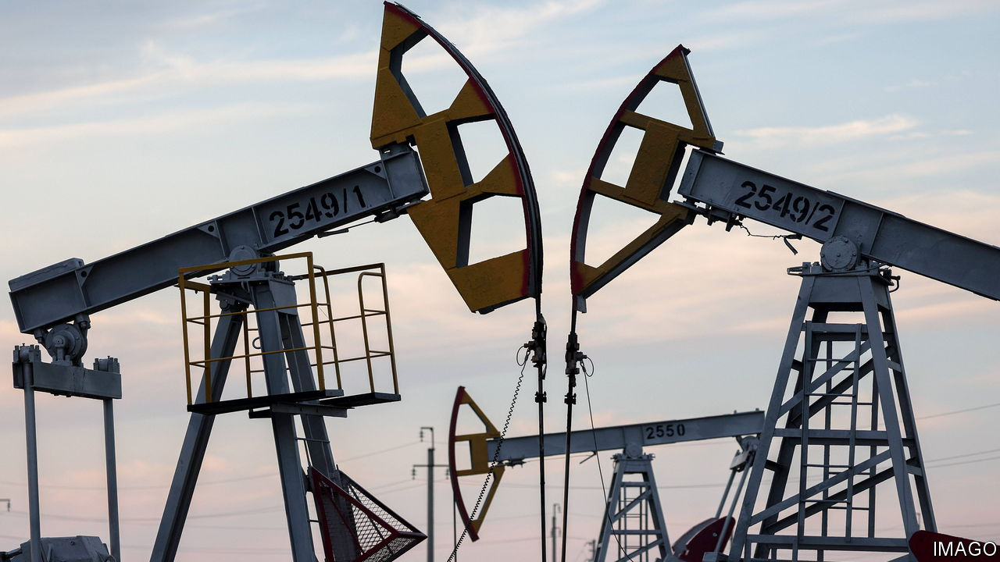
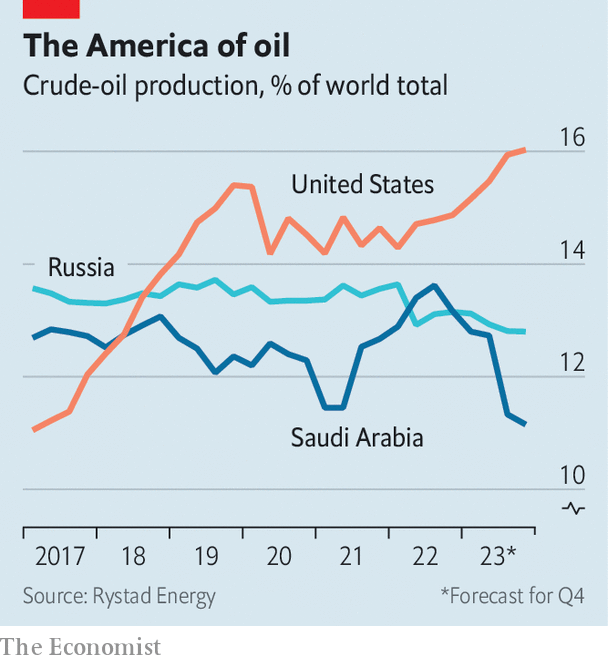

###### Fissures

# An unruly OPEC is causing problems for Russia and Saudi Arabia 

##### The cartel is failing to drive up oil prices 

 

> Nov 29th 2023 

The meeting in November of the Organisation of the Petroleum Exporting Countries and its partners (opec+) was meant to be a staid affair. Instead, the summit was first pushed back from the 26th and then moved online, revealing a fracas between the cartel’s big producers and its minnows. After acquiescing to lower output quotas at their previous meeting in June, opec+’s west African members were unhappy to learn that Russia and Saudi Arabia, the bloc’s de facto leaders, wanted to further curtail output. One oil minister, Diamantino Azevedo of Angola, planned to boycott the in-person meeting altogether.

As  went to press, opec+ was at last due to meet online. Members were reported to be preparing modest additional cuts into 2024. This would represent the extension of a strategy in place since last October, under which they try to resist downward pressure on prices by restricting supply. Saudi Arabia and Russia are leading the way, with cuts of 1m barrels a day (b/d) and 300,000 b/d respectively; the rest of opec+ is together contributing another 3.7m b/d in cuts. Yet the price of the Brent crude benchmark is down by around 15% since the strategy was introduced—it currently sits at $83 a barrel—and has fallen for the past five weeks.

 


The back-and-forth over November’s pow-wow exposes the difficulties that opec+ faces. Recent oil-price drops reflect both expectations of slowing global demand, influenced by concerns over China’s economy, and the fact that geopolitical risk has fallen: few now expect the war in Gaza to turn into a broader regional conflict. At the same time, other producers, including America, Brazil and Guyana, have increased output, making up for opec+’s cuts (see chart). 

Yet the price falls also reflect the fact that opec+ is struggling to hold the line. The cartel welcomed an additional ten countries when it gained the plus sign in 2016, and plans to recruit still more. A larger organisation has no choice but to straddle divergent interests, as is now clear. The Angolan minister who planned to boycott the in-person get-together also walked out of another meeting in June alongside his counterpart from Gabon. The two ministers were apparently protesting against quota reductions. Along with others, they worry that output cuts will  in exploration .

At least Angola does not exceed its targets. Not all countries are so well-behaved. Iraq, for example, is producing 180,000 b/d more than its limit. Iran and Venezuela are not subject to the group’s production caps because of sanctions. Mexico refuses to accept quotas. Despite being members of opec+, all have been selling more oil of late, eagerly hoovering up the market share forfeited by Russia and Saudi Arabia.

The last time the group faced a similar state of affairs—decelerating demand, new entrants and co-ordination problems—in 2014, officials chose a different strategy, as Alberto Behar of the imf and Robert Ritz of Cambridge University have written. Back then members increased supply in an attempt to drive down the oil price. The aim, as announced at opec’s meeting in November nine years ago, was to grab market share (and in so doing drive out American competitors). This had the advantage of stimulating demand and not requiring discipline among opec’s members: they were able to produce oil to their hearts’ content.

Such an approach is no longer feasible. opec’s market-share strategy last time round helped discipline America’s oil producers, pushing them to become more efficient and therefore more resistant to future squeezes. JPMorgan Chase, a bank, reckons that the cost of getting oil out of the American ground has declined by more than one-third since 2014. The country’s oilmen have found methods to fracture rocks that produce more fissures, easing the extraction of oil, and now drill deeper wells that have longer lifespans. 

Saudi Arabia would very much like opec+’s current strategy to succeed. Its free-spending government has pushed up the price at which the country’s budget balances to $85 a barrel, according to the imf—and that number is higher when outlays from its sovereign wealth fund are included. Russia, meanwhile, needs oil revenues to fund its war in Ukraine. Delaying the meeting to November 30th did not help either country. Both will now be hoping for a change in their luck. ■


