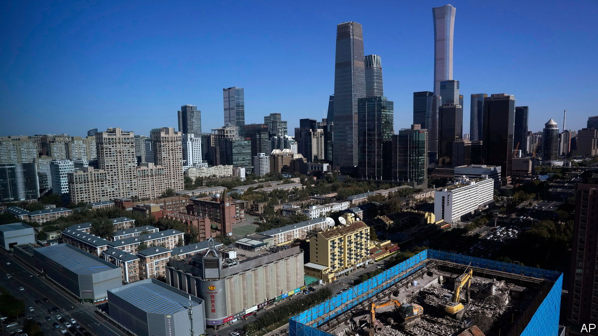

###### Property pain

# China edges towards a big bail-out 

##### But officials are wary of moral hazard 

 

> Nov 30th 2023 

Chinese buses are idling. Statements released by a handful of transport companies complain of deteriorating economic conditions and a lack of financial support. In October two in the city of Nanchong, in south-west China, said that they would halt services owing to a lack of finance from municipal authorities. These announcements may seem prosaic, but the intention is to do more than just inform riders about cancelled bus routes. They are aimed upwards at central authorities, says a former state official, and local authorities encourage the statements because they send a signal that all is not well in the provinces. Some have been even more direct, warning that they can no longer pay their debts. Across the country cadres are begging for bail-outs, in ways both subtle and direct. And there are signs that their efforts are beginning to persuade the higher-ups.

Local cadres must overcome severe resistance. Officials in Beijing want to avoid picking winners and the moral hazard inherent in bailing-out poorly run localities. Property is at the heart of the problem. Over the past year local governments have used shrinking budgets to stop construction sites from shutting down. Some have drummed up demand by lowering downpayments or making mortgages more accessible. But these efforts seem to be failing. In the first half of November home sales by floor space fell by nearly 20% year on year. Local government land sales have plummeted, squeezing a vital source of income. And thousands of firms run by provincial officials, called local-government financing vehicles (lgfvs), face problems. Goldman Sachs, a bank, estimates that such firms sit on 61trn yuan ($8.6trn) in debt, equivalent to about half China’s gdp, and are struggling to make payments.

Individual property developers are also hoping for rescues, and small banks require capital injections. On November 22nd Zhongzhi, one of China’s largest wealth-management companies, said that it was “severely insolvent” and unable to pay $36bn in debts, prompting a police investigation. Zhongzhi’s liabilities are heavily intertwined with developers, local governments and wealthy urban investors, meaning they pose risks of financial contagion. The firm will probably require some form of state-brokered bail-out.

Will officials give in to the demands? They seem to have realised the scale of damage that could be caused by forced deleveraging in the property sector, says Zhang Zhiwei of Pinpoint Asset Management. According to Bloomberg, a news service, banks are being asked to supply unsecured short-term loans to a handful of developers. Prices of developer bonds traded in Hong Kong have risen recently on reports that authorities are drawing up a list of 50 firms eligible for new financing through banks, bonds and equities. 

This news came after unconfirmed reports in mid-November that the government would provide 1trn yuan in low-cost financing for affordable housing and urban renovation. Another 1trn yuan in government bonds was issued in October. Some of the cash will probably find its way to local officials hoping to pay down debts. The plans imply that the central government is willing to print money in order to avert a collapse of local governments and the property market. They will be music to the ears of desperate local apparatchiks.

Analysts are yet to call the moves a bail-out. lgfvs have been swapping high-cost loans for special refinancing bonds that carry lower interest rates. This is easing the crushing repayment pressure many poor cities are under but, crucially, the towering debts are not being wiped clean. The 1trn yuan for urban renovation, if it materialises, will probably encourage more people to buy homes, but millions of others are still waiting for the delivery of properties for which they paid upfront. Many will not be built on time, if at all. Zhongzhi’s liabilities are to wealthy investors; the state will be reluctant to rescue all of them.

A true bail-out would give developers access to copious credit, as would be needed to restore confidence in the property market. Demand for land would rise, giving local governments more income. Shadow banks such as Zhongzhi might even be able to recoup debts from developers. There have been signs of such a move. The city of Shenzhen said it would provide enough cash to a large local developer for it to avoid default. Reuters, a news agency, reported that Ping An, an insurance firm, was tapped to bail-out Country Garden, one of China’s largest developers. Ping An denied the story, but the rumour has raised expectations that something is coming.

The plan to provide just 50 developers with liquidity indicates that officials still do not want to bail out everyone. They think that they can protect healthy but illiquid firms, and let insolvent ones fail. The desire to weed out duds has already prevented the creation of a lender of last resort for the companies, says Larry Hu of Macquarie, an investment bank. Therefore officials must also get banks to lend, says Mr Hu. This has not worked in the past. As always, the more cash Beijing hands out, the more others come begging for help. ■


