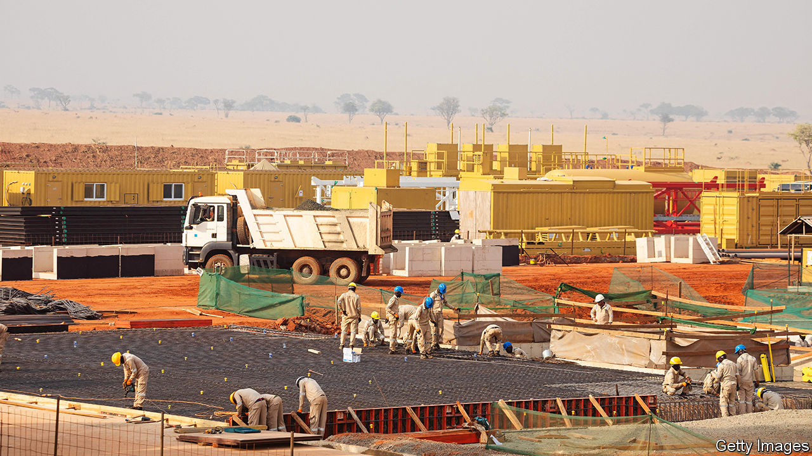

###### Pipe dreams

# How to get African oil out of the ground without Western lenders 

##### Go local, woo traders or head east 

 

> Nov 30th 2023 

From western Uganda, the East African Crude Oil Pipleine will run for 1,443km through farms, forests and rivers, until it reaches the Tanzanian coast. If, that is, anyone pays for it. Already, 27 banks have ruled themselves out as lenders. Shareholders, led by TotalEnergies, a French oil giant, are now courting Chinese firms as they try to raise $2.4bn in debt. In response, environmental and human-rights activists in six African and European countries protested outside Chinese banks, embassies and insurers on November 20th.

The battle is a sign of things to come as Western lenders reconsider fossil fuels. Several banks, including Société Générale, say that they will no longer directly finance new oil and gas projects. G7 governments have also promised to wind down support for overseas extraction, albeit with some caveats and loopholes. “We need to recognise that you [can’t] just walk to Mayfair or the City and get a deal done,” says Rahul Dhir, the chief executive of Tullow Oil, which gets most of its barrels from Ghana. “You’re going to have to go to Cairo, you’re going to Lagos, you’re going to Beijing.”

In Africa, the drilling continues, at least for now. Politicians argue that revenues can finance development, even though Africans are on the front line of climate change (and oil and gas often lead to corruption, not prosperity). Wood Mackenzie, a consultancy, foresees nearly $300bn of capital spending on extracting African oil and gas this decade. Apart from dipping into their own pockets, firms have three options: go local, woo traders or look east.

African lenders, like the continent’s politicians, remain enthusiastic about fossil fuels. In South Africa, Standard Bank is expanding its oil-and-gas portfolio and acting as a financial adviser on the East African pipeline. The African Export-Import Bank, based in Cairo, is teaming up with oil-producing countries to launch an “African Energy Bank”, which will plug the gap left by traditional financiers. Such African multilaterals have helped keep the Nigerian oil sector afloat by assuming financial risks that deter local lenders, says Ayodeji Dawodu of BancTrust, an investment bank.

Funding for existing projects also comes from trading firms such as Glencore and Vitol, which will arrange a multi-year loan in return for future barrels. “We have no ambition to replace banks, what we want is more barrels to trade,” says one financier. Prepayments of this sort are popular with midsize producers and national oil companies, in part because they can be organised quickly. Yet they can pose difficulties, too. Opaque deals with oil traders lay at the heart of recent debt troubles in the Republic of Congo and Chad, as state firms struggled to fulfil their commitments.

The third option is to look east. Saudi Aramco is investing in Nigerian oil refineries; the Islamic Development Bank has pledged $100m to the East African pipeline. Most important is China, which has a long history of resource-backed lending, mostly through its state-owned financial firms. Despite a slowing economy, which has dragged on overseas lending, Chinese firms are making more direct investments in African oil and gas than ever. 

Nor is Western capital retreating altogether. Its oil giants will still provide funding for headline projects such as Namibia’s oilfields, which are probably the largest ever discovery south of the Sahara. There will still be money for gas, which has a cleaner reputation than oil. And although banks are nervous about supporting specific projects, they seem to be less worried about general-purpose finance, such as corporate loans or the underwriting of bond issuances. Western lenders contributed two-thirds of corporate financing for fossil fuels in Africa between 2016 and 2021, according to BankTrack and Milieudefensie, two Dutch ngos, and Oil Change International, an American one.

Even so, the cost of capital is rising. Combined with weak demand, that could jeopardise assets in places like Angola and Nigeria. Extraction in Africa is pricey and carbon-intensive. McKinsey, a consultancy, reckons that 60% of the continent’s production could be uncompetitive by 2040 if rich countries stick to green commitments. Oil provides around 60% of fiscal revenues in the countries that export it; gas provides a rising share of the continent’s electricity. African governments complain they are being rushed into an energy transition on somebody else’s timetable. ■


