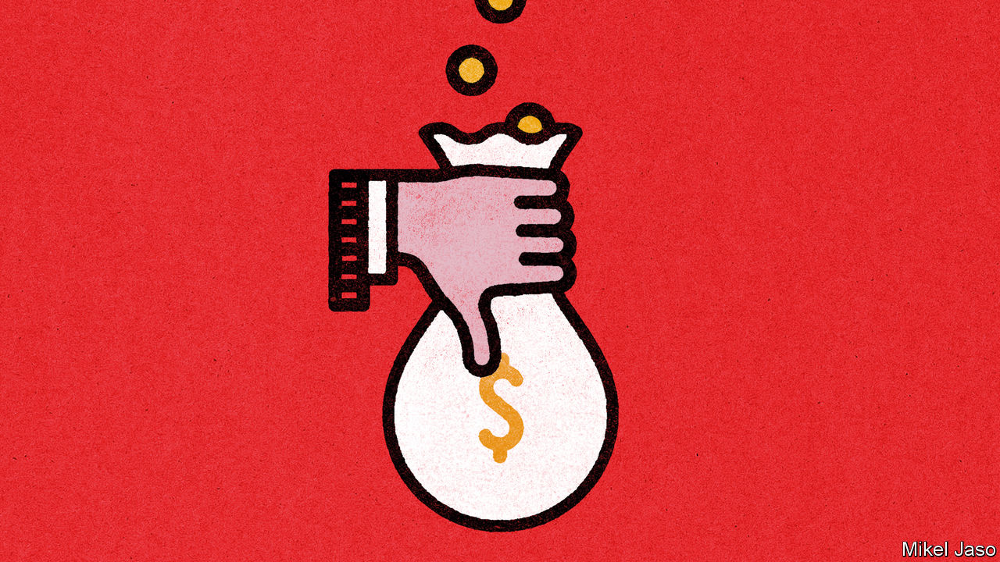

###### The pay picture

# Real wages have risen in America and are rebounding in Europe 

##### Yet workers remain miserable 

 

> Nov 30th 2023 

Not much unites the world these days. Yet there is one sentiment shared by many people, regardless of nationality: pessimism about the economy. Just one in ten Americans thinks they are better off than a year ago, according to a recent poll conducted for  by YouGov. Similar negativity shows up in surveys elsewhere. 

Such glumness persists in America despite the remarkable feat performed by its economy: workers’ real wages are significantly higher than before the covid-19 pandemic—even after controlling for inflation. Those on low incomes have done particularly well, benefiting from tight labour markets since 2021.

Average weekly earnings for the country’s workers reached nearly $1,170 in October, up by around 3% in real terms since the end of 2019. The lowest quartile of earners has seen average annual nominal pay rises of 5.6% per year since the beginning of 2020, compared with 3.8% for the highest quartile, according to figures compiled by the Federal Reserve Bank of Atlanta.

 


As ever with economic data, it is possible to tell different stories. Much depends on the choice of baseline. Incomes surged early in the pandemic on the back of the government’s giant handouts. Relative to that heady period, real incomes are lower today. The choice of deflator also matters. The oft-cited consumer-price index exaggerates how much inflation erodes wages because it fails to capture how people adjust spending patterns amid rapid price increases.

Like America’s economy, Britain’s has produced growth in real wages despite the pandemic: inflation-adjusted pay 1.5% higher than it was at the end of 2019. As in other countries, there is also a bright spot at the bottom end of the jobs market. A 9.7% increase in the minimum wage this year and a further 9.8% increase scheduled for next year help explain that. But official figures may overstate the increase, since other sources, such as tax receipts, point to slightly weaker growth. Moreover, on a longer time horizon, real wages remain 4.7% below their peak, which was reached in February 2008. The government’s forecasting office estimates that wages will not regain that level until 2028. 

The effects of a tight labour market take longer to appear in Europe, since most of the continent’s workers have pay set by collective-bargaining agreements. These tend to run for a year or more, and do not respond quickly to inflation. Real wages under collective-bargaining agreements in the euro zone thus dropped by 5.2% last year as inflation hit.

But since then wage agreements have ticked up. In the Netherlands, which has some of Europe’s most up-to-date figures, annual growth in negotiated wages has reached 6% this year, even as inflation has dropped to zero. As inflation falls elsewhere, too, and new agreements come into force, real wages are likely to rise further. In Germany, for instance, federal-government employees will receive nominal wage rises of as much as 16.9% next year, with the heftiest rises accorded to those on the lowest wages.■


