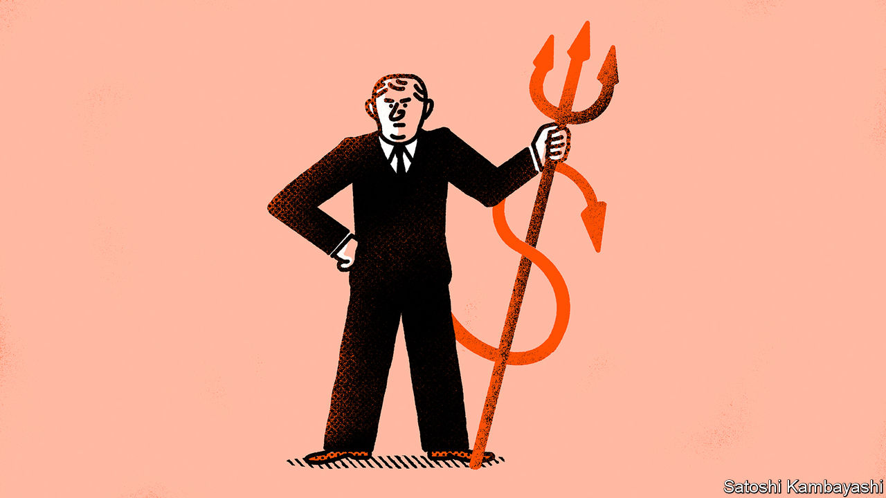

###### Buttonwood

# Short-sellers are endangered. That is bad news for markets 

##### Nobody likes shorts, but they provide an invaluable service 

 

> Nov 30th 2023 

If you want to be liked, don’t be a short-seller. Some other investors might defend you, at least in the abstract, as an important part of a healthy and efficient market. But to most you are—at best—a ghoul who profits from the misfortune of others. At worst, you are a corporate raider who bets that honest firms will go bust and then spreads lies about them until they do. Even your defenders will melt away if you pick the wrong target (shares they own) or the wrong moment (a crash in which many are losing money but you are making it).

Since the authorities are often among these fair-weather friends, the list of historical short-selling bans is long. It features 17th-century Dutch regulators, 18th-century British ones and Napoleon Bonaparte. The latest addition, issued on November 6th, came from South Korea’s Financial Services Commission. It has caught the zeitgeist well, and not just among the army of local retail investors who blame shorts for a soggy domestic stockmarket. Wall Street’s “meme stock” craze also cast amateur traders as the heroic underdogs, pitted against villainous short-selling professionals.

Meanwhile, one of America’s best-known shorts, Jim Chanos, wrote to his investors on November 17th to announce the closure of his main hedge funds. “Our assets under management just fell to the point where it was no longer economic to run them,” he explains, defining that point as “a few hundred million”. At its peak in 2008, a few years after predicting the downfall of Enron, an energy company, his firm was managing “between $6bn and $7bn”. Since being set up in 1985 its short bets have returned profits of nearly $5bn to its investors.

The shorts who remain in the game, then, face two threats. The first is an old one: that regulators, egged on by those who view short-selling as immoral, will clamp down on their business model. The second, more insidious, threat is that investors have lost patience with that business model and no longer want to put their money into it. Should short-sellers fall prey to either danger, financial markets will be worse at allocating capital, and those who invest in them will be worse off.

Start with the charge that betting on asset prices falling is immoral. This view holds that short-sellers drive down prices, hurting other investors’ returns and making it harder for companies (or even governments) to raise capital. Most obviously, it ignores the fact that the shorts’ biggest targets tend to be those, like Enron, that have themselves defrauded investors. Short-sellers are the only people with a strong financial incentive to uncover such frauds and bring them to light, saving investors from even greater losses in the long run. The same is true of firms that are simply overvalued. Had shorts managed to puncture the dotcom bubble earlier, or the more recent ones in SPACs and meme stocks, fewer investors would have bought in at the top and lost their shirts.

Meanwhile, there is scant evidence that short-selling depresses prices. A study of six European countries that temporarily banned short-selling during the crash of March 2020, by Wolfgang Bessler and Marco Vendrasco of the University of Hamburg, found that these bans failed to stabilise stockmarkets. Instead, they reduced liquidity, increasing the gap between “buy” and “sell” prices and thereby making transactions more costly. Moreover, the shares of smaller firms—often painted as victims of bigshot shorts—suffered more from a deterioration in market quality.

What short-sellers can do, if they head off the second threat and convince their investors to stick with them, is alert the rest of the market to assets they believe to be overvalued. They are often successful in this endeavour: take Adani Enterprises, a vast Indian conglomerate that was loudly shorted by Hindenburg Research in January, and whose share price is down 39% since the start of the year. Such arguments might be self-interested, but so are those of any fund manager talking up their book.

The difference is that the longs are backed by investment banks, public-relations advisers and the companies themselves, all with a clear interest in selling optimism and hype. Markets work better, and capital is allocated more efficiently, when there are also killjoys willing to take the opposing side. And with stockmarkets, especially America’s, close to their all-time highs, the insurance against a crash that short-selling funds provide may be particularly valuable to investors. After all, notes Mr Chanos, the fact that it is so out of fashion means it is cheaper than ever.■


