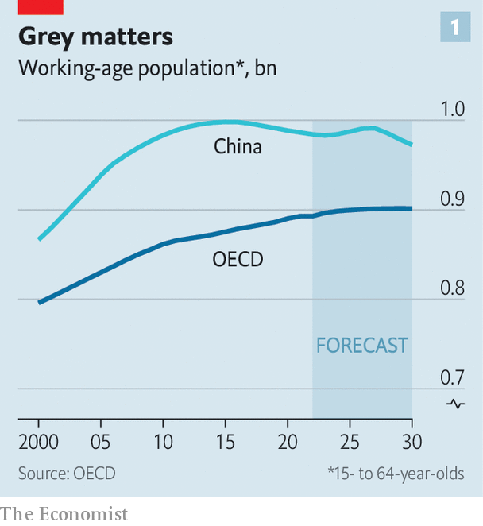

###### Labour markets

# Welcome to a golden age for workers 

##### How employment and pay is being transformed for the better 

 

> Nov 28th 2023 

Almost everyone agreed that the mid-2010s were a terrible time to be a worker. David Graeber, an anthropologist at the London School of Economics, coined the term “bullshit jobs” to describe purposeless work, which he argued was widespread. With the recovery from the global financial crisis of 2007-09 taking time, some 7% of the labour force in the oecd club of mostly rich countries lacked work. Wage growth was weak and income inequality seemed to be rising inexorably.

How things change. In the rich world, workers now face a golden age. As societies age, labour is becoming scarcer and better rewarded, especially manual work that is hard to replace with technology. Governments are spending big and running economies hot, supporting demands for higher wages, and are likely to continue to do so. Artificial intelligence (ai) is giving workers, particularly less skilled ones, a productivity boost, which could lead to higher wages, too. Some of these trends will reinforce the others: where labour is scarce, for instance, the use of tech is more likely to increase pay. The result will be a transformation in how labour markets work.

To understand why, return to the gloom. When it was at its peak in 2015, so was China’s working-age population, then at 998m people. Western firms could use the threat of relocation, or pressure from Chinese competitors, to force down wages. David Autor of the Massachusetts Institute of Technology (mit) and colleagues estimate that this depressed American pay between 2000 and 2007, with a larger hit for those on lower wages. Populist politicians, not least Donald Trump, took advantage, vowing to end China’s job “theft”. 

 


Now China’s working age-population is falling, other poor countries are struggling to build industrial capacity and geopolitical instability is making outsourcing less appealing. The rich world also faces a dearth of workers (see chart 1). Indeed, the number of them aged 20 to 54 (who are likely to be capable of physical labour) has already flattened off. A survey across 41 countries by ManpowerGroup, a staffing firm, finds that 77% of companies are struggling to fill vacancies, twice as many as in 2015. Two-thirds of Polish industrial firms say that worker shortages are one of the main things holding back production. In Germany public-transport services have been reduced owing to a lack of bus and train drivers. In South Korea the old are increasingly staying on the job to avert shortages: some 59% of 55- to 79-year-olds work, up from 53% a decade ago. 

Labour has become so precious that businesses are starting to hoard it. A survey of small American companies found that more than 90% seek to retain employees if possible. In Germany, where the economy has stagnated since early last year, some 730,000 positions are advertised at job centres, close to the record high. Unemployment sits at just 3%. In part because of worker shortages, the rich world is experiencing an immigration boom, with its foreign-born population growing at a record pace. Yet such is the size of coming workforce gaps, even immigration on this scale will not plug them.

It would, then, be a good time to be a worker even without intervention from politicians. Yet they are hardly holding back. Most countries in the oecd, including America and France, have managed to maintain or even increase minimum wages in real terms during the recent bout of inflation. Across the rich world, trillions of dollars are also being spent in a bid to speed up the green transition, reduce dependence on China—and create jobs. Although such subsidies mostly end up in firms’ pockets, and tariffs are costly for consumers, they give workers in protected industries bargaining chips. 

The macroeconomic policy mix favoured by today’s politicians and officials also suits workers. In the mid-2010s rich-world inflation was the lowest it had been outside of crises, but few countries opted for stimulus. This was partly because of analysis suggesting the economy was at full capacity; it later turned out there was more slack. In 2013 America’s Federal Reserve thought that unemployment would settle at 5.6% in the long run. By 2019 that estimate had fallen to 4.1%. The imf thought that Germany was close to full employment in 2012. The country then added 2.8m jobs without unusual wage growth.

Blue-collar bliss

Things look very different today (see chart 2). Despite high inflation, eu countries will run an average fiscal deficit of more than 3% of gdp this year, reckons the European Commission. America’s deficit will hit 8.2%, expects the imf. Ageing societies, climate change and uncertain geopolitics imply that governments will struggle to tighten the purse strings any time soon. Central banks want to bring down inflation, but their policy guidance suggests that they would like to avoid the insufficient demand and low price growth of the 2010s once they have done so. 

 


Policymakers will therefore aim for what Janet Yellen called, before becoming America’s treasury secretary, a “high-pressure economy” (ie, one that runs very close to its potential). Western leaders want to ensure that they can fight the next election while being able to point to healthy employment and rising wages, especially for the lower paid. In this sense, they seem to have learnt the lesson of the 2010s.

 


The approach is already bearing fruit for workers. In a recent paper, Mr Autor and colleagues demonstrate that tight American labour markets are leading to fast wage growth, as workers switch jobs for better pay, and that poorer employees are benefiting most of all (see chart 3). The researchers reckon that, since 2020, some two-fifths of the rise in wage inequality over the past four decades has been undone. 

A similar trend is probably playing out across the rich world. Germany’s employment agency keeps a tally of jobs that are facing severe worker shortages. So far this year it has added 48 professions to the 152-strong list. Most require technical, rather than academic, education, with shortages most pressing in construction and health care. Japan offers time-limited visas for workers in a dozen fields, including the making of machine parts and shipbuilding, and the country’s wages are rising faster than at any point in the past three decades. The wage premium that accrues to those with a university education is already shrinking; it may now fall faster. 

Tight labour markets also encourage unions to demand more free time—to the horror of firms already short of staff. German steelworkers will seek a 32-hour work week in forthcoming negotiations, down from 35 hours. In Spain a new government wants to cut the standard 40-hour work week by two and a half hours. As shown by surveys and data about hours spent on the job, even Americans want to work less.

Many bosses hope that computers will pick up the slack. ai can perform tasks which require creativity, improvisation and learning, and were previously out of reach for machines. Companies have strong incentives to adopt it. A preliminary study by Dean Alderucci of Carnegie Mellon University and colleagues, using American patent data from 1990 to 2018, found that firms which innovated even with more basic forms of ai had 25% faster employment growth and 40% faster revenue growth than otherwise similar ones. 

If the tech helps service workers—in call centres, for example—to be more useful, that will enhance productivity and perhaps job satisfaction as well. Indeed, a recent study by Erik Brynjolfsson of mit and colleagues finds that such workers manage to resolve 14% more issues per hour when assisted by an AI bot, with the lowest-performers benefiting most from the tool. According to a survey by the oecd, some 80% of workers in manufacturing and financial services who use ai report that it improves their output. A large majority also say that it improves working conditions.

AI AI, sir

Some workers will get more of a boost than others. Those in professional services, such as doctors or lawyers, regularly make high-stakes decisions in non-routine circumstances. Since there is often no correct answer, doing so requires judgment as well as extensive training. AI may help people reach the required level of expertise. Imagine AI-assisted nurses taking over tasks from doctors, or coders able to take on more complex assignments. “The positive case is that AI brings a lot more people into higher-paid expert work,” says Mr Autor. 

Early evidence from freelancers editing or writing texts suggests that ChatGPT has decreased monthly earnings by 5.2%. Such findings must be taken with a pinch of salt, however, for they show the impact of AI before labour markets adjust. A lot depends on how the adjustment progresses.

If demand rises strongly as prices fall, those in jobs affected by AI might benefit from their higher productivity: they can serve more customers, even if they are paid a bit less per task. And the good news is that higher productivity leads to more demand elsewhere. Think of a robot that is better at making phones than humans. Use of it leads to cheaper phones, higher demand and thus more production. In turn, this means more demand for phone designers and app coders. Daron Acemoglu of MIT and co-authors, looking at Dutch data from between 2009 and 2020, find that use of robots meant higher wages for workers who were not replaced, and that benefits spread beyond automating firms. 

A more productive economy is a richer economy, which creates demand for labour—as well as for goods and services less affected by ai. Between 1980 and 2010 about half of employment growth came from the creation of new jobs, according to Mr Acemoglu and Pascual Restrepo of Boston University. This process will continue, and may speed up. Although AI will displace workers, new tasks will be created around it and in other parts of the economy. The skills required for these new tasks will not necessarily be digital ones but those that best complement AI. Hospitals may seek nurses with a wonderful bedside manner to work alongside AI tools. 

“Technological progress so far has replaced routine tasks, first physically in the 1970s, then office tasks in the 1990s,” says Melanie Arntz of Heidelberg University. “The higher-skilled, meanwhile, sat on the complementary side of the progress, seeing their wages rise as a result.” With the AI revolution, it is likely to be those with fewer qualifications who benefit. And they are precisely the sort that are already seeing higher wages, as firms struggle to attract staff to look after ageing populations and to work in new green industries. 

The forces transforming labour markets—demographic change, policy and AI—will interact differently in different conditions. Places with fast-ageing populations will see worker shortages, especially in professions requiring physical labour. So long as macro policies stay expansionary, upward pressure on wages will remain. That will spur AI use, which may also push up wages. Governments will need to remove barriers in regulated professions such as health care, so that these benefits may be enjoyed. Bosses will need to be nimble when redesigning firms.

In America, where demographic pressure is less intense, AI’s impact is harder to predict. As in Hollywood, it may threaten to push down wages, leading to strikes. Yet history suggests the economy will generate new jobs in response to the affluence AI ought to bring. Politicians will want to polish their pro-worker credentials by supporting those on the streets protesting against AI. They would be better advised to look after those who lose jobs in the transition, but not to stand in its way. If in doubt: always bet on American dynamism. ■


