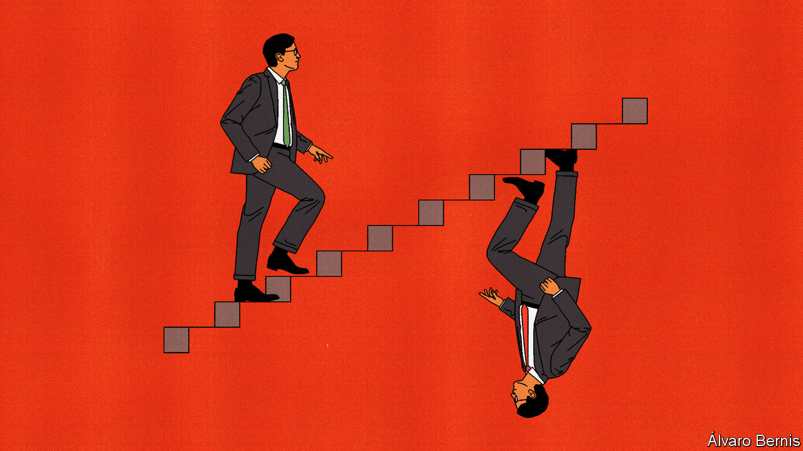

###### Free exchange

# Why economists are at war over inequality 

##### Income gaps are growing inexorably—aren’t they? 

 

> Nov 30th 2023 

According to a familiar saying, academic disputes are so vicious precisely because the stakes are so low. But in a scholarly battle over inequality, the stakes are rather higher. Research by a trio of French economists—Thomas Piketty, Emmanuel Saez and Gabriel Zucman—has popularised the notion that American income inequality is soaring. Other economists have built heaps of research upon these findings, while politicians have pledged to undo the trends through higher taxes and spending. To most people the phrase “inequality is rising” seems self-evidently true. 

Others have cast doubt on the trio’s findings, however—notably Gerald Auten of the Treasury Department and David Splinter of the Joint Committee on Taxation, a nonpartisan group in Congress. We first analysed their work in 2019, as part of a cover story. It modifies the French trio’s methodology and comes to a very different conclusion: American post-tax income inequality has hardly risen at all since the 1960s. In the past few days the  (JPE), one of the discipline’s most prestigious outlets, has accepted their paper for publication. 

This has not settled the debate. In fact, the opposing sides are digging in. “I don’t think that inequality denial (after climate denial) is a very promising road to follow,” Mr Piketty tells your columnist. “We’ve been showered with prizes from the establishment for our academic contributions on this very topic,” adds Mr Saez. Others say the JPE paper has won the day. “It seems clearly correct to me,” says Tyler Cowen of George Mason University. “The Piketty and Saez work is careless and politically motivated,” says James Heckman, a Nobel prizewinner at the University of Chicago. 

You might think that analysing trends in income inequality would be straightforward. Don’t people’s tax returns tell researchers all they need to know? But although tax returns are useful, they can mislead. Americans who are partners in a company, or hold investments, often have enough trouble estimating their own income. Now imagine trying to estimate the incomes of millions of people over several decades, accounting for overhauls to the tax code. Researchers then need to account for the 30-40% of national income that is not even reported on tax returns—including some employer-provided benefits and government welfare. Researchers’ methodological choices have huge effects on the results. 

Messrs Auten and Splinter focus much of their attention on the distorting impact of an important tax reform in 1986. Before it was introduced many rich people used tax shelters that allowed them to report less income on their tax return and therefore pay less to the irs. In “Mad Men”, a television series about advertising executives in the 1960s, Don Draper and his pals fund their lavish lifestyles by putting lots of spending on expenses. Reforms made such wheezes harder, and increased incentives to report income, in part by lowering rates. Looking only at his tax return, Draper might appear to have got richer after 1986, even as his true income stayed the same. Once this is corrected for, the rise in top incomes is less dramatic than it might at first appear. In some papers one-third of the long-term rise in inequality occurs around 1986. 

Messrs Auten and Splinter make other adjustments. Messrs Piketty and Saez have focused on “tax units”, typically households who file taxes in a single return. This introduces bias. In recent decades marriage has declined among poorer Americans. As a consequence, the share of income enjoyed by those at the top appears to have risen, as the incomes of poorer people are spread across more households, even as those of richer households remain pooled. Messrs Auten and Splinter therefore rank individuals. 

They also account for benefits provided by employers, including health insurance, which reduces the share of the top 1% in 2019 by about a percentage point. They make different assumptions about the allocation of government spending, and about misreported income. All in all, they find that after tax, the top 1% command about 9% of national income, compared with the 15% or so reported by Messrs Piketty, Saez and Zucman. Whereas the trio conclude that the share of the top 1% has sharply increased since the 1960s, Messrs Auten and Splinter find practically no change. 

Their paper is a valuable contribution. Greg Kaplan of the University of Chicago, who edited it, notes that it was reviewed by four expert referees and went through two rounds of revisions that he oversaw. The paper is scholarly in the extreme (including delights such as “the deduction for loss carryovers is limited to 80% of taxable income computed without regard to the loss carryover”). The authors are clearly obsessive about the history of the tax code.

Yet their methodology has its own difficulties. “The remarkable thing is that almost all of their modifications push in the same direction—that’s something you wouldn’t expect a priori,” says Wojciech Kopczuk of Columbia University. Mr Splinter, speaking at a seminar in 2021, seemed not to have thought deeply about the potentially distorting effects of the decline of America’s informal economy. The gradual shift from cash-in-hand payments to direct deposits could have forced poorer folk such as cleaners and taxi-drivers to report more income on tax returns, making them appear richer when in fact they were not. 

I feel bad for you / I don’t think about you at all

The trio has concerns as well. Mr Piketty argues that “in order to get their results, Auten-Splinter implicitly assume that non-taxed labour income, pension income and capital income has been much more equally distributed than taxed income since 1980”, which he believes is unrealistic. Mr Saez seems a little fed up with the scholarly battle. “Our experience is that they haven’t changed anything of substance following these long exchanges.” But the JPE paper makes Mr Kopczuk “think that together with earlier papers we are now getting (wide) bounds for where the truth might be”. As a consequence, the idea that inequality is rising is very far from a self-evident truth. ■


