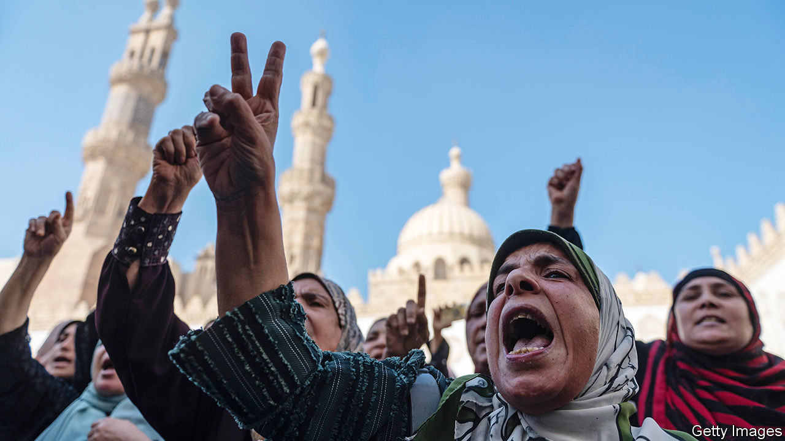
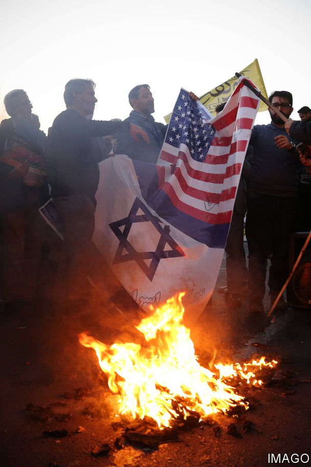

###### Islamism on the edge

# A religious revolution is under way in the Middle East 

##### Can it survive the Gaza war? 

 

> Nov 29th 2023 

OLD STEREOTYPES are haunting the Middle East once more. The biggest butchery of Israeli civilians since the state’s creation, carried out on , has been followed by a . America, which has funded, armed and defended Israel is again an object of ire. So are its Western allies. Together they are blamed for facilitating Gaza’s pummelling and the displacement of its people. A truce which began on November 24th, and which was set to expire as  went to press, had led to the release of 81 hostages and 180 Palestinian detainees as of November 28th.

The violence has punctured recent efforts to improve relations in the region. The standard-bearers of Islam—Sunni Saudi Arabia and Shia Iran—had started to bridge their sectarian division. As well as accepting each other, Muslim states were beginning to accept the Jewish one, too. Since 2020 four Arab states had joined the Abraham accords, normalising their interactions with Israel. More, including Saudi Arabia, were poised to follow.

Now the war in Gaza is radicalising and horrifying the Muslim world. The Palestinians have global attention fixed on their plight after years of neglect. Hamas may claim that as a success of sorts. But many blame the Islamist terrorist group for bringing down Israel’s hellfire. 

The fallout shows that Muslims stand at a critical juncture in the evolution of their faith. Huge religious, political and social transformations are changing the Middle East and its 400m people. The question is whether Hamas’s attack reverses this revolution by stoking Islamism’s embers. Anti-Israeli and anti-Western fervour could agitate its grassroots anew. 

To understand why such an outcome would be so harmful, consider how much Muslim attitudes to religion had shifted in the years leading up to the attacks of October 7th. Religious practice has changed from a political mobilisation for communal salvation, as espoused by Islamists, to a more personal quest for spirituality. The upshot is that for many Muslims Islam has become increasingly depoliticised. 

This trend is clear in Iran. Since the revolution in 1979, It has been led by a Shia cleric. It calls itself an Islamic republic and officially, 99.5% of its 89m people are Muslim. But in 2021 an online poll by Gamaan, a Dutch research group, claimed that about half of its 50,000 Iranian respondents said they had lost or changed their religion. Fewer than a third identified as Shia, the ruling Muslim sect. And despite the country’s ban on proselytising, interest in the country’s non-Muslim faiths, like the Zoroastrian and Baha’i ones, is soaring. Evangelicals in Iran say that Christianity is growing faster there than in any other country. Iran is “the first post-Islamic society”, believes Shahriyar Ahy, a pundit from the country. 

Across the Muslim world clerics, once untouchable, have been lampooned for greed and hypocrisy in recent years. Tax breaks, land allocations and gay sex tapes in countries including Iran, Iraq and Pakistan have provoked outrage. Some theologians have tried to adapt, either out of conviction or in an effort to remain relevant. In Morocco Abderrahmane Taha, arguably the most influential philosopher in the Muslim world, synthesised humanism with Islam’s ethical code.

Institutions formerly in lockstep with Islam, such as the Saudi royal family, have loosened up. The kingdom’s crown prince and de facto ruler, Muhammad bin Salman (MBS), ditched his family’s 250-year alliance with followers of Ibn Abd al-Wahhab, an 18th-century zealot. He also had himself proclaimed a , or renewer of the faith, in 2018. In a survey conducted last year by James Zogby, an American pollster, over two-thirds of the Middle East’s young adults said they wanted religious institutions to “modernise”.

Religious tolerance has increased widely among Muslim countries. Over the past decade more than a dozen have hosted Pope Francis. Egypt, the United Arab Emirates (UAE) and Morocco have renovated synagogues or built new ones. And in Iraq, a centre for inter-faith dialogue opened opposite the gates of Shiism’s holiest shrine, in Najaf. 

Vanity fair

Social reform has accompanied slumping Islamist fervour. In Saudi Arabia pressure came from the top, but many citizens welcomed it. Mosques there now compete with star-studded concerts, film festivals and sports fixtures for popular attention. Men and women are no longer segregated in universities, offices and restaurants. Economic necessity has also pushed women to take up traditionally male jobs, from herding livestock to driving taxis. Meanwhile Tunisia’s parliament overturned a sharia-based ban on Muslim women marrying non-Muslim men in 2017.

Other changes are being promoted by ordinary Muslims, if not by the elites. Iran saw mass protests for women’s rights last year; the regime killed 500 people in retaliation. Divorce rates in the once conservative Gulf now exceed those of many Western countries. And as economic hardship forced couples to delay marriage, pre-marital sex has become more prevalent in the region, say sociologists. 

Political Islam faltered during a decade in which social and cultural norms became increasingly globalised. In 2011 it flourished during the Arab Spring. But by 2019 protesters in Algeria, Iran, Iraq, Lebanon and Sudan were demanding a civil state. In 2021 Moroccans voted out an Islamist prime minister and his party.

This rejection of political Islam reflects how little its adherents did to tackle profound economic malaise in the countries where they held power. In Egypt, Gaza and Tunisia, incomes slumped under their rule. Unemployment mushroomed; foreign investment plummeted. Idlib, a jihadist redoubt in north-west Syria, is among the country’s poorest provinces. The malaise wasn’t always of the Islamists’ own making. But they had promised that “Islam is the solution.” It wasn’t. 

In countries such as Egypt, military might drove Islamists from power. (Popular disillusion meant they weren’t always missed.) There and in Saudi Arabia and the UAE the Muslim Brotherhood, the world’s oldest Islamist movement, was banned. Last year Tunisia jailed Rached Ghannouchi, the Islamist who served as the speaker of the country’s parliament. Overt religiosity has rankled governments, too. In September Egypt banned the niqab, or face-covering, in schools. 

Violent jihadism declined alongside political Islam. From 2001 Western governments waged a “war on terror”. Two decades on, “spectaculars” in much of the world are considered a thing of the past. In Syria and Iraq, an American-led coalition destroyed the caliphate of Islamic State (IS), a territory the size of Britain which harboured and trained tens of thousands of fighters. Since 2019, jihadist attacks in Syria have fallen from over 1,000 per year to around 100. 

Other Islamist movements curbed their behaviour in order to survive. Al-Qaeda’s Syrian offshoot was one such. For years Hamas, at least on the surface, seemed part of that club. It stopped its suicide-bombings in Israel and in 2017 issued a new charter stripped of the overt antisemitism of the original. Many women in Gaza city took off the veil. It is an irony that Israel, in order to divide the Palestinians, actually propped up one of the region’s last Islamist redoubts and learned to live with its rule. Hamas’s rampage through southern Israel has shattered any illusion of possible coexistence, however. 

How will political Islam evolve in response to the war in Gaza? It is possible that a new generation of extremists emerges. Economic woes, poor governance and pernicious despotism all provide fertile ground for a comeback. Libya, Lebanon and Yemen are already failed states. The Middle East’s most populous ones, Egypt and Iran, are both economically unstable. 

The Gaza war “could be the kiss of life for the Muslim Brotherhood”, says Ahmed Abu Douh, an Egyptian analyst with Chatham House, a British think-tank. Out of government, Hamas could wreak more havoc. And in Islam’s periphery the ideological fires burn unquenched. Jihadists thrive in Afghanistan and in eastern Syria when the Kurds retreat to their barracks. They control much of the Sahel and are pushing into other parts of Africa. “It’s too soon to celebrate the end of jihadism,” says Rajan Basra of the Department of War Studies in London.

 


Governments in the Middle East are trying to suppress any resurgence. Many Muslim rulers see an Islamist revival as a threat to themselves as much as it is one to the West. They may even support Israel’s goal of destroying Hamas, if not its means. No country which has recently normalised relations with Israel has broken off ties, or called for America to leave its regional bases. And most Gulf states have banned protests and sermons in solidarity with Palestinians. Even Qatar, the protector of Hamas and other Islamist causes, offered to expel the Islamists if its ally, America, asked as much. Iran and its axis of resistance have also shied from the fight and left the group to battle alone.

Still, it would be wrong to mistake silence for acquiescence. “Beware of the calm,” says Ali Bakir, an expert in political Islam with the Atlantic Council, an American think-tank. “It can herald the explosion to come.” Islamism has a habit of bouncing back. Many cheered the death of jihadism after the killing of Osama Bin Laden in 2011. Yet two years later IS swept through the Middle East. 

Hamas’s overthrow in Gaza might bring a short-term lull, but in time it could disperse its ideas and its militants across the Middle East. Islamism itself might evolve into something less sectarian as it spreads, perhaps bringing Sunni and Shia followers together, but its militancy could intensify. “The world is dreaming if it thinks the Islamist moment has gone,” says Andrew Hammond of Oxford University.

To keep political Islam reasonably quiescent, the rift between Israel and the Palestinians will have to be healed. Muslim regimes across the region should urgently tackle the socioeconomic ills that Islamists feed upon. The Middle East’s oil-rich states can afford a contract which offers individual rather than political freedom. But poorer ones cannot pay for the social protection that underwrites it. Still, locking Islamists up will do nothing to compensate for that. Islam has often flourished in a multi-faith world. It can do so again.■

