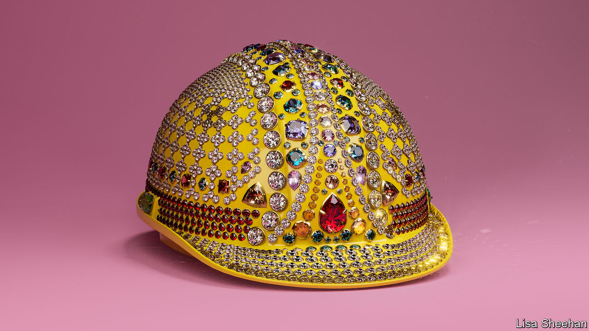

###### Blue-collar bonanza

# A new age of the worker will overturn conventional thinking 

##### Around the rich world, wage gaps are shrinking 

 

> Nov 30th 2023 

Few ideas are more unshakable than the notion that the rich keep getting richer while ordinary folks fall ever further behind. The belief that capitalism is rigged to benefit the wealthy and punish the workers has shaped how millions view the world, whom they vote for and whom they shake their fists at. It has been a spur to political projects on both left and right, from the interventionism of Joe Biden to the populism of Donald Trump. But is it true?

Even as the suspicion of free markets has hardened, evidence for the argument that inequality is rising in the rich world has become flimsier. Wage gaps are shrinking. Since 2016 real weekly earnings for those at the bottom of America’s pay distribution have grown faster than those at the top. Since the covid-19 pandemic this wage compression has gone into overdrive; according to one estimate, it has been enough to reverse an extraordinary 40% of the pre-tax wage inequality that emerged during the previous 40 years. A blue-collar bonanza is under way.

Across the Atlantic, such trends are more nascent, but still apparent. In Britain wage growth has been healthier at the bottom of the jobs market; in continental Europe wage agreements are building in higher increases for the lower paid. Long-running trends in inequality are being questioned, too. A decade ago Thomas Piketty, a French economist, became a household name by arguing that it had surged. Now increasing weight is being given to research which finds that, after taxes and government transfers, American income inequality has barely increased since the 1960s.

All this can be discombobulating, not least when the prices you pay for food and energy have risen at an unusually fast pace. So ingrained is the idea that workers are suffering in today’s world that claiming otherwise is almost heretical; the dissenting inequality research has  among economists. 

To understand what is going on, it helps to consider that the blue-collar bonanza is not just an artefact of the statistics: it makes intuitive sense, too. , three forces that shape labour markets—demand, demography and digitisation—have each shifted in ways that benefit workers.

Take demand. After quiescent inflation in the mid-2010s, America’s Federal Reserve resolved to run the economy hot in the hope that doing so would bring more people into work. Then, after covid-19 struck, governments across the rich world untied the purse-strings. This year the pandemic is a memory, but America has continued to run deficits of a size usually seen in depressions or wartime. As a consequence, demand for labour has stayed high even as central banks have raised interest rates. 

That higher demand has met with constrained supply, owing to shifts in demography. In 2015 a long-running global demographic dividend came to an end as China’s working-age population peaked. In the rich world the prime working-age population is growing at its slowest pace on record, and will probably start falling by the end of the decade. That adds to the tightness in labour markets. The unemployment rate across the rich world, at less than 5%, is at historical lows and the working-age employment rate in more than half of oecd countries is running close to an all-time high. As populations shrink, the workforce gaps are likely to become so wide that it is hard to imagine politicians letting in enough immigrants to fill them. 

Shifts in digitisation, meanwhile, have changed who stands to benefit most in today’s labour market. At the end of the 20th century the information revolution vastly increased the demand for college graduates with brains and computing skills. From Wall Street to Walmart these stars were put to work transforming how firms did business, making use of new tools including email and spreadsheets. 

By the mid-2010s, however, the revolution had matured and the college wage premium began to shrink. In 2015 the average rich-world worker with a bachelor’s degree or more was paid two-thirds more than the average high-school leaver; four years later, the gap had narrowed to a half. According to one estimate, the college premium for white graduates born in America in the 1980s has been lower than that enjoyed by those born in any of the preceding five decades. 

Generative artificial intelligence looks likely to reinforce this equalising trend. Early research suggests that ai bots provide a bigger productivity boost for lower performers, helping the laggards catch up with the vanguard. And until robotics matures, ai may add to the value of the sorts of tasks that only humans can do, such as manual labour, or providing emotional support. 

This golden age is still young—and it may be vulnerable. One danger is that recession strikes, cooling demand for workers. On both sides of the Atlantic labour markets have shown signs of softening. In a downturn the least paid tend to suffer most. Another threat is that governments kill it off. Mr Biden’s industrial policy came too recently to account for the blue-collar bonanza. In fact, plentiful opportunities and rising pay make it wasteful to spend taxpayer cash promoting manufacturing jobs. Protection and handouts stand to make the economy less productive and more sclerotic, meaning less of a bounty for all. 

Blue-sky thinking

If the blue-collar age endures, the effect will be profound. The idea that capitalism fails workers is so pervasive that it may explain why people consistently tell pollsters they are unhappy about the state of the economy—even as they themselves continue to spend freely and to benefit from low unemployment. The idea has shaped views on everything from the dangers of immigration and low-cost manufacturers, to the desirability of more handouts and higher tariffs. 

The bonanza for workers, though, shows governments need not shackle markets for workers to do well—and that the best route to prosperity for all is to increase the size of the economic pie. If you fight too much over distribution, you risk bringing the golden age to a premature end. ■


