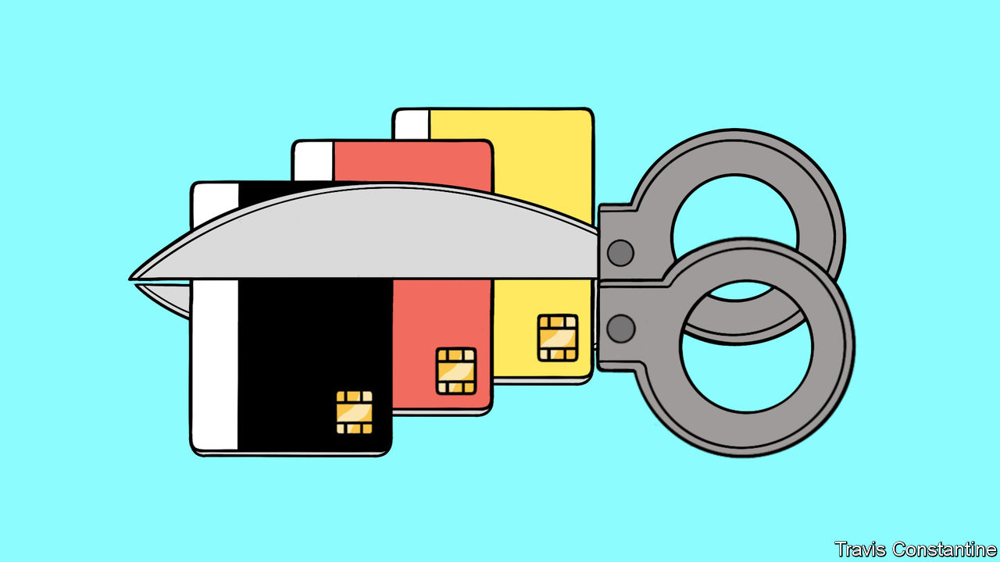
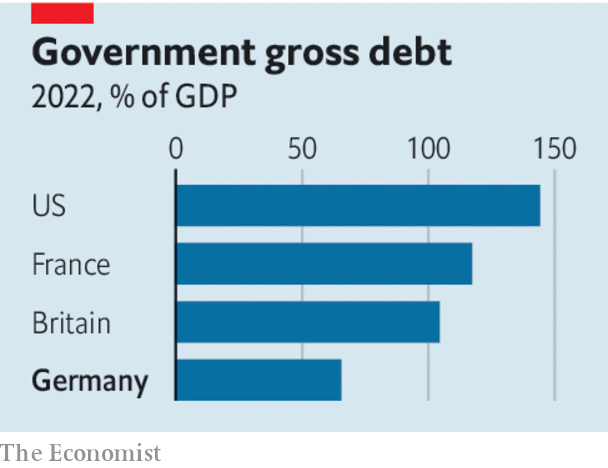

###### Debt break

# Germany is in a bizarre fiscal mess of its own making 

##### Three steps to resolve the fiscal panic 

 

> Nov 30th 2023 

Germany mAY pride itself on its fiscal prudence, but over the past fortnight it has been in the grip of a bizarre fiscal panic. At the heart of the drama lies the much-revered “debt brake”, a constitutional clause that limits the country’s budget deficit, but which the government has resorted to circumventing through a series of special funds. On November 15th the country’s constitutional court ruled that one such wheeze to finance €60bn ($66bn), or 1.5% of GDP, in climate spending was illegal, jeopardising all the financing done in this way. 

The consequences have been shambolic. As lawmakers have scrambled to plug fiscal holes, members of the ruling coalition have resorted to and the opposition are divided, too. On November 28th Olaf Scholz, the Social Democratic chancellor, promised in the Bundestag that some fixes would be found. The government will invoke an emergency clause to ensure its spending for 2023 passes legal muster, but there was no explanation of where the money for future years would come from. Because of its obsession with its debt rule, Europe’s largest economy now looks unable to revive domestic demand, to finance an energy transition or to achieve its geopolitical aims. Unless Germany can lead by example, other countries in Europe are unlikely to offer more aid for Ukraine. 

 


The strange thing is that the fiscal mess has nothing to do with economics. Germany is the envy of the rich world because it still has room to borrow. Its public debts are equivalent to about 65% of GDP, compared with an average of 90% across the oecd club of mostly rich countries. And the case for investing is crystal clear. Its growth is lagging behind its peers’; after decades of neglect, its infrastructure desperately needs refreshing. Because the benefits of such spending accrue over time, debt finance, which smooths the costs of investment, makes sense. 

Faced with a strong economic case for spending, but political and legal hurdles to doing so, how should Mr Scholz proceed? One step is to review current spending and cut unnecessary handouts. Years of affluence have led previous governments to spend on pensions giveaways and to paper over inefficiencies in health care. The cuts will be tough, but necessary. 

Another step is to protect investment spending. Soon after Russia invaded Ukraine in 2022, the federal government agreed to raise €100bn for the armed forces, to make up for years of underinvestment, and tweaked the constitution to isolate that commitment from debt-brake provisions. A similar fund could be set up to permit debt-financed infrastructure and climate investment over the long term. This would need a majority in two-thirds of both houses of parliament, which the coalition alone would not have. But it would be far-sighted of the Christian Democrats, the largest opposition party, to co-operate. The cdu was the main party of government between 2005 and 2021, and the chief architect under Angela Merkel of the debt brake. Should it ever return to office, it too would face the difficulty of getting its investment plans through. 

Such manoeuvres are not ideal, but they allow time for the Social Democrats and the Christian Democrats to make the argument for reform—the most important step of all. Germany’s reputation for prudence was won not because of the debt brake itself, but because years of strong growth boosted its tax receipts and flattered the deficit figures. As much as Germans love their rules, to put the debt brake before achieving growth today would be a perverse act of self-harm. Much better instead to enshrine principles such as debt sustainability in the constitution, and to leave deficit limits to elected politicians. Germany has many problems. Excessive public debt is not one of them. ■

