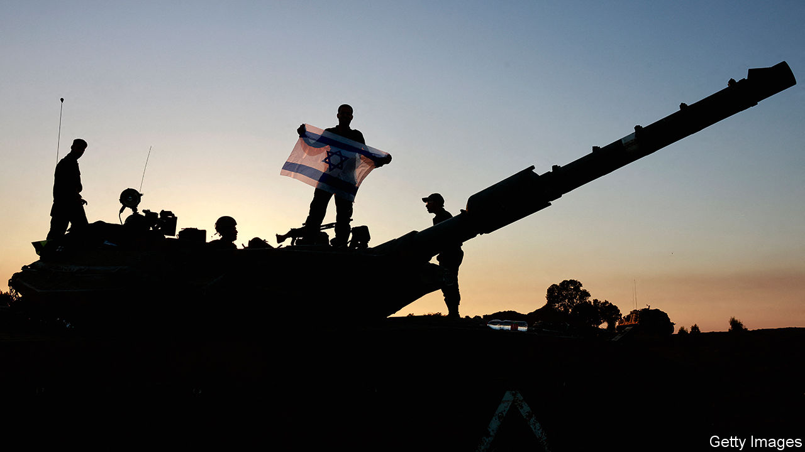

###### Israel and Hamas

# How America should manage the next stage of the Gaza war 

##### For the sake of Israel and a two-state solution, America has to get tougher with its ally 

 

> Nov 29th 2023 

In recent days a truce has held in Gaza, which was ongoing as we went to press. As the fighting has paused and hostages and prisoners have been swapped, some things have become clear. One is the cynicism of Hamas, which having taken part in the murder, rape or abduction of 1,400 Israelis is now trading infants. Another is the brutal toll Israel has inflicted on Gaza. The north of the strip lies devastated. Some 15,000 people, including terrorists, have been killed according to the Hamas-run authorities, and 2.2m are crowded into the south in dire conditions.


Also visible is the dilemma facing America, Israel’s staunchest ally: for how long should it endorse the war? And how should it try to shape what happens next? These are not abstract questions. As in the past, America has provided Israel with arms and diplomatic cover, and deterred its regional foes. This gives it leverage over Israeli decisions. America’s goals must be to protect Israel’s security and right to self-defence, and to reopen a path to a two-state solution that offers Palestinians self-determination. President Joe Biden should choose the approach that maximises the odds of these goals being reached. That means marginalising the extremists on both sides who want to sabotage a long-term settlement.

One option is for America to urge a permanent ceasefire now. That would dramatically cut civilian casualties: were Israel to enter southern Gaza and use the tactics it has in the north, the toll would be far higher because the area is now more densely populated and civilians have nowhere to go. The end of the war might also lead to the fall of Israel’s hard-right coalition government led by Binyamin Netanyahu, which has been and remains an obstacle to a two-state solution. 

The trouble is a permanent ceasefire now would leave Hamas victorious, undermine Israel’s security and wreck the prospects for two states. Hamas still has perhaps three-quarters of its military strength and says it wants more attacks, cheered on by Iran. Gazans would remain under Hamas’s grim rule. And if Hamas were Gaza’s de facto government, with growing sway in the West Bank, two-states would be impossible, because Hamas would not be seen as a plausible partner for peace. Having used violence to such effect on October 7th, if it were ever to claim that it renounced terror and recognised Israel, it would take years for its word .

That is why America should instead press ahead with its efforts to shape how Israel conducts the war, influence its post-war planning, and steer its politics towards two-states. Mr Biden must be clear that his support for action in southern Gaza is contingent on Israel adopting new tactics, using less armour and bombardment and more infantry, even if that risks more Israeli military casualties. Israel must spell out a realistic military goal: to destroy most of Hamas’s military capabilities and its ability to govern Gaza, rather than eradicating it entirely. Israel needs to go beyond its minimum legal responsibilities and open its border at Kerem Shalom to aid flows, and provide Gazans with shelter and medical help in the enclave and in Israel. 

Last, America should insist that Israel articulate a long-term plan. In the coming weeks we will explore how a new two-state solution might work. But the ingredients are an interim authority in Gaza, with a role for Israel’s friendly Arab neighbours; a new government in Israel and new, moderate Palestinian leaders; and a resumption of negotiations. As an ardent opponent of two-states, Mr Netanyahu is not credible on the subject. But America can signal its intent by talking to his potential successors and by requiring that he release cash owed to the Palestinians, crack down on violent settlers and restrain the army in the West Bank. If this results in Mr Netanyahu’s coalition falling, so be it. America, rightly, offers Israel extraordinary support in times of need. That gives it extraordinary influence. It should be put to use. ■

