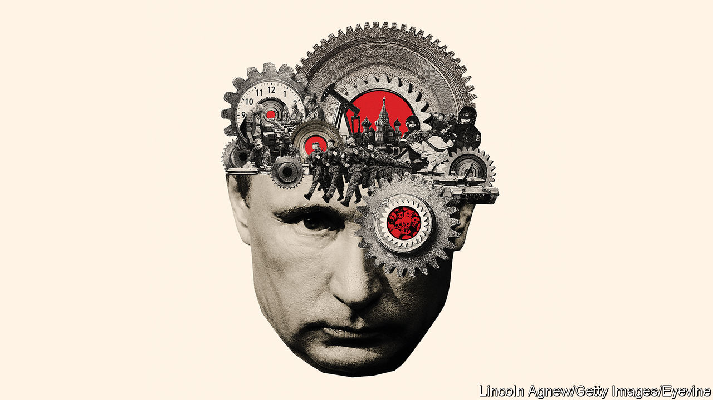

###### War in Ukraine

# Putin seems to be winning the war in Ukraine—for now 

##### His biggest asset is Europe’s lack of strategic vision 

 

> Nov 30th 2023 

FOR THE first time since Vladimir Putin invaded Ukraine on February 24th 2022, he looks as if he could win. Russia’s president has put his country on a war footing and strengthened his grip on power. He has procured military supplies abroad and is helping turn the global south against America. Crucially, he is undermining the conviction in the West that Ukraine can—and must—emerge from the war as a thriving European democracy.


The West could do a lot more to frustrate Mr Putin. If it chose, it could deploy industrial and financial resources that dwarf Russia’s. However, fatalism, complacency and a shocking lack of strategic vision are getting in the way, especially in Europe. For its own sake as well as Ukraine’s, the West urgently needs to shake off its lethargy.

The reason a Putin victory is possible is that winning is about endurance rather than capturing territory. Neither army is in a position to drive out the other from the land they currently control. Ukraine’s counter-offensive has stalled. Russia is losing over 900 men a day in the battle to take Avdiivka, a city in the Donbas region. This is a defenders’ war, and it could last many years.

However, the battlefield shapes politics. Momentum affects morale. If Ukraine retreats, dissent in Kyiv will grow louder. So will voices in the West saying that sending Ukraine money and weapons is a waste. In 2024 at least, Russia will be in a stronger position to fight, because it will have more , because its army has developed successful electronic-warfare tactics against some Ukrainian weapons and because Mr Putin will tolerate horrific casualties among his own men.

Increasing foreign support partly explains Russia’s edge on the battlefield. Mr Putin has obtained drones from Iran and shells from North Korea. He has worked to convince much of the global south that it has no great stake in what happens to Ukraine. Turkey and Kazakhstan have become channels for goods that feed the Russian war machine. A Western scheme to limit Russian oil revenues by capping the price for its crude at $60 a barrel has failed because a parallel trading structure has emerged beyond the reach of the West. The price of Urals crude from Russia is $64, up nearly 10% since the start of 2023.

Mr Putin is also winning because he has strengthened his . He now tells Russians, absurdly, that they are locked in a struggle for survival against the West. Ordinary Russians may not like the war, but they have become used to it. The elite have tightened their grip on the economy and are making plenty of money. Mr Putin can afford to pay a lifetime’s wages to the families of those who fight and die.

Faced with all this, no wonder the mood in Kyiv is . Politics has returned, as people jostle for influence. Volodymyr Zelensky, Ukraine’s president, and Valery Zaluzhny, its most senior general, have fallen out. Internal polling suggests that corruption scandals and worries about Ukraine’s future have dented Mr Zelensky’s standing with voters.

Western governments insist they are as committed to Ukraine as ever. But polls around the world suggest that many doubt it. In America the Biden administration is struggling to make Congress release funding worth over $60bn. Next year’s election campaign will soon get in the way. If Donald Trump is elected president, having promised peace in short order, America could suddenly stop supplying weapons altogether.

Europe should be preparing for that dire possibility—and for American help to slow, whoever is in the White House. Instead, European leaders are carrying on as if munificent Joe Biden will always be in charge. The European Union has promised Ukraine €50bn ($56bn), but the money is being held up by Hungary and, possibly, a . In December the EU should signal that it is ready to start talks for Ukraine’s membership. But many believe that the process will be intentionally strung out because enlargement is hard and threatens vested interests. Italy’s prime minister, Giorgia Meloni, was recorded (during a prank call) saying that Europe is weary. You would think a Trump presidency would galvanise support for Ukraine, as Europe took responsibility for its own defence. One leader privately predicts that support will in fact fragment.

That would be a disaster. By 2025 the strain of running a war may start to catch up with Mr Putin. Russians may increasingly resent the forced mobilisations, inflation and diversion of social spending to the army. Yet simply hoping that his regime collapses makes no sense. He could remain in power for years and if he does, he will threaten war because that is his excuse for domestic repression and his own people’s suffering. He has blighted his country’s prospects by isolating it from Europe and driving its most enterprising people into exile. Without war, the hollowness of his rule would be on full display. 

Europe must, therefore, plan for Mr Putin as the main long-term threat to its security. Russia will rearm. It will have combat experience. Planning for Europe’s defence should be designed to prevent Mr Putin from sensing weakness on its flank—especially if he doubts a President Trump’s willingness to fight should a NATO country be attacked.

The best way to deter Mr Putin would be for Europe to demonstrate its resolve by showing right now that it is fully committed to a thriving, democratic, westward-looking Ukraine. Weapons matter, especially air defences and long-range missiles to strike at Russian supply lines, which is why it is crucial for America to approve the latest tranche of aid. Because arsenals are already depleted, more work needs to go into increasing the capacity of Western arms-makers. Sanctions could be targeted more effectively to split the regime from the elite.

Political action in Europe is essential, too (see Charlemagne). Mr Putin will attack Ukraine’s cities and subvert its society to sabotage the country’s transformation into a Western democracy. In response Europe should be redoubling its efforts to ensure that Ukraine progresses, with the promise of money and EU accession. European leaders have not acknowledged the size of the task—indeed, too many seem to shrink from it. That is folly. They should heed Leon Trotsky: they may not be interested in war, but war is interested in them. ■


