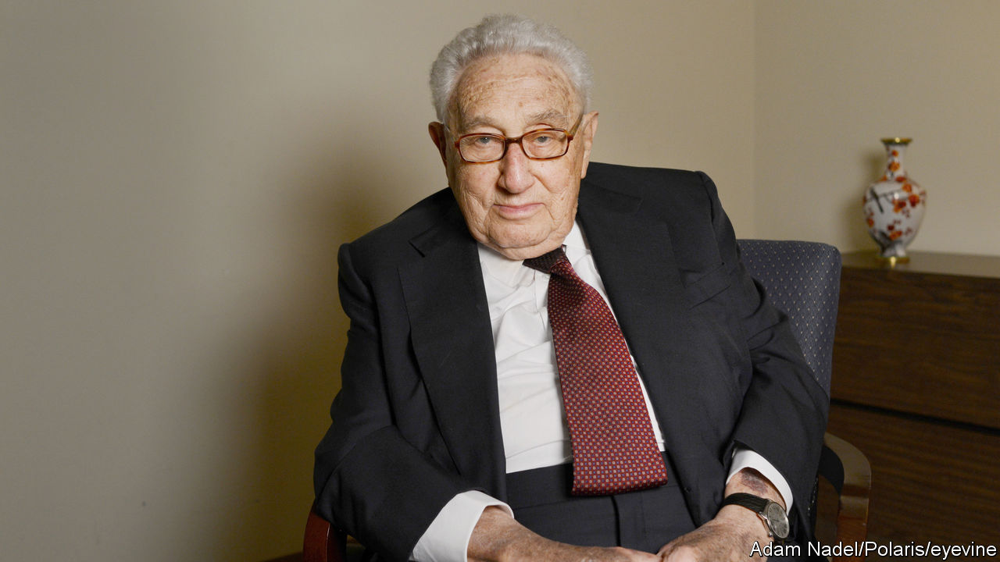

###### Superpower politics

# What does Henry Kissinger’s diplomacy have to teach the world? 

##### A grasp of the subtle interplay between interests, values and the use of force is still useful 

 

> Nov 30th 2023 

FOR SOMEONE who promoted his own views so tirelessly, Henry Kissinger was surprisingly misunderstood. Many see him as the arch-exponent of an amoral realism that tarnishes America. Sure enough, like any diplomat, he lied for his country (and occasionally himself). More disturbingly, he was willing to see tens of thousands of people killed if he thought that the national interest demanded it. Yet what distinguishes Mr Kissinger, , was not only his realpolitik, but the fact that his practice of diplomacy was also shot through with idealism. It is a style that still holds valuable lessons today.

The would-be Kissingers in the Biden White House (and they exist) confront some daunting challenges. The rivalry between China and America is increasingly poisonous. Bitter wars rage in Ukraine and Gaza. Political divisions are tearing apart Western democracies. Hard-to-solve global issues, such as how to curb climate change and minimise the risks of artificial intelligence, are piling up.

, Mr Kissinger himself seemed almost overwhelmed. But his central theme cut to the heart of his idealism. His life’s work, he said, had been devoted to preventing a repeat of the wars in 1914-18 and 1939-45 that had destroyed his childhood in Germany and much of the world besides. Today that means keeping the peace between China and America.

His method still bears examination. It starts with dispassionate analysis. In his later years, Mr Kissinger was often criticised for being soft on China. But his concern was to see off the thinking that portrayed it as a rising power like the Kaiser’s Germany, bent on expansion. China, he countered, saw the rules-based order as America’s rules and America’s order. It wanted room to adjust, not to overturn the system altogether.

Dispassionate analysis leads to Mr Kissinger’s next prescription, to live and let live. Drawing on his study of 19th-century European diplomacy, he argued that stability required states to tolerate each other’s differences. The main threat to peace comes not from realists, he thought, but from zealots and proselytisers who are quick to condemn and who demand change over a point of principle. Hence Mr Kissinger recommended that China and America talk, quietly at first, to build trust and that they avoid issues, like trade and Taiwan, where differences are unbridgeable.

Analysis and tolerance are fortified by Mr Kissinger’s call for military deterrence. America’s assessment of China may be wrong or it may go out of date. The attempt to co-exist could founder. If so, what ultimately keeps the peace is the threat of war and the willingness to carry it through.

Mr Kissinger’s many critics hold him responsible for an orgy of killing in Cambodia and Bangladesh in the 1970s, as well as for helping topple elected governments. He retorted that everything had to be subordinate to peace between America and the Soviet Union. The idea that he was acting out of necessity is a sweeping and unknowable claim. However, as the world’s reaction to Israel’s strikes on Gaza shows, his readiness to sacrifice human life in the search for stability would probably be seen as intolerable today.

In other ways, too, Kissingerian diplomacy is harder now than when he was shuttling around the Middle East as secretary of state. Secret back-channel meetings end up being plastered on TikTok. The world cannot so easily be ordered according to a hierarchy of Soviet- and American-backed allies and clients. It is multipolar. For all that, it would be a pity if Mr Kissinger’s vision of diplomacy died with him. A dangerous world sorely needs his grasp of the subtle interplay between interests, values and the use of force. The search for stability must go on without him. ■

